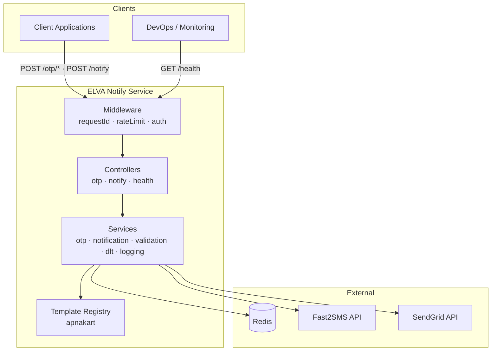
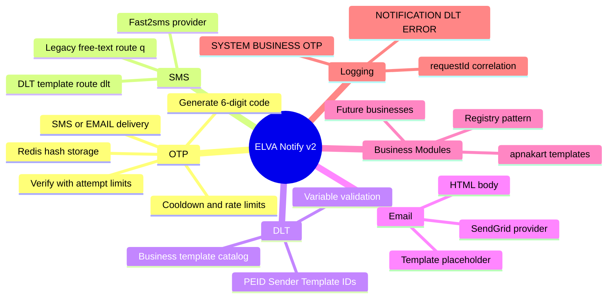

# ELVA Notify Platform v2 — Documentation Portal

| | |
|---|---|
| **Purpose** | Entry point for the ELVA Notify Platform v2 documentation. Describes what the platform is, what it can do today, and how to navigate the core documentation set. |
| **Intended Audience** | New developers, future maintainers, DevOps engineers, ELVA team members, and future business integrators. |
| **Last Updated** | 2026-06-05 |
| **Related Documents** | [Architecture Overview](./architecture/overview.md) · [Request Lifecycle](./architecture/request-lifecycle.md) · [DLT Layer](./architecture/dlt-layer.md) · [Authentication](./api/authentication.md) · [OTP API](./api/otp.md) · [Notify API](./api/notify.md) · [Error Codes](./api/error-codes.md) · [ApnaKart Templates](./businesses/apnakart.md) |

---

## What is ELVA Notify?

**ELVA Notify** (`elva-otp-service`) is a Node.js + Express microservice that provides:

- **OTP generation and verification** — 6-digit codes stored as salted hashes in Redis, scoped per `appId` and recipient.
- **SMS delivery** — via Fast2SMS (legacy free-text route `q`, and DLT-compliant templated route `dlt`).
- **Email delivery** — via SendGrid.
- **Unified notification API** — `POST /notify` for SMS and EMAIL in one contract.
- **Template groups** — shared DLT template catalogs (currently **ApnaKart**) with metadata and variable validation.
- **Structured logging** — JSON logs with `requestId`, `provider`, `templateId`, and category-based events.

The service uses **ELVA-issued platform credentials** (`appId` + `apiKey`) plus **per-brand identity** (`brandId`). OTP storage keys are namespaced as `otp:{brandId}:{recipient}` in Redis.

---

## High-Level Architecture

ELVA Notify is deployed as the **backend** package (`backend/`). A separate **frontend** (`frontend/`) serves this documentation portal from `docs/`. External systems call REST endpoints on the backend; the service orchestrates Redis, Fast2SMS, and SendGrid.

```
elva-notify-platform/
├── backend/     # Express API
├── frontend/    # Documentation portal (Next.js)
├── docs/        # Markdown source (this folder)
└── package.json # Root orchestrator scripts
```



---

## Platform Capabilities



| Capability | Endpoint / Path | Provider | Notes |
|------------|-----------------|----------|-------|
| OTP Send | `POST /otp/send` | Fast2SMS / SendGrid | Not DLT-templated; uses free-text OTP message |
| OTP Resend | `POST /otp/resend` | Fast2SMS / SendGrid | Revokes prior OTP, then re-sends |
| OTP Verify | `POST /otp/verify` | Redis only | Consumes OTP on success |
| Legacy SMS | `POST /notify` + `message` | Fast2SMS route `q` | Free-text SMS |
| DLT SMS | `POST /notify` + `templateKey` + `variables` | Fast2SMS route `dlt` | ApnaKart templates (per approved brand) |
| Email | `POST /notify` + `subject` + `html`/`template` | SendGrid | HTML or simple template |
| Health | `GET /health` | — | No authentication |

---

## Platform Evolution Timeline

| Phase | Focus | Status |
|-------|-------|--------|
| **Phase 1** | Template registry + ApnaKart group | Complete |
| **Phase 2** | Template validation layer on `/notify` | Complete |
| **Phase 3** | DLT SMS delivery via Fast2SMS | Complete |
| **Phase 4** | Centralized structured logging (`businessLogger`) | Complete |
| **Phase 5A** | Core documentation portal (this set) | In progress |
| **Future** | Full doc portal UI, OTP→DLT migration, multi-business, WhatsApp | Planned |

---

## Documentation Map

### Getting Started

| Document | Description |
|----------|-------------|
| [End-to-End Integration Guide](./getting-started/end-to-end-integration-guide.md) | Portal onboarding → credentials → playground → app integration |

### Architecture

| Document | Description |
|----------|-------------|
| [Architecture Overview](./architecture/overview.md) | Components, folder structure, request processing |
| [Request Lifecycle](./architecture/request-lifecycle.md) | Sequence diagrams for OTP, SMS, DLT, and email flows |
| [DLT Layer](./architecture/dlt-layer.md) | DLT concepts, ApnaKart IDs, payload transformation |

### API Reference

| Document | Description |
|----------|-------------|
| [Authentication](./api/authentication.md) | ELVA-issued `appId` / `apiKey` + `brandId` |
| [OTP API](./api/otp.md) | Send, resend, verify — **LOGIN_OTP**, **LOGIN_OTP_WITH_ID** |
| [Notify API](./api/notify.md) | Legacy SMS, DLT template SMS, email — **order templates only** |
| [Error Codes](./api/error-codes.md) | All API error codes with HTTP status |
| [OpenAPI Specification](./api/openapi.md) | OpenAPI 3.1 contract overview |
| [API Reference Intro](./api/reference.md) | Interactive endpoint explorer guide |
| [Interactive API Reference](/api-reference) | Searchable endpoint catalog (portal) |

### API testing (Phase 10D)

| Document | Description |
|----------|-------------|
| [Postman / curl collection](./testing/POSTMAN_COLLECTION.md) | Copy-paste requests for OTP + notify flows |
| [API validation checklist](./testing/PHASE_10D_API_CHECKLIST.md) | Pre-integration test checklist |

### Businesses

| Document | Description |
|----------|-------------|
| [ApnaKart Templates](./businesses/apnakart.md) | Template catalog, DLT IDs, integration guide |

### Phase reports

Implementation audits and migration reports live under [`docs/reports/`](./reports/). Filenames are preserved from each phase.

| Document | Description |
|----------|-------------|
| [ELVA Notify Architecture](./reports/ELVA_NOTIFY_ARCHITECTURE.md) | Full-stack architecture audit (pre-v2) |
| [DLT Migration](./reports/ELVA_NOTIFY_DLT_MIGRATION.md) | DLT migration analysis |
| [Phase 8E Report](./reports/ELVA_NOTIFY_PHASE_8E_REPORT.md) | eNandi template exposure + playground validation |
| [Phase 9A Report](./reports/ELVA_NOTIFY_PHASE_9A_REPORT.md) | Frontend metadata API refactor |
| [Phase 9C Report](./reports/ELVA_NOTIFY_PHASE_9C_REPORT.md) | DLT delivery validation |
| [Phase 9C Message ID Report](./reports/ELVA_NOTIFY_PHASE_9C_MESSAGE_ID_REPORT.md) | Fast2SMS Message ID fix |

---

## Quick Start for Integrators

> **New to ELVA Notify?** Start with the [End-to-End Integration Guide](./getting-started/end-to-end-integration-guide.md) — from landing on [notify.elvatech.in](https://notify.elvatech.in) through onboarding, testing, and production API integration.

1. Submit your brand and templates at [/onboard](/onboard).
2. Track approval on the status link emailed to you.
3. After ELVA approves, use the **`appId` and `apiKey` issued to your team** (approval email) plus your **`brandId`** on API calls.
4. Read [Authentication](./api/authentication.md) — credentials go in the **JSON body**, not headers.
5. For OTP flows, start with [OTP API](./api/otp.md).
6. For transactional SMS, use [Notify API](./api/notify.md) + [ApnaKart Templates](./businesses/apnakart.md).
7. On errors, consult [Error Codes](./api/error-codes.md).

---

## Troubleshooting Notes

| Symptom | Likely cause | See |
|---------|--------------|-----|
| `403 forbidden` on all requests | Wrong `appId`/`apiKey` or missing `APP_CREDENTIALS_JSON` | [Authentication](./api/authentication.md) |
| `502 sms_failed` on OTP send | `FAST2SMS_API_KEY` missing or provider error | [OTP API](./api/otp.md) |
| `400 unsupported_business` | Unknown `business` field on `/notify` | [ApnaKart Templates](./businesses/apnakart.md) |
| `500 notification_failed` on DLT | Provider rejection or missing DLT metadata | [DLT Layer](./architecture/dlt-layer.md) |
| `429 rate_limited` | Global or OTP per-phone limits exceeded | [OTP API](./api/otp.md) |

---

## Warnings

> **OTP DLT delivery (Phase 8B+):** When `OTP_DLT_ENABLED=true` and per-app `dltEnabled: true`, OTP SMS uses Fast2SMS `route=dlt`. Otherwise OTP falls back to `route=q`. See [OTP DLT Migration](./architecture/otp-dlt-migration.md) and [Observability](./architecture/otp-dlt-observability.md). Operations dashboard: [/platform/otp](/platform/otp).

> **Credentials in body.** `appId` and `apiKey` are sent in the request JSON body. Use HTTPS in production.

> **India SMS compliance.** DLT template SMS via `/notify` uses approved ApnaKart template IDs. Each brand supplies its own `brandName` in variables or via `brandId`.
