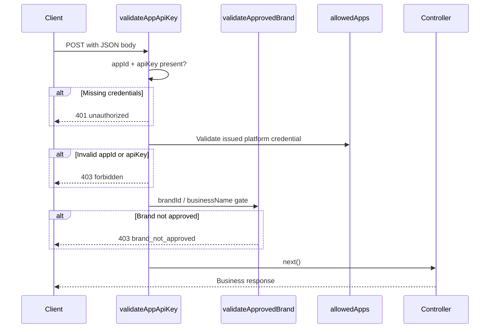

# Authentication

| | |
|---|---|
| **Purpose** | Document platform authentication (`appId` + `apiKey`) and per-brand identity (`brandId`) for ELVA Notify. |
| **Intended Audience** | Client developers, integrators, and ELVA ops configuring the platform. |
| **Last Updated** | 2026-06-17 |
| **Related Documents** | [OTP API](./otp.md) · [Notify API](./notify.md) · [Error Codes](./error-codes.md) · [Business onboarding runbook](../runbooks/business-onboarding.md) · [Architecture Overview](../architecture/overview.md) |

---

## Concepts

ELVA Notify uses **two layers** on every protected API call:

| Layer | Fields | Who provides it |
|-------|--------|-----------------|
| **Platform auth** | `appId`, `apiKey` | **ELVA team** — issued after your onboarding request and templates are approved |
| **Brand identity** | `brandId` (OTP; optional on notify SMS) | Your team — requested at [/onboard](/onboard) and activated on approval |

Credentials are **not** sent via `Authorization` headers. The middleware `validateAppApiKey` runs before OTP and Notify controllers. Approved-brand checks run via `validateApprovedBrand` (see [OTP](./otp.md) and [Notify](./notify.md)).

### Platform credentials (`appId` + `apiKey`)

After ELVA approves your brand and requested templates, the **ELVA team issues** an `appId` and `apiKey` for API access. These credentials are tied to your approved integration — you receive them by email when your request is approved.

| Field | Type | Description |
|-------|------|-------------|
| `appId` | string | Platform application ID issued by ELVA (e.g. `ELVA_NOTIFY`) |
| `apiKey` | string | API key paired with your issued `appId` |

Server-side, valid pairs are configured in `APP_CREDENTIALS_JSON`:

```json
{"ELVA_NOTIFY": "your-issued-api-key"}
```

Implementation: `src/config/allowedApps.js`, `src/middleware/validateAppApiKey.js`.

> **Integrators:** Do not generate your own `appId` or `apiKey`. Submit [/onboard](/onboard), wait for ELVA approval, and use the credentials sent to your work email.

### Brand identity (`brandId`)

| Field | Type | Required on | Description |
|-------|------|-------------|-------------|
| `brandId` | string | `POST /otp/*` | Approved brand slug (e.g. `enandi`, `cms`, `puma`) |
| `brandId` or `variables.businessName` | string | `POST /notify` (SMS) | Resolves the tenant brand for DLT templates and SMS text |

- List active brands: `GET /platform/brands`
- Request a new brand: [/onboard](/onboard)
- OTP Redis keys are scoped per **`brandId`** + recipient: `otp:{brandId}:{phone}`

### Protected vs Unprotected Endpoints

| Endpoint | Authentication |
|----------|----------------|
| `GET /health` | Not required |
| `GET /integrations/catalog` | Not required |
| `POST /integrations/requests` | Not required |
| `POST /otp/send` | Required + approved `brandId` |
| `POST /otp/resend` | Required + approved `brandId` |
| `POST /otp/verify` | Required + approved `brandId` |
| `POST /notify` | Required; SMS also requires approved brand |

---

## Authentication Flow



---

## Real Request Example (OTP)

```json
{
  "appId": "ELVA_NOTIFY",
  "apiKey": "your-issued-api-key",
  "brandId": "enandi",
  "phone": "919876543210"
}
```

Use your ELVA-issued `appId` and `apiKey` together with your approved `brandId`.

## Real Response Example (missing apiKey)

```json
{
  "success": false,
  "error": "unauthorized",
  "message": "API key is required",
  "requestId": "a1b2c3d4-e5f6-7890-abcd-ef1234567890"
}
```

## Real Response Example (wrong credentials)

```json
{
  "success": false,
  "error": "forbidden",
  "message": "Invalid app credentials",
  "requestId": "b2c3d4e5-f6a7-8901-bcde-f12345678901"
}
```

---

## cURL Example

```bash
curl -X POST {{API_BASE_URL}}/otp/send \
  -H "Content-Type: application/json" \
  -d '{
    "appId": "ELVA_NOTIFY",
    "apiKey": "your-issued-api-key",
    "brandId": "enandi",
    "phone": "919876543210"
  }'
```

---

## Onboarding a new brand

1. Integrator submits [/onboard](/onboard) with desired `brandId`, templates, and contact details.
2. ELVA reviews the request. You receive a confirmation email with a **status page link**.
3. ELVA ops approves at [/platform/approvals](/platform/approvals).
4. ELVA emails your **`appId`**, **`apiKey`**, and confirmed **`brandId`** based on approved templates.
5. Integrate using those credentials on OTP and notify API calls.

---

## Global Rate Limiting (post-auth context)

After authentication, protected routes pass through a global rate limiter (`src/middleware/rateLimiter.js`):

- **10 requests per minute** per `appId` (or client IP fallback)
- Exceeded limit returns **429** `rate_limited`

Onboarding and platform metadata routes are excluded. OTP has additional per-phone limits — see [OTP API](./otp.md).

---

## Troubleshooting Notes

| Symptom | Cause | Resolution |
|---------|-------|------------|
| `401 unauthorized` | Missing or empty `appId`/`apiKey` | Include both fields in JSON body |
| `403 forbidden` `Invalid app credentials` | Wrong or unissued `appId`/`apiKey` | Use credentials from your ELVA approval email |
| `403 brand_not_approved` | `brandId` not active in registry | Complete [/onboard](/onboard) or wait for approval |
| `400 brand_id_required` | Missing `brandId` on OTP | Add `brandId` on send, resend, and verify |
| Works locally, fails in production | Stale server env after `.env` change | Restart backend so `APP_CREDENTIALS_JSON` reloads |
| `429 rate_limited` | Global or OTP per-phone limits | Wait and retry |

---

## Warnings

> **Always use HTTPS in production.** Credentials in the JSON body are visible on the wire without TLS.

> **Do not commit `APP_CREDENTIALS_JSON` to source control.** Configure via deployment secrets.

> **Do not confuse `appId` with `brandId`.** `appId` + `apiKey` authenticate your integration; `brandId` selects which approved brand (SMS text, DLT templates, OTP scope) applies to the call.

---

## Related Configuration

| Environment Variable | Required | Description |
|---------------------|----------|-------------|
| `APP_CREDENTIALS_JSON` | Yes (for auth to work) | Server map of valid `appId` → `apiKey` pairs |
| `INTEGRATION_APP_ID` | No | `appId` included in approval emails (default: `ELVA_NOTIFY`) |
| `OPS_ADMIN_TOKEN` | For approvals portal | Ops-only; not used by integrators |

If `APP_CREDENTIALS_JSON` is empty or unset, `allowedApps` is an empty object and **all** authenticated requests return `403 forbidden`.
