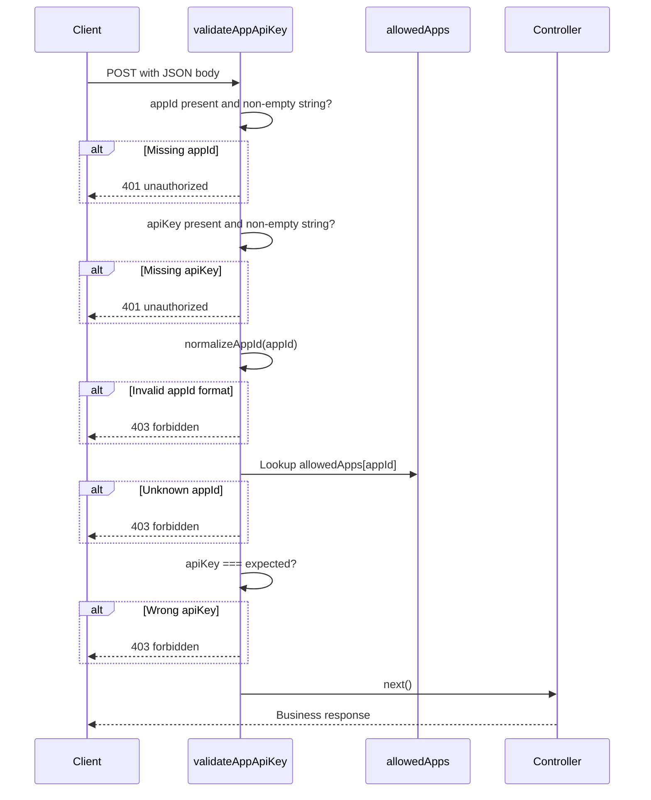
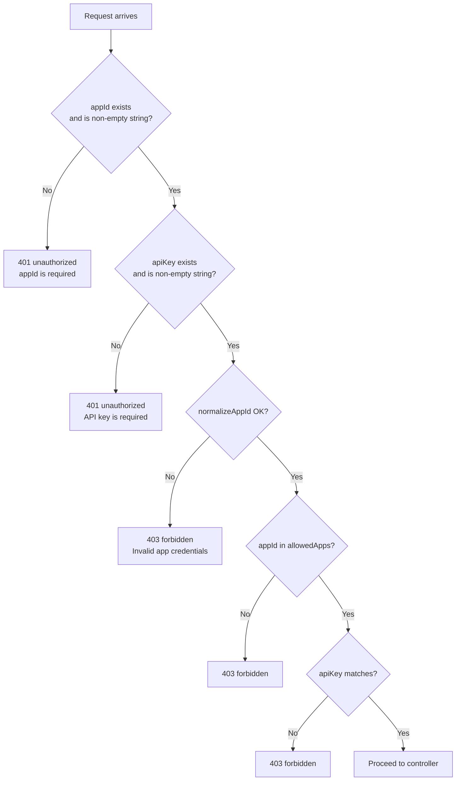

# Authentication

| | |
|---|---|
| **Purpose** | Document how ELVA Notify authenticates API requests using `appId` and `apiKey` in the JSON request body. |
| **Intended Audience** | Client developers, integrators, and ELVA team members configuring application credentials. |
| **Last Updated** | 2026-06-05 |
| **Related Documents** | [Documentation Portal](../README.md) · [OTP API](./otp.md) · [Notify API](./notify.md) · [Error Codes](./error-codes.md) · [Architecture Overview](../architecture/overview.md) |

---

## Concepts

ELVA Notify uses **application-level authentication**. Every protected endpoint requires two fields in the **JSON request body**:

| Field | Type | Description |
|-------|------|-------------|
| `appId` | string | Application identifier; also used as OTP tenant key in Redis |
| `apiKey` | string | Secret key paired with `appId` |

Credentials are **not** sent via `Authorization` headers. The middleware `validateAppApiKey` runs before OTP and Notify controllers.

Server-side credentials are loaded at startup from `APP_CREDENTIALS_JSON`:

```json
{"enandi-app": "your-secret-key", "other-app": "another-secret"}
```

Implementation: `src/config/allowedApps.js`, `src/middleware/validateAppApiKey.js`.

### Protected vs Unprotected Endpoints

| Endpoint | Authentication |
|----------|----------------|
| `GET /health` | Not required |
| `GET /` | Not required |
| `POST /otp/send` | Required |
| `POST /otp/resend` | Required |
| `POST /otp/verify` | Required |
| `POST /notify` | Required |

---

## Authentication Flow



---

## Validation Decision Flow



---

## appId Rules

From `src/utils/appId.js`:

- Must be a non-empty string after trim
- Must not contain `:` (colon) — reserved for Redis key structure
- Normalized to trimmed value for lookup and OTP storage

The `appId` in the request body determines the Redis namespace: `otp:{appId}:{recipient}`.

---

## Real Request Example (valid)

```json
{
  "appId": "enandi-app",
  "apiKey": "your-secret-key",
  "phone": "919876543210"
}
```

## Real Response Example (missing apiKey)

```json
{
  "success": false,
  "error": "unauthorized",
  "message": "API key is required",
  "requestId": "a1b2c3d4-e5f6-7890-abcd-ef1234567890"
}
```

## Real Response Example (wrong key)

```json
{
  "success": false,
  "error": "forbidden",
  "message": "Invalid app credentials",
  "requestId": "b2c3d4e5-f6a7-8901-bcde-f12345678901"
}
```

---

## cURL Example

```bash
curl -X POST {{API_BASE_URL}}/otp/send \
  -H "Content-Type: application/json" \
  -d '{
    "appId": "enandi-app",
    "apiKey": "your-secret-key",
    "phone": "919876543210"
  }'
```

---

## Global Rate Limiting (post-auth context)

After authentication, all routes pass through a global rate limiter (`src/middleware/rateLimiter.js`):

- **10 requests per minute** per `appId` (or `apiKey` / client IP fallback)
- Exceeded limit returns **429** `rate_limited`

This is separate from OTP-specific per-phone limits documented in [OTP API](./otp.md).

---

## Troubleshooting Notes

| Symptom | Cause | Resolution |
|---------|-------|------------|
| `401 unauthorized` | Missing or empty `appId`/`apiKey` | Include both fields in JSON body |
| `403 forbidden` with valid-looking credentials | `appId` not in `APP_CREDENTIALS_JSON` | Add entry to server env and restart |
| `403 forbidden` after credential rotation | Stale `apiKey` on client | Update client config |
| `403 forbidden` with special chars in appId | `normalizeAppId` rejected (e.g. contains `:`) | Use alphanumeric app IDs |
| Works locally, fails in production | Different `APP_CREDENTIALS_JSON` per environment | Verify deployment env vars |
| `429 rate_limited` before auth error | Global limit keyed by IP when body empty | Ensure body is parsed; send `appId` |

---

## Warnings

> **Always use HTTPS in production.** Credentials in JSON body are visible on the wire without TLS.

> **Do not commit `APP_CREDENTIALS_JSON` to source control.** Configure via deployment secrets.

> **Each `appId` is an OTP tenant.** Using the same `appId` across unrelated products shares OTP state.

---

## Related Configuration

| Environment Variable | Required | Description |
|---------------------|----------|-------------|
| `APP_CREDENTIALS_JSON` | Yes (for auth to work) | JSON map of `appId` → `apiKey` |

If `APP_CREDENTIALS_JSON` is empty or unset, `allowedApps` is an empty object and **all** authenticated requests return `403 forbidden`.
