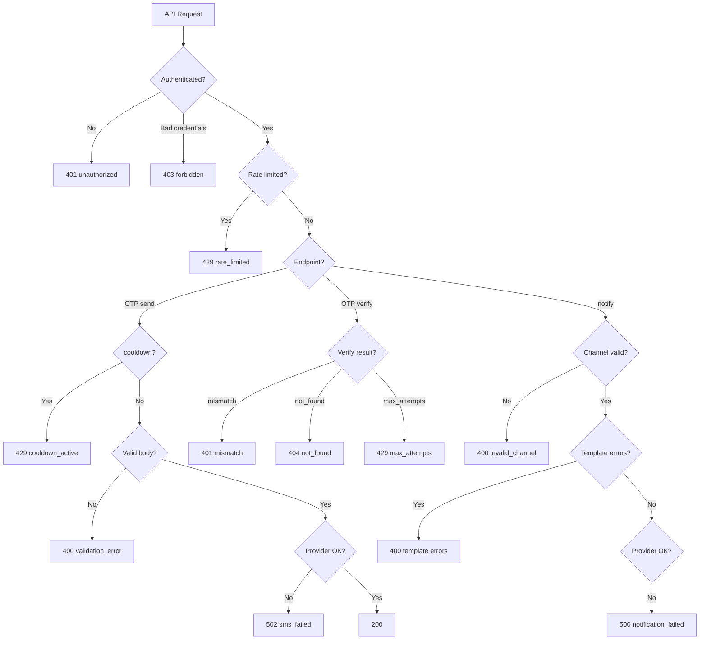

# Error Codes

| | |
|---|---|
| **Purpose** | Comprehensive reference for all machine-oriented `error` codes returned by ELVA Notify API responses. |
| **Intended Audience** | Client developers, support engineers, and integrators handling API failures. |
| **Last Updated** | 2026-06-17 |
| **Related Documents** | [Authentication](./authentication.md) · [OTP API](./otp.md) · [Notify API](./notify.md) · [Request Lifecycle](../architecture/request-lifecycle.md) |

---

## Concepts

All API error responses follow a consistent JSON shape:

```json
{
  "success": false,
  "error": "<machine_code>",
  "message": "<human_readable_text>",
  "requestId": "<uuid>"
}
```

Some endpoints add context fields (e.g. `channel` on `/notify` failures).

The `error` field is stable for programmatic handling. The `message` field is safe for display but may change wording.

---

## Error Routing Decision Tree



---

## Complete Error Code Reference

### Authentication Errors

| HTTP | error | message (typical) | Cause | Resolution |
|------|-------|-------------------|-------|------------|
| 401 | `unauthorized` | `appId is required` | Missing, null, empty, or non-string `appId` | Include valid `appId` string in body |
| 401 | `unauthorized` | `API key is required` | Missing, null, empty, or non-string `apiKey` | Include valid `apiKey` string in body |
| 403 | `forbidden` | `Invalid app credentials` | Wrong shared `appId` or `apiKey` | Use the platform pair from ELVA integration guide |

### Brand access errors (Phase 3)

| HTTP | error | message (typical) | Cause | Resolution |
|------|-------|-------------------|-------|------------|
| 400 | `brand_id_required` | `brandId is required` | OTP request missing `brandId` | Include approved `brandId` on `/otp/*` |
| 400 | `brand_id_required` | `brandId or variables.businessName is required...` | SMS `/notify` without brand identity | Send `brandId` or `variables.businessName` matching an approved brand |
| 403 | `brand_not_approved` | Brand is not registered or not approved | Unknown `brandId`, pending brand, or unregistered `businessName` | Submit onboarding request; use `GET /platform/brands` |
| 403 | `brand_suspended` | Brand is suspended | Brand `status: suspended` in registry | Contact ELVA ops |
| 403 | `template_not_allowed` | Template not enabled for brand | `templateKey` not in brand's `templates.notify` | Request template access or use an allowed template |

**Endpoints:** `/otp/*` (requires `brandId`), `POST /notify` SMS (requires `brandId` or `variables.businessName`)

---

### Validation Errors

| HTTP | error | message (typical) | Cause | Resolution |
|------|-------|-------------------|-------|------------|
| 400 | `validation_error` | Field-specific text | Missing/invalid body fields, normalization failure | Fix request per [OTP](./otp.md) or [Notify](./notify.md) docs |

**Common `validation_error` messages:**

| Message | Endpoint |
|---------|----------|
| `phone is required` | `/otp/send`, `/otp/resend` |
| `email is required` | `/otp/send` (EMAIL channel) |
| `phone or email is required` | `/otp/verify` |
| `OTP must be exactly 6 digits` | Controller (before service) |
| `channel is required` | `/notify` |
| `to must be an array with at least one value` | `/notify` |
| `message is required for SMS channel` | `/notify` legacy |
| `Provide either message or business with templateKey, not both` | `/notify` mixed mode |
| `subject is required for EMAIL channel` | `/notify` |
| `Either template or html is required for EMAIL channel` | `/notify` |

**Endpoints:** `/otp/*`, `/notify`

---

### Channel Errors

| HTTP | error | message (typical) | Cause | Resolution |
|------|-------|-------------------|-------|------------|
| 400 | `invalid_channel` | `channel must be one of: EMAIL, SMS` | Unsupported channel value | Use `SMS` or `EMAIL` |

**Endpoints:** `/notify`

---

### Template / Business Errors (DLT)

| HTTP | error | message (typical) | Cause | Resolution |
|------|-------|-------------------|-------|------------|
| 400 | `unsupported_business` | `Unsupported business: {id}` | `business` not in registry | Use registered template group (e.g. `apnakart`) |
| 400 | `invalid_template` | `Unknown templateKey: {key}` | Template not in business catalog | See [ApnaKart](../businesses/apnakart.md) template keys |
| 400 | `otp_template_not_supported` | OTP must use `/otp/send`… | OTP template (`LOGIN_OTP`, `LOGIN_OTP_WITH_ID`) sent via `/notify` | Use [OTP API](./otp.md) instead |
| 400 | `missing_variable` | `Missing required variable: {name}` | Required template variable absent | Include all required variables |
| 400 | `validation_error` | Variable format messages | Wrong type, length, pattern, or date format | Match variable schema exactly |

**Endpoints:** `/notify` (DLT template mode)

> **Note:** `dlt_metadata_missing` can occur internally during send but surfaces as **500** `notification_failed`, not as a 400 template error.

---

### OTP Verify Errors

| HTTP | error | message (typical) | Cause | Resolution |
|------|-------|-------------------|-------|------------|
| 400 | `invalid_input` | `Invalid request` | Non-string `otp` or `appId` in service layer | Send string values |
| 400 | `invalid_contact` | `Invalid phone number or email` | Recipient normalization failed | Fix phone/email format |
| 400 | `invalid_app_id` | `Invalid app id` | `appId` contains `:` or fails normalization | Use valid appId |
| 400 | `invalid_otp_format` | `OTP must be exactly 6 digits` | OTP not 6 numeric digits | Submit 6-digit code |
| 401 | `mismatch` | `Invalid OTP` | OTP does not match stored hash | Re-enter correct OTP |
| 404 | `not_found` | `No active OTP for this contact. Request a new code.` | No Redis record or incomplete record | Call `/otp/send` or `/otp/resend` |

**Endpoints:** `/otp/verify`

---

### Rate Limit and Cooldown Errors

| HTTP | error | message (typical) | Cause | Resolution |
|------|-------|-------------------|-------|------------|
| 429 | `rate_limited` | `Too many requests. Please try again later.` | Global limit: 10/min per appId | Wait and retry |
| 429 | `rate_limited` | `Too many OTP requests. Try later.` | OTP limit: 3/min or 10/hr per phone | Wait and retry |
| 429 | `cooldown_active` | `Please wait before requesting another OTP` | SMS cooldown key exists in Redis | Wait for cooldown expiry |
| 429 | `max_attempts` | `Too many failed attempts. Request a new code.` | 3 failed verify attempts | Resend new OTP |

**Endpoints:** Global (`rate_limited`), OTP send/resend (`rate_limited`, `cooldown_active`), OTP verify (`max_attempts`)

---

### Provider and Server Errors

| HTTP | error | message (typical) | Cause | Resolution |
|------|-------|-------------------|-------|------------|
| 502 | `sms_failed` | `Failed to send OTP. Please try again.` | Fast2SMS/SendGrid failed during OTP send; OTP revoked | Retry send; check provider config |
| 500 | `notification_failed` | Sanitized provider message | Fast2SMS or SendGrid failure on `/notify` | Check logs with `requestId` |
| 500 | `internal_error` | `An unexpected error occurred` | Unhandled exception in Express error handler | Contact ops; check server logs |

**Endpoints:** `/otp/send`, `/otp/resend` (`sms_failed`); `/notify` (`notification_failed`); all (`internal_error`)

---

## Error Code Quick Lookup

| error | HTTP | Primary endpoint(s) |
|-------|------|---------------------|
| `unauthorized` | 401 | `/otp/*`, `/notify` |
| `forbidden` | 403 | `/otp/*`, `/notify` |
| `validation_error` | 400 | `/otp/*`, `/notify` |
| `invalid_channel` | 400 | `/notify` |
| `unsupported_business` | 400 | `/notify` DLT |
| `invalid_template` | 400 | `/notify` DLT |
| `missing_variable` | 400 | `/notify` DLT |
| `invalid_input` | 400 | `/otp/verify` |
| `invalid_contact` | 400 | `/otp/verify` |
| `invalid_app_id` | 400 | `/otp/verify` |
| `invalid_otp_format` | 400 | `/otp/verify` |
| `mismatch` | 401 | `/otp/verify` |
| `not_found` | 404 | `/otp/verify` |
| `cooldown_active` | 429 | `/otp/send`, `/otp/resend` |
| `rate_limited` | 429 | All routes |
| `max_attempts` | 429 | `/otp/verify` |
| `sms_failed` | 502 | `/otp/send`, `/otp/resend` |
| `notification_failed` | 500 | `/notify` |
| `internal_error` | 500 | All routes |

---

## Real Error Response Examples

**Template validation:**

```json
{
  "success": false,
  "error": "invalid_template",
  "message": "Unknown templateKey: ORDER_SHIPPED",
  "requestId": "f47ac10b-58cc-4372-a567-0e02b2c3d479"
}
```

**Rate limited:**

```json
{
  "success": false,
  "error": "rate_limited",
  "message": "Too many OTP requests. Try later.",
  "requestId": "a1b2c3d4-e5f6-7890-abcd-ef1234567890"
}
```

**Notification provider failure:**

```json
{
  "success": false,
  "error": "notification_failed",
  "message": "Failed to send notification",
  "channel": "SMS",
  "requestId": "b2c3d4e5-f6a7-8901-bcde-f12345678901"
}
```

---

## Troubleshooting Notes

| Client handling tip | Detail |
|---------------------|--------|
| Always log `requestId` | Correlate with server JSON logs |
| Retry on `rate_limited` | Use exponential backoff |
| Do not retry `forbidden` | Fix credentials first |
| On `sms_failed`, prompt user to retry | OTP was revoked from Redis |
| On `max_attempts`, call resend | Old OTP is deleted |
| `validation_error` messages vary | Parse `error` code, display `message` |

---

## Codes NOT Currently Returned

The following appear in internal mappings or README but are **not emitted** by current service code:

| Code | Notes |
|------|-------|
| `expired` | Mapped in `verifyReasonHttp` but `otp.service` returns `not_found` when TTL elapsed |
| `invalid_phone` | Mapped in controller but verify uses `invalid_contact` instead |

Integrators should not expect these codes until a future release explicitly adds them.
