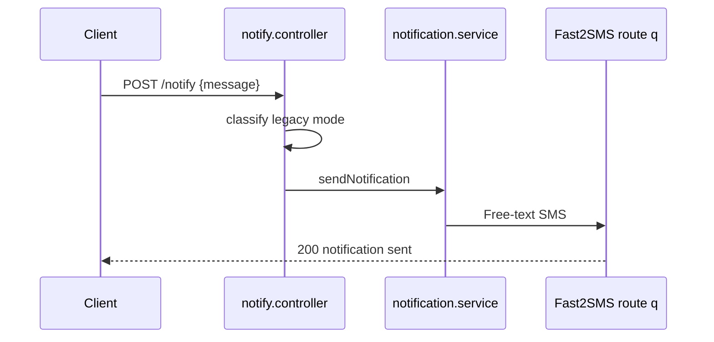
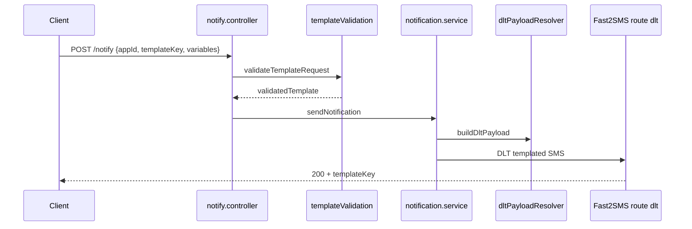
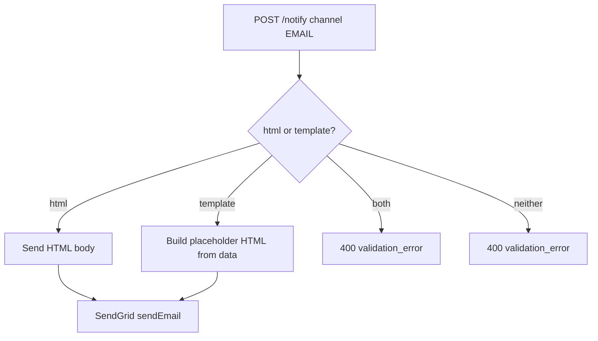
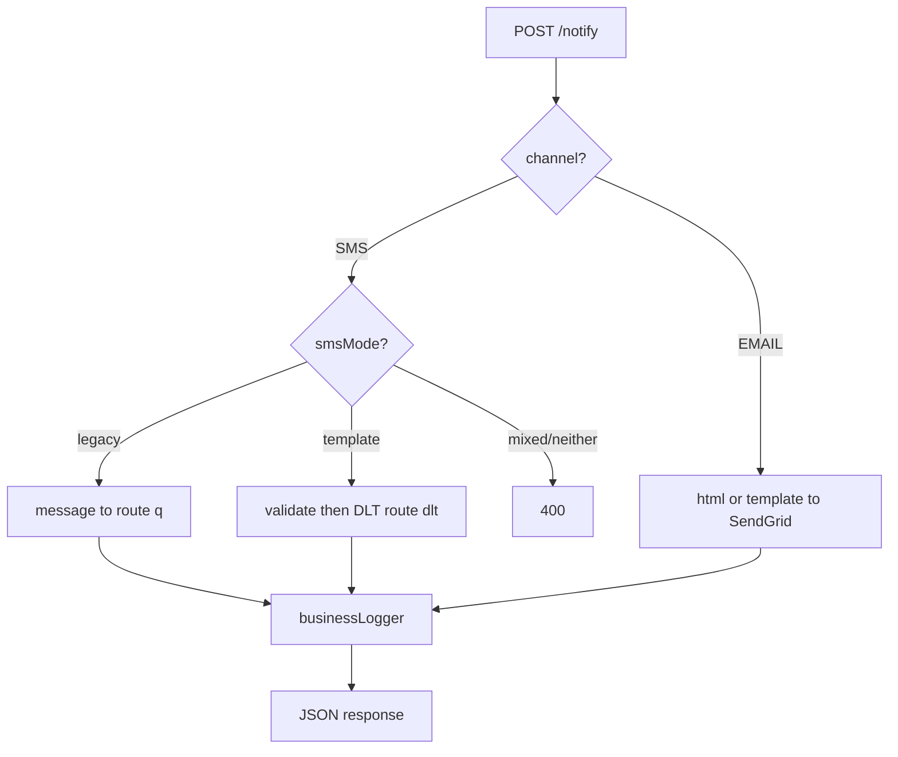

# Notify API

| | |
|---|---|
| **Purpose** | Document the unified `POST /notify` endpoint for SMS (legacy and DLT template) and EMAIL notifications. |
| **Intended Audience** | Client developers and business integrators sending transactional notifications. |
| **Last Updated** | 2026-06-05 |
| **Related Documents** | [Authentication](./authentication.md) · [Error Codes](./error-codes.md) · [DLT Layer](../architecture/dlt-layer.md) · [Request Lifecycle](../architecture/request-lifecycle.md) · [eNandi Business](../businesses/enandi.md) |

---

## Concepts

`POST /notify` is the unified notification endpoint. The `channel` field determines delivery mode:

| Channel | Modes | Provider |
|---------|-------|----------|
| `SMS` | Legacy (`message`) or DLT template (`templateKey` + `variables`; `appId` identifies the business) | Fast2SMS |
| `EMAIL` | HTML (`html`) or placeholder template (`template` + `data`) | SendGrid |

SMS mode is classified by `classifyNotifySmsMode()`:

- **legacy** — `message` field present
- **template** — `templateKey` present (`appId` resolves the business module)
- **mixed** — both present → **400** error
- **neither** — no `message` and no `templateKey` → **400** error

> **OTP SMS — use OTP API, not `/notify`**

| Template | Correct API |
|----------|-------------|
| `LOGIN_OTP` | `POST /otp/send` → `POST /otp/verify` · `POST /otp/resend` |
| `LOGIN_OTP_WITH_ID` | Same OTP endpoints (+ optional `loginId` on send/resend) |

ELVA generates and verifies OTP codes. `/notify` rejects OTP templates with **400** `otp_template_not_supported`.

**Transactional SMS on `/notify`:** `ORDER_PLACED`, `ORDER_DELIVERED`, `OUT_FOR_DELIVERY` only.

See [OTP API](./otp.md) for login flows.

---

## Endpoint

| Method | Path | Auth |
|--------|------|------|
| `POST` | `/notify` | Yes (`appId` + `apiKey` in body) |

### Common Required Fields

| Field | Type | Description |
|-------|------|-------------|
| `appId` | string | Application identifier |
| `apiKey` | string | API secret |
| `channel` | string | `SMS` or `EMAIL` |
| `to` | string[] | Non-empty array of recipient addresses/numbers |

---

## Legacy SMS Mode

### Flow



### Request

```json
{
  "appId": "enandi-app",
  "apiKey": "your-secret-key",
  "channel": "SMS",
  "to": ["919876543210"],
  "message": "Your refund of Rs. 500 has been processed."
}
```

### Success Response — 200

```json
{
  "success": true,
  "message": "Notification sent",
  "channel": "SMS",
  "requestId": "a1b2c3d4-e5f6-7890-abcd-ef1234567890"
}
```

---

## DLT Template SMS Mode

### Flow



### Request

```json
{
  "appId": "enandi",
  "apiKey": "your-secret-key",
  "channel": "SMS",
  "to": ["919876543210"],
  "templateKey": "ORDER_DELIVERED",
  "variables": {
    "orderId": "ORD-2026-001",
    "deliveryDateTime": "2026-06-05 14:30"
  }
}
```

### Success Response — 200

```json
{
  "success": true,
  "message": "Notification sent",
  "channel": "SMS",
  "templateKey": "ORDER_DELIVERED",
  "requestId": "b2c3d4e5-f6a7-8901-bcde-f12345678901"
}
```

> DLT template success responses include `templateKey`. Legacy and email responses do not.

### Validation Errors — 400

```json
{
  "success": false,
  "error": "missing_variable",
  "message": "Missing required variable: orderId",
  "requestId": "b2c3d4e5-f6a7-8901-bcde-f12345678901"
}
```

```json
{
  "success": false,
  "error": "unsupported_business",
  "message": "Unsupported business: unknown-corp",
  "requestId": "c3d4e5f6-a7b8-9012-cdef-123456789012"
}
```

---

## Email Mode

### Flow



### Request (HTML)

```json
{
  "appId": "enandi-app",
  "apiKey": "your-secret-key",
  "channel": "EMAIL",
  "to": ["user@example.com"],
  "subject": "Welcome to eNandi",
  "html": "<h1>Welcome!</h1><p>Your account is ready.</p>"
}
```

### Request (Template placeholder)

```json
{
  "appId": "enandi-app",
  "apiKey": "your-secret-key",
  "channel": "EMAIL",
  "to": ["user@example.com"],
  "subject": "Account Update",
  "template": "basic",
  "data": {
    "name": "Ravi",
    "status": "active"
  }
}
```

> The `template` field builds a simple HTML wrapper around the subject and JSON data payload. It is not connected to eNandi SMS templates.

### Success Response — 200

```json
{
  "success": true,
  "message": "Notification sent",
  "channel": "EMAIL",
  "requestId": "d4e5f6a7-b8c9-0123-def0-234567890123"
}
```

---

## EMAIL Validation Rules

| Rule | Error |
|------|-------|
| `subject` required | `validation_error` |
| Either `html` OR `template` required | `validation_error` |
| Cannot send both `html` and `template` | `validation_error` |
| `data` must be object if provided | `validation_error` |

---

## SMS Validation Rules

| Rule | Error |
|------|-------|
| Legacy: `message` required | `validation_error` |
| Template: `templateKey` + `variables` required | `validation_error` (via template validation) |
| OTP template via `/notify` (e.g. LOGIN_OTP) | `otp_template_not_supported` — use `/otp/send` |
| Cannot mix `message` with `templateKey` | `validation_error` |
| `to` must be non-empty string array | `validation_error` |
| Invalid `channel` | `invalid_channel` |

---

## Provider Failure — 500

```json
{
  "success": false,
  "error": "notification_failed",
  "message": "Failed to send notification",
  "channel": "SMS",
  "requestId": "e5f6a7b8-c9d0-1234-ef01-345678901234"
}
```

The `message` field is sanitized — provider secrets and stack traces are never exposed.

---

## Multi-Recipient

`to` accepts an array. Each recipient receives an individual provider call:

```json
{
  "appId": "enandi",
  "apiKey": "your-secret-key",
  "channel": "SMS",
  "to": ["919876543210", "919876543211"],
  "templateKey": "ORDER_PLACED",
  "variables": {
    "orderId": "ORD-2026-001",
    "orderDate": "2026-06-05"
  }
}
```

---

## cURL Examples

**Legacy SMS:**

```bash
curl -X POST {{API_BASE_URL}}/notify \
  -H "Content-Type: application/json" \
  -d '{
    "appId": "enandi-app",
    "apiKey": "your-secret-key",
    "channel": "SMS",
    "to": ["919876543210"],
    "message": "Hello from ELVA"
  }'
```

**DLT SMS (transactional):**

```bash
curl -X POST {{API_BASE_URL}}/notify \
  -H "Content-Type: application/json" \
  -d '{
    "appId": "enandi",
    "apiKey": "your-secret-key",
    "channel": "SMS",
    "to": ["919876543210"],
    "templateKey": "ORDER_PLACED",
    "variables": {
      "orderId": "ORD-2026-001",
      "orderDate": "2026-06-05"
    }
  }'
```

**Login OTP** — use `/otp/send` and `/otp/verify` instead; see [OTP API](./otp.md).

---

## Architecture — Notify Dispatch



---

## Troubleshooting Notes

| Issue | Check |
|-------|-------|
| `Provide either message or business...` | Remove `message` when using DLT template fields |
| `message is required for SMS` | Add `message` or switch to `templateKey`+`variables` |
| `invalid_channel` | Use exactly `SMS` or `EMAIL` (case-insensitive) |
| `notification_failed` on DLT | See [DLT Layer](../architecture/dlt-layer.md) |
| Email `notification_failed` | Verify `SENDGRID_API_KEY` and `EMAIL_FROM` |
| `to must be an array` | Wrap single recipient in array: `["919..."]` |

---

## Warnings

> **DLT and legacy SMS are mutually exclusive** in a single request.

> **Phone numbers** are normalized to digits-only before sending to Fast2SMS.

> **EMAIL `template` field** is a simple HTML wrapper, not the eNandi SMS template catalog.
