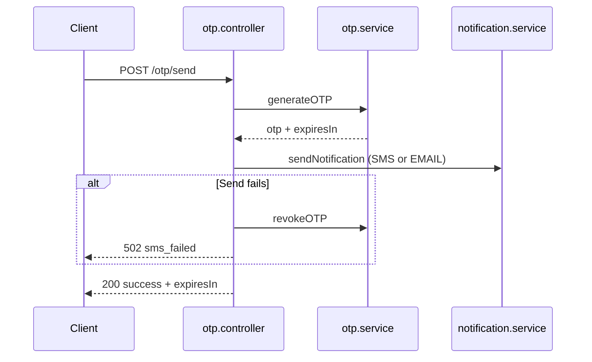
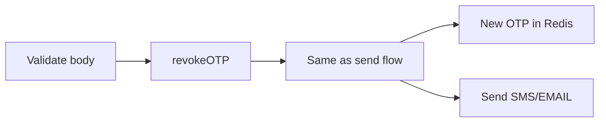
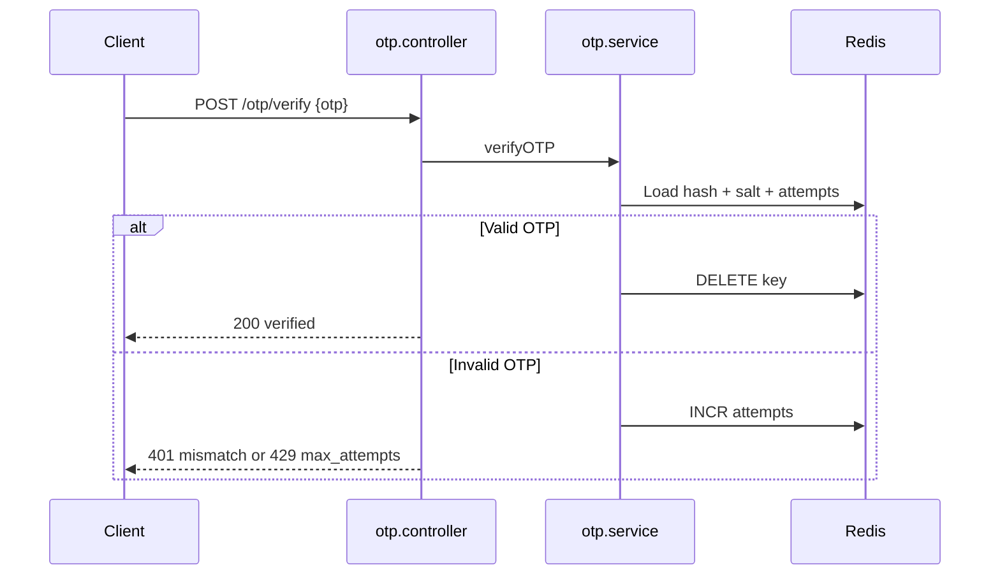

# OTP API

| | |
|---|---|
| **Purpose** | Document the OTP endpoints: send, resend, and verify — including request/response formats, rate limits, and error handling. |
| **Intended Audience** | Client developers integrating OTP flows for SMS or email verification. |
| **Last Updated** | 2026-06-17 |
| **Related Documents** | [Authentication](./authentication.md) · [Error Codes](./error-codes.md) · [Request Lifecycle](../architecture/request-lifecycle.md) · [Notify API](./notify.md) |

---

## Concepts

The OTP API provides a complete verification flow:

1. **Send** — Generate a 6-digit OTP, store salted hash in Redis (TTL 5 minutes), deliver via SMS or email
2. **Resend** — Revoke existing OTP, then send a new one
3. **Verify** — Validate submitted OTP; consume on success; track failed attempts (max 3)

OTP SMS delivery uses **layered DLT rollout** (Phase 8B):

- When `OTP_DLT_ENABLED=true` and the app mapping has `dltEnabled: true`, SMS is sent via Fast2SMS `route=dlt` using the ApnaKart `LOGIN_OTP` template (scoped to your `brandId`).
- Otherwise SMS uses Fast2SMS `route=q` with a fixed free-text message.

API request/response contracts are **unchanged** regardless of delivery mode. EMAIL OTP is unaffected.

See [OTP DLT Migration](../architecture/otp-dlt-migration.md) for rollout and rollback.

### OTP templates — use OTP API only

These ApnaKart catalog templates **must not** be sent via `POST /notify`:

| Template | Endpoints |
|----------|-----------|
| `LOGIN_OTP` | `POST /otp/send` · `POST /otp/verify` · `POST /otp/resend` |
| `LOGIN_OTP_WITH_ID` | Same (+ optional `loginId` on send/resend) |

ELVA generates the 6-digit OTP, stores a hash in Redis, and delivers via DLT SMS. Clients verify with `POST /otp/verify`. Passing `otp` in `/notify` returns **400** `otp_template_not_supported`.

All OTP endpoints require authentication. Send and resend have additional cooldown and rate-limit middleware.

---

## Endpoints Summary

| Method | Path | Middleware chain |
|--------|------|------------------|
| `POST` | `/otp/send` | `validateAppApiKey` → `validateApprovedBrand` → `checkOtpSendCooldown` → `rateLimitOtpSend` |
| `POST` | `/otp/resend` | Same as send |
| `POST` | `/otp/verify` | `validateAppApiKey` → `validateApprovedBrand` |

---

## POST /otp/send

### Send Flow



### Request Body

**SMS (default channel):**

```json
{
  "appId": "ELVA_NOTIFY",
  "apiKey": "shared-platform-api-key",
  "brandId": "enandi",
  "phone": "919876543210"
}
```

**EMAIL:**

```json
{
  "appId": "ELVA_NOTIFY",
  "apiKey": "shared-platform-api-key",
  "brandId": "enandi",
  "channel": "EMAIL",
  "email": "user@example.com"
}
```

| Field | Required | Description |
|-------|----------|-------------|
| `appId` | Yes | ELVA-issued platform application ID (sent on approval) |
| `apiKey` | Yes | ELVA-issued API key paired with your `appId` |
| `brandId` | Yes | Approved tenant brand slug (e.g. `enandi`, `cms`). See `GET /platform/brands`. OTP is stored in Redis per `brandId` + recipient. |
| `phone` | Yes (SMS) | Phone number; normalized to digits |
| `email` | Yes (EMAIL) | Email address |
| `channel` | No | `SMS` (default) or `EMAIL` |
| `loginId` | No | Optional for `LOGIN_OTP_WITH_ID` when enabled for the brand |
| `businessName` | No | Optional override of registry `brandName` in DLT SMS text |

> **Never use `/notify` for login OTP.** See [Notify API](./notify.md) for transactional templates only.

### Success Response — 200

```json
{
  "success": true,
  "message": "OTP sent successfully",
  "expiresIn": 300,
  "requestId": "a1b2c3d4-e5f6-7890-abcd-ef1234567890"
}
```

`expiresIn` is seconds until OTP expires (300 = 5 minutes).

### Error Responses

```json
{
  "success": false,
  "error": "validation_error",
  "message": "phone is required",
  "requestId": "a1b2c3d4-e5f6-7890-abcd-ef1234567890"
}
```

```json
{
  "success": false,
  "error": "cooldown_active",
  "message": "Please wait before requesting another OTP",
  "requestId": "a1b2c3d4-e5f6-7890-abcd-ef1234567890"
}
```

```json
{
  "success": false,
  "error": "sms_failed",
  "message": "Failed to send OTP. Please try again.",
  "requestId": "a1b2c3d4-e5f6-7890-abcd-ef1234567890"
}
```

---

## POST /otp/resend

### Resend Flow



Revokes any existing OTP for the same `brandId` + recipient before generating a new code.

### Request Body

Identical to `/otp/send`.

### Success Response — 200

Same as send.

---

## POST /otp/verify

### Verify Flow



### Request Body

**SMS:**

```json
{
  "appId": "ELVA_NOTIFY",
  "apiKey": "shared-platform-api-key",
  "brandId": "enandi",
  "phone": "919876543210",
  "otp": "482910"
}
```

**EMAIL:**

```json
{
  "appId": "ELVA_NOTIFY",
  "apiKey": "shared-platform-api-key",
  "brandId": "enandi",
  "email": "user@example.com",
  "otp": "482910"
}
```

| Field | Required | Description |
|-------|----------|-------------|
| `appId` | Yes | ELVA-issued platform application ID (sent on approval) |
| `apiKey` | Yes | ELVA-issued API key paired with your `appId` |
| `brandId` | Yes | Same brand slug used in `POST /otp/send` |
| `phone` or `email` | Yes (one) | Recipient used during send |
| `otp` | Yes | Exactly 6 digits |

### Success Response — 200

```json
{
  "success": true,
  "message": "OTP verified successfully",
  "requestId": "b2c3d4e5-f6a7-8901-bcde-f12345678901"
}
```

### Error Responses

| HTTP | error | message |
|------|-------|---------|
| 400 | `validation_error` | Field validation (e.g. missing `otp`) |
| 400 | `invalid_otp_format` | OTP must be exactly 6 digits |
| 400 | `invalid_contact` | Phone/email normalization failed |
| 400 | `invalid_app_id` | App ID normalization failed |
| 401 | `mismatch` | Invalid OTP |
| 404 | `not_found` | No active OTP for this contact |
| 429 | `max_attempts` | Too many failed attempts |

Example:

```json
{
  "success": false,
  "error": "not_found",
  "message": "No active OTP for this contact. Request a new code.",
  "requestId": "c3d4e5f6-a7b8-9012-cdef-123456789012"
}
```

---

## Rate Limits and Cooldowns

| Limit | Scope | Value | Error |
|-------|-------|-------|-------|
| Global | Per `appId` | 10/min | `rate_limited` |
| OTP send | Per normalized phone | 3/min | `rate_limited` |
| OTP send | Per normalized phone | 10/hour | `rate_limited` |
| Cooldown | Per `brandId` + phone (SMS only) | After successful send | `cooldown_active` |
| Verify attempts | Per OTP record | 3 max | `max_attempts` |

Redis keys:

- Rate: `otp:rate:{phone}:minute`, `otp:rate:{phone}:hour`
- Cooldown: `otp:cooldown:{brandId}:{phone}`
- OTP: `otp:{brandId}:{recipient}`

---

## cURL Examples

**Send OTP:**

```bash
curl -X POST {{API_BASE_URL}}/otp/send \
  -H "Content-Type: application/json" \
  -d '{"appId":"ELVA_NOTIFY","apiKey":"shared-platform-api-key","brandId":"enandi","phone":"919876543210"}'
```

**Verify OTP:**

```bash
curl -X POST {{API_BASE_URL}}/otp/verify \
  -H "Content-Type: application/json" \
  -d '{"appId":"ELVA_NOTIFY","apiKey":"shared-platform-api-key","brandId":"enandi","phone":"919876543210","otp":"482910"}'
```

---

## Troubleshooting Notes

| Issue | Likely cause | Action |
|-------|--------------|--------|
| OTP never arrives | Fast2SMS failure | Check `502 sms_failed`; verify `FAST2SMS_API_KEY` |
| `not_found` on verify | OTP expired (5 min) or wrong phone | Resend OTP; ensure same normalized phone |
| `cooldown_active` after failed send | Cooldown only applies after **successful** SMS send | If failing before send, check provider |
| `max_attempts` | 3 wrong OTP entries | Call `/otp/resend` for new code |
| Email OTP fails | SendGrid config | Set `SENDGRID_API_KEY` and `EMAIL_FROM` |
| OTP not DLT when expected | `OTP_DLT_ENABLED` off or app not mapped | Set `OTP_DLT_ENABLED=true`; confirm mapping in `otp-mappings.json` |
| OTP falls back to route `q` | Hybrid app (`CMS`) with DLT failure | Check logs for `otp_dlt_fallback`; fix DLT template/provider first |

---

## Warnings

> **OTP is consumed on successful verify.** A second verify with the same code returns `not_found`.

> **Resend revokes the previous OTP immediately.** Any in-flight verification of the old code will fail.

> **Email channel skips SMS cooldown** but still subject to global rate limits.
