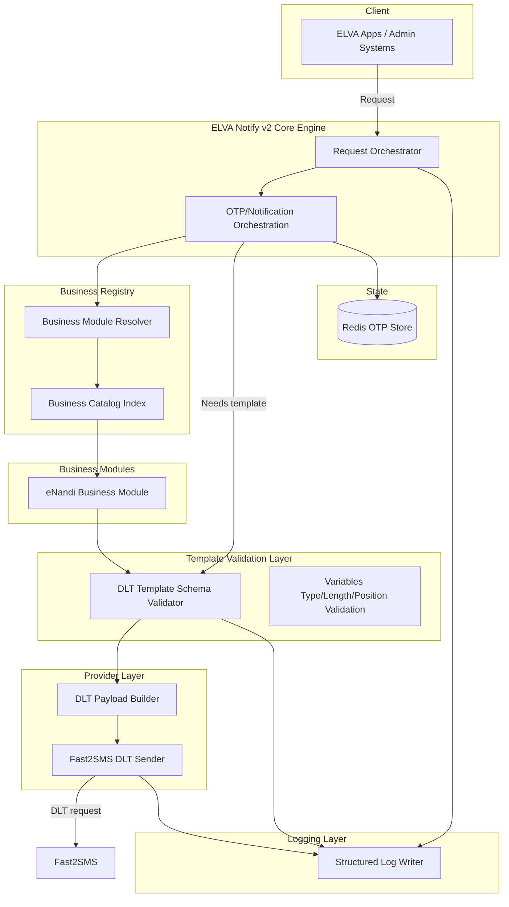
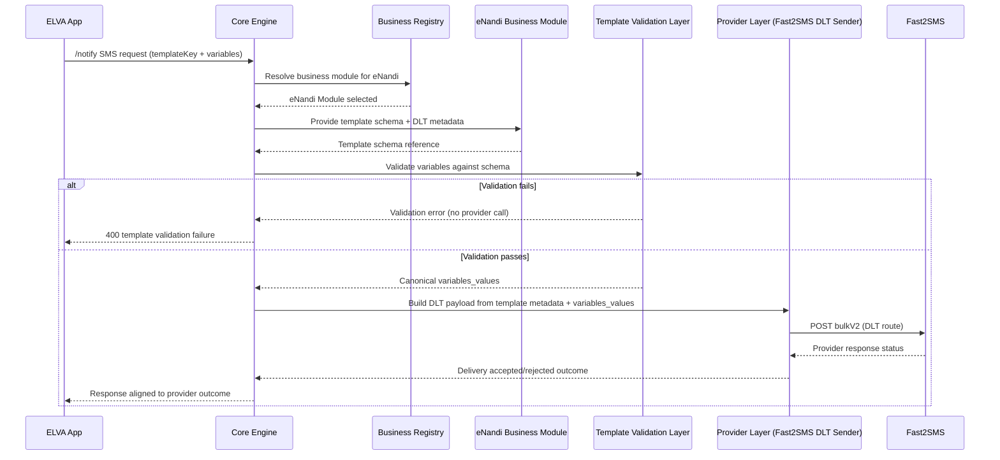

# Vision

ELVA Notify v2 is a single, multi-tenant notification platform that delivers OTPs and transactional SMS using **DLT-approved templates only** for Indian traffic. The system remains a **single Node.js + Express service**, with **business-specific logic isolated** into dedicated modules and **template correctness enforced before any Fast2SMS call**.

# Goals

1. **DLT compliance by construction**  
   SMS content is generated from a **business template registry** and validated against a **DLT variable schema** before calling Fast2SMS.

2. **Business logic isolation**  
   Adding or changing a business (eNandi today; others later) must not require changes to core OTP/notification orchestration.

3. **Backward-safe platform evolution**  
   Existing behavior must not break when new businesses are onboarded.

4. **Template-first messaging API semantics**  
   Template keys + variables become the canonical way to request SMS (legacy free-text is treated as a migration-only concern).

5. **Observability that supports compliance debugging**  
   Structured logging provides correlation across request handling, template resolution/validation, and provider delivery results.

# Non Goals

1. No rewrite of OTP storage mechanics (OTP hashing, TTL, attempts, cooldowns remain Redis-based).
2. No introduction of queues/workers, background jobs, or new databases in Phase 1.
3. No addition of new provider channels beyond existing Fast2SMS (SMS) and SendGrid (EMAIL).
4. No UI/front-end work; documentation is delivered as markdown portal pages only.
5. No “client-supplied DLT IDs” at runtime. DLT metadata remains server-side configured.

# Current Architecture

The current system is a layered monolith Express microservice running at `notify.elvatech.in`:

- OTP lifecycle:
  - Generate OTP and store **hashed OTP + salt** in Redis with TTL (5 minutes).
  - Verify OTP by fetching hash and comparing (timing-safe compare), with attempt counting and OTP consumption.
- SMS lifecycle:
  - SMS is currently sent using Fast2SMS with a non-DLT route and free-form SMS text constructed in the application layer.
- Multi-tenancy:
  - Requests are authenticated using `appId` + `apiKey`.
  - Redis keys are scoped by `appId` (tenant isolation).

The DLT gap today is that **Fast2SMS receives free-text SMS**, not DLT-approved template payloads.

# Target Architecture

ELVA Notify v2 introduces a **Core Engine** that orchestrates OTP/notification flows, while the DLT and business concerns are handled by specialized layers:

- **Core Engine**: request orchestration, authentication/rate-limit integration points, OTP lifecycle orchestration.
- **Business Registry**: resolves the active business module and the template catalog it exposes.
- **Business Modules**: implement business-specific template selection rules and define templateKey-to-variable schemas.
- **Template Validation Layer**: validates templateKey + variables against DLT schema (variable count, type, and position/format constraints) before sending.
- **Logging Layer**: structured logs with compliance-friendly fields and categories.
- **Provider Layer**: Fast2SMS integration using the DLT route and the resolved template metadata.

# Core Components

## Core Engine

Responsibilities:

- Owns the end-to-end request lifecycle orchestration:
  - OTP send/resend/verify flows.
  - Notification send flows for SMS and EMAIL.
- Integrates with existing tenant boundary semantics (`appId` + `apiKey`) and Redis OTP storage.
- Delegates business-specific template selection and variable schemas to business modules.
- Ensures template validation occurs before any provider call for SMS routes governed by DLT.

Key design principle:
- Core Engine must treat business modules as **purely declarative configuration + deterministic selection logic** (no direct provider calls).

## Business Registry

Responsibilities:

- Maintains a registry of supported businesses (Phase 1: only `eNandi`).
- Provides a resolution interface:
  - Given `(businessId, templateKey, event context/variables)`, return:
    - Template schema reference
    - DLT metadata reference (template ID, sender ID, entity ID)
    - Approved variable schema (name/type/position/required)

Constraints:
- Unknown business or unknown templateKey must be handled as validation failures (never silently fall back to free-text).

## Business Modules

Responsibilities:

- Define business-specific mapping of:
  - “business events” (LOGIN, ORDER_PLACED, etc.) to `templateKey`s.
  - `templateKey` to:
    - Required variables
    - Variable types
    - Variable formatting constraints
- Ensure DLT template variable ordering matches the schema expected by Fast2SMS’s `variables_values` contract.

In Phase 1, `eNandi` is the only module registered.

## Template Validation Layer

Responsibilities:

1. Template existence checks:
   - `templateKey` must be known in the business module registry.
2. Variable presence checks:
   - Required variables must be present.
   - No extra variables are allowed unless explicitly permitted by the schema.
3. Variable type/format checks:
   - Types (numeric/string/date/datetime) must match.
   - Length/regex constraints must match the DLT variable schema.
4. Variable position checks:
   - Variables must be provided (or derived) such that their position ordering is deterministic.
5. DLT payload readiness:
   - After validation, the layer produces a canonical representation suitable for Fast2SMS payload construction.

Outcome:
- If any validation step fails, the system returns a template-validation failure and does **not** call Fast2SMS.

## Logging Layer

Responsibilities:

- Emit structured logs on:
  - Request start/end.
  - Template resolution and validation outcomes.
  - Provider call attempt and provider response status.
  - DLT-specific errors.
- Provide required correlation fields consistently across categories.

## Provider Layer

Responsibilities:

- Send SMS through Fast2SMS using the DLT route:
  - Use resolved DLT template ID, sender ID, entity ID.
  - Send the validated `variables_values` derived from the schema.
- Ensure provider error handling returns a consistent service outcome for callers and a compliance-friendly log trail.

# Business Module Concept

Business modules are the unit of isolation. A business module encapsulates:

- Template catalog exposed by the business (`templateKey` set).
- Required variables and their DLT schema constraints.
- Event-to-template selection rules (where applicable for OTP vs notify flows).

### How eNandi Fits

For Phase 1, the Business Registry includes:

- `eNandi` → `ENANDI_BUSINESS_CONTRACT`

The `eNandi` module exports the following `templateKey`s:

- `LOGIN_OTP`
- `LOGIN_OTP_WITH_ID`
- `ORDER_PLACED`
- `ORDER_DELIVERED`
- `OUT_FOR_DELIVERY`

The Core Engine uses these keys when:

- OTP send requests are mapped to the eNandi login template(s).
- `/notify` SMS requests specify `templateKey` + `variables`.

# DLT Integration Strategy

## Template-first integration

- The system does not accept raw DLT template IDs from clients.
- DLT metadata is registered server-side (configured via environment/config artifacts in Phase 1).
- SMS is considered DLT-governed when it uses a DLT-registered templateKey.

## Fast2SMS DLT route strategy

Fast2SMS calls must be made only after the Template Validation Layer confirms:

- templateKey exists for the business
- all required variables are present
- variables meet the DLT schema constraints

The Provider Layer constructs the Fast2SMS payload with:

- `route`: DLT route for templates
- `sender_id`, `message`: resolved DLT template identity
- `variables_values`: positional variable values derived from schema validation
- entity/PEID: resolved DLT entity ID for ELVA’s principal entity model

## Migration model alignment (Phase 1 scope)

Phase 1 is focused on:

- Introducing the template registry + validator
- Enabling Fast2SMS DLT payload submission for DLT-governed SMS

Legacy free-text support is treated as migration-only behavior and must be clearly scoped (documented as non-goal for production strictness).

# Logging Strategy

Logging in v2 is compliance-oriented:

- Every request has a `requestId` for correlation.
- Every template validation and provider call is logged with the required fields so operators can reconstruct:
  - what templateKey was used
  - what variables were validated
  - whether the provider accepted or rejected the DLT payload

Logging is architecture-defined here; see `LOGGING_SPECIFICATION.md` for exact categories and fields.

# Documentation Strategy

Documentation is treated as a product surface for internal ELVA teams:

- Define request/response semantics at the templateKey layer.
- Document all error codes and required variables per template.
- Provide a structured portal hierarchy under `/docs` with consistent navigation.

See `DOCUMENTATION_PORTAL_STRUCTURE.md` for the target portal blueprint.

# Future Business Onboarding Strategy

Onboarding a new business must not require changes to:

- Core Engine
- Existing business modules (including eNandi)
- Validation mechanics
- Provider integration

Only the Business Registry configuration and the new business module definition should change.

## Onboarding workflow (spec-level)

1. Register DLT templates for the business in the DLT portal.
2. Create/update the business contract:
   - define templateKeys
   - define variable schemas and validation rules
   - bind each templateKey to DLT template ID/sender/entity IDs
3. Add the business module entry to Business Registry.
4. Validate the business template schema against expected variable formatting for Fast2SMS.
5. Enable the business in Phase-appropriate environments.

# Appendix: Template Validation and Provider Sequence (eNandi)

