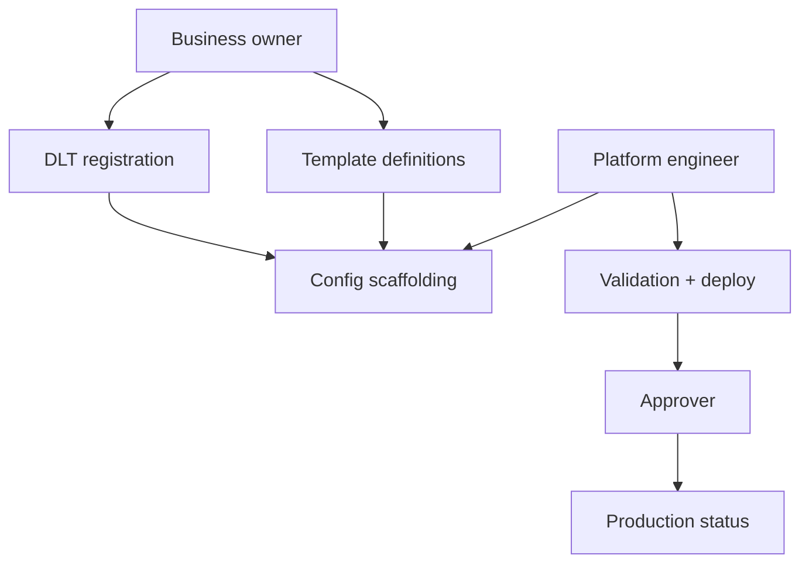

# Business Governance

| | |
|---|---|
| **Purpose** | Platform governance for multi-business onboarding, ownership, and lifecycle. |
| **Intended Audience** | Platform maintainers, business owners, release approvers. |
| **Last Updated** | 2026-06-05 |
| **Related Documents** | [Onboarding Guide](../businesses/onboarding-guide.md) · [Business Onboarding Runbook](../runbooks/business-onboarding.md) |

---

## Principles

1. **Configuration over code** — new businesses require JSON only
2. **Fail fast at startup** — invalid schema blocks deployment
3. **Gradual production readiness** — Draft → Ready → Production
4. **Observable onboarding** — portal and health snapshots reflect state

---

## Naming standards

| Asset | Pattern | Example |
|-------|---------|---------|
| `businessId` | `^[a-z][a-z0-9-]*$` | `apnakart`, `workspace` |
| `templateKey` | `SCREAMING_SNAKE_CASE` | `LOGIN_OTP` |
| Folder name | Must equal `businessId` | `backend/config/businesses/apnakart/` |

---

## Ownership model

| Role | Responsibility |
|------|----------------|
| Business owner | DLT entity, sender ID, template content approval |
| Platform engineer | Config scaffolding, validation, deployment |
| Approver | Production readiness sign-off |

---

## DLT ownership

- Entity ID and sender ID owned by business legal entity
- Template IDs registered per business in TRAI DLT portal
- Platform stores IDs in config; does not modify DLT payload generation

---

## Template ownership

- Each business maintains its own `templates.json`
- Template keys are unique within a business
- Template IDs must be globally unique within a business catalog

---

## Onboarding approvals

Production promotion requires:

1. `npm run validate:businesses` → `PASS` (no FAIL)
2. No placeholder DLT values
3. Portal checklist all green for production apps
4. Stakeholder sign-off documented

---

## Retirement process

1. Remove OTP mappings referencing business
2. Deprecate templates (do not delete until consumers migrated)
3. Remove business folder
4. Restart backend and rebuild manifest

---

## Versioning strategy

- `business.json` `version` field tracks config generation (e.g. `v1`, `v2`)
- Breaking template changes require new template keys or version bump
- Portal displays version per business

---

## Phase 9A tooling

| Tool | Purpose |
|------|---------|
| `create-business.mjs` | Scaffold new business |
| `validate:businesses` | CLI validation |
| `business-health-snapshot.json` | Runtime health |
| `/platform/businesses` | Onboarding dashboard |
