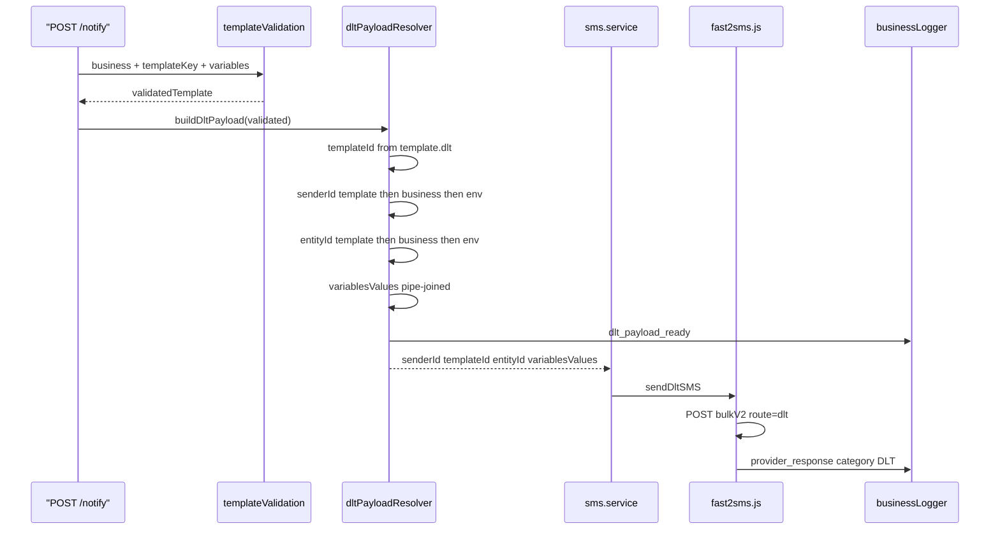
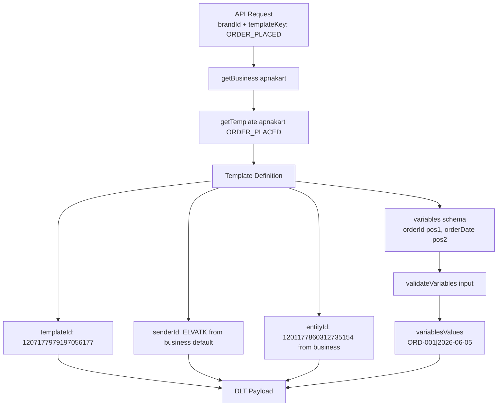
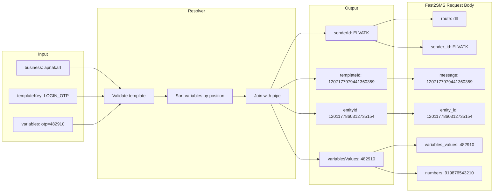

# DLT Layer

| | |
|---|---|
| **Purpose** | Explain DLT (Distributed Ledger Technology) SMS compliance, how ELVA Notify builds and sends DLT payloads, and the approved ApnaKart configuration. |
| **Intended Audience** | Developers, DevOps engineers, ELVA team members, and business integrators sending templated SMS in India. |
| **Last Updated** | 2026-06-05 |
| **Related Documents** | [Architecture Overview](./overview.md) · [Request Lifecycle](./request-lifecycle.md) · [Notify API](../api/notify.md) · [ApnaKart Templates](../businesses/apnakart.md) · [Error Codes](../api/error-codes.md) |

---

## Concepts

In India, commercial SMS must comply with **DLT** regulations administered by telecom operators. Messages must be sent using:

- A registered **Principal Entity ID (PEID / entity ID)**
- An approved **Sender ID** (header)
- An approved **Template ID** with variable placeholders
- Variable values that match the registered template format

ELVA Notify implements DLT delivery via **Fast2SMS** using `route: "dlt"`. Template metadata is owned by **business modules** (currently ApnaKart). The **DLT Payload Resolver** transforms validated API requests into provider-ready payloads.

### Key Terms

| Term | Description | ApnaKart value |
|------|-------------|--------------|
| **PEID / Entity ID** | Principal Entity Identifier registered on DLT portal | `1201177860312735154` |
| **Sender ID** | 6-character SMS header shown to recipient | `ELVATK` |
| **Template ID** | DLT-registered template identifier | Per-template (see below) |
| **variables_values** | Pipe-separated variable values in position order | e.g. `482910` or `ORD-001\|2026-06-05` |

---

## Approved ApnaKart DLT Configuration

### Business-Level Defaults

From `backend/config/businesses/apnakart/config.js`:

| Field | Value |
|-------|-------|
| Template group ID | `apnakart` |
| PEID (entityId) | `1201177860312735154` |
| Default Sender ID | `ELVATK` |

### Template IDs

| Template Key | Template ID | Purpose |
|--------------|-------------|---------|
| `LOGIN_OTP` | `1207177979441360359` | Login OTP (1 variable: `otp`) |
| `LOGIN_OTP_WITH_ID` | `1207177979905330405` | Login OTP with login ID |
| `ORDER_PLACED` | `1207177979197056177` | Order placed notification |
| `ORDER_DELIVERED` | `1207177979979637116` | Order delivered notification |
| `OUT_FOR_DELIVERY` | `1207177987065122467` | Out for delivery notification |

---

## DLT Send Sequence



---

## Template Resolution Diagram



### Metadata Resolution Order

The resolver (`buildDltPayload`) picks the first non-empty value:

| Field | Priority 1 | Priority 2 | Priority 3 |
|-------|------------|------------|------------|
| `templateId` | `template.dlt.templateId` | — | — |
| `senderId` | `template.dlt.senderId` | `business.dlt.defaultSenderId` | `FAST2SMS_DEFAULT_SENDER_ID` env |
| `entityId` | `template.dlt.entityId` | `business.dlt.entityId` | `FAST2SMS_ENTITY_ID` env |

For ApnaKart, template and business config provide all values; environment fallbacks are optional.

---

## DLT Payload Transformation



> **Important:** In Fast2SMS DLT route, the `message` field carries the **Template ID**, not the rendered text. The provider substitutes variables using `variables_values`.

---

## Legacy SMS vs DLT Comparison

| Aspect | Legacy SMS (`message`) | DLT Template SMS (`business` + `templateKey`) |
|--------|------------------------|-----------------------------------------------|
| **Endpoint** | `POST /otp/send` (OTP API) | `POST /notify` |
| **Required fields** | `message` | `business`, `templateKey`, `variables` |
| **Fast2SMS route** | `q` | `dlt` |
| **Message content** | Free text in `message` field | Template ID in `message` field |
| **Compliance** | May not meet DLT template rules | Uses approved template IDs |
| **Validation** | Length/non-empty only | Full variable schema validation |
| **Sender ID** | Provider default | `ELVATK` (ApnaKart) |
| **Entity ID** | Not sent | `1201177860312735154` |
| **Response** | No `templateKey` | Includes `templateKey` |
| **Logging category** | `NOTIFICATION` | `DLT` + `NOTIFICATION` |
| **OTP path** | OTP uses legacy route `q` | OTP **not** on DLT today |

---

## Real Request Example

```json
{
  "appId": "enandi-app",
  "apiKey": "your-secret-key",
  "channel": "SMS",
  "to": ["919876543210"],
  "business": "apnakart",
  "templateKey": "LOGIN_OTP",
  "variables": {
    "otp": "482910"
  }
}
```

## Real Success Response

```json
{
  "success": true,
  "message": "Notification sent",
  "channel": "SMS",
  "templateKey": "LOGIN_OTP",
  "requestId": "f47ac10b-58cc-4372-a567-0e02b2c3d479"
}
```

## Fast2SMS DLT Payload (internal)

After resolution, the provider receives:

```json
{
  "route": "dlt",
  "sender_id": "ELVATK",
  "message": "1207177979441360359",
  "variables_values": "482910",
  "language": "english",
  "numbers": "919876543210",
  "entity_id": "1201177860312735154"
}
```

---

## Error Scenarios

| Stage | Error | HTTP | Cause |
|-------|-------|------|-------|
| Validation | `unsupported_business` | 400 | `business` not in registry |
| Validation | `invalid_template` | 400 | Unknown `templateKey` |
| Validation | `missing_variable` | 400 | Required variable absent |
| Validation | `validation_error` | 400 | Wrong format (date, pattern, length) |
| Resolver | `dlt_metadata_missing` | 500* | Missing templateId/senderId/entityId |
| Provider | `notification_failed` | 500 | Fast2SMS HTTP or API rejection |

\* `dlt_metadata_missing` is thrown as `TemplateValidationError` during send; the notify controller surfaces it as **500** `notification_failed`, not 400.

---

## Troubleshooting Notes

| Issue | Diagnosis | Fix |
|-------|-----------|-----|
| SMS not delivered, HTTP 200 | Check Fast2SMS response `return: false` in logs | Verify template ID active on DLT portal |
| `Invalid template id` from provider | Template ID mismatch | Confirm ID matches table above |
| Wrong variable order | `variablesValues` pipe order | Variables sorted by `position` in template schema |
| `unsupported_business` | Typo in business field | Use exactly `apnakart` (lowercase) |
| Mixed `message` + `templateKey` | `classifyNotifySmsMode` → `mixed` | Send only one mode per request |
| OTP not using DLT | `OTP_DLT_ENABLED` off or app not mapped | Set `OTP_DLT_ENABLED=true` and map app in `otp-mappings.json`; use `POST /otp/send` |

---

## Warnings

> **Do not hardcode DLT IDs in client applications.** Reference `templateKey` only. IDs are resolved server-side from the business module.

> **Variable formats are strict.** Dates must be `YYYY-MM-DD`, datetimes `YYYY-MM-DD HH:mm`, times `HH:mm`. See [ApnaKart Templates](../businesses/apnakart.md).

> **OTP DLT is opt-in.** When `OTP_DLT_ENABLED=true` and the app is mapped in `otp-mappings.json`, `POST /otp/send` uses the same DLT payload builder as notify. OTP templates are blocked on `POST /notify` with `otp_template_not_supported`.

---

## Future Extensibility

- Add per-template `senderId` override in template definitions
- Support multiple SMS providers with DLT route abstraction
- Migrate OTP send to `LOGIN_OTP` DLT template — **done** when `OTP_DLT_ENABLED=true`
- Environment-level DLT defaults for businesses without embedded config
