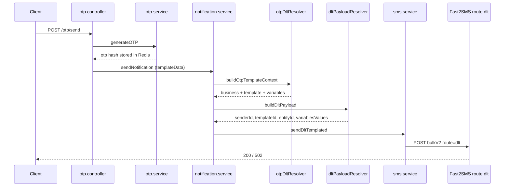
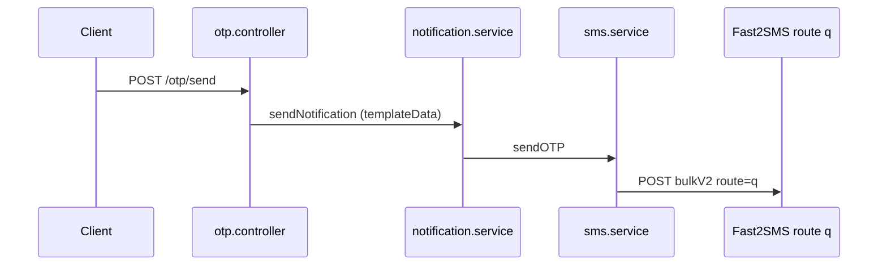
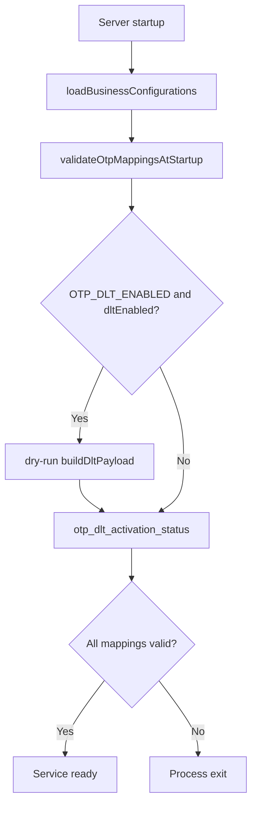

# OTP DLT Migration

| | |
|---|---|
| **Purpose** | Describe OTP delivery architecture, DLT activation (Phase 8B), appId→template mappings, resolver infrastructure, rollout controls, and startup validation. |
| **Intended Audience** | Developers, operations teams, and platform maintainers managing OTP DLT compliance. |
| **Last Updated** | 2026-06-05 |
| **Related Documents** | [DLT Layer](./dlt-layer.md) · [Request Lifecycle](./request-lifecycle.md) · [eNandi Business](../businesses/enandi.md) · [OTP API](../api/otp.md) |

---

## OTP SMS delivery (Phase 8B)

OTP SMS delivery supports **layered rollout** between legacy free-text (`route=q`) and DLT-templated (`route=dlt`) delivery.

### Activation rule (Phase 8B + 8D)

```
dltActive = OTP_DLT_ENABLED === true AND mapping.dltEnabled === true
```

| Condition | Primary delivery | On DLT failure |
|-----------|------------------|----------------|
| DLT inactive | Fast2SMS `route=q` | N/A |
| DLT active + `legacyRouteEnabled=true` (hybrid) | Fast2SMS `route=dlt` | `otp_dlt_fallback` → `route=q` |
| DLT active + `legacyRouteEnabled=false` (DLT-only) | Fast2SMS `route=dlt` | `otp_dlt_hard_failure` — no fallback |

```
dltOnly = dltActive AND legacyRouteEnabled === false
```

### DLT flow (when active)



### Legacy fallback flow



**Unchanged:** OTP verify, Redis, cooldowns, rate limits, API contracts, EMAIL OTP, Notify DLT.

---

## Rollout configuration

### Global master switch

```env
OTP_DLT_ENABLED=false
```

Set to `true` to allow per-app DLT activation. Default is `false` for safe rollout.

### Per-app mapping

`backend/config/otp-mappings.json`:

```json
{
  "eNandi": {
    "business": "enandi",
    "templateKey": "LOGIN_OTP",
    "dltEnabled": true,
    "legacyRouteEnabled": false
  }
}
```

| Field | Description |
|-------|-------------|
| `appId` (key) | Application identifier (matches `APP_CREDENTIALS_JSON`) |
| `business` | Registered business module ID |
| `templateKey` | DLT template key from business catalog |
| `dltEnabled` | Per-app opt-in (`true` required for DLT delivery) |
| `legacyRouteEnabled` | When `false` with DLT active, app is DLT-only (Phase 8D retired). Default `true` if omitted. |

### Rollback

1. Set `OTP_DLT_ENABLED=false` in environment.
2. Restart backend.
3. All OTP SMS immediately revert to `route=q`.

Per-app rollback: set `dltEnabled: false` and restart.

---

## Mapping model

Future multi-app example:

```json
{
  "bank-app": {
    "business": "banking",
    "templateKey": "LOGIN_OTP",
    "dltEnabled": false
  }
}
```

---

## Resolver flow

`backend/src/services/otpDltResolver.service.js`:

| Function | Returns |
|----------|---------|
| `isOtpDltEnabled(appId)` | `boolean` — global + per-app activation |
| `isLegacyFallbackAllowed(appId)` | `boolean` — per-app `legacyRouteEnabled` |
| `isDltOnly(appId)` | `boolean` — DLT active with fallback disabled |
| `getOtpDeliveryPolicy(appId)` | `{ deliveryPolicy, fallbackAllowed, templateId, ... }` |
| `resolveOtpConfiguration(appId)` | `{ appId, businessId, templateKey, business, dltEnabled, legacyRouteEnabled }` |
| `resolveOtpTemplate(appId)` | Template object with `dlt` metadata |
| `buildOtpTemplateContext({ appId, otp, loginId? })` | `{ businessId, templateKey, template, variables }` |

Example output for `appId: eNandi`, `otp: 123456`:

```json
{
  "businessId": "enandi",
  "templateKey": "LOGIN_OTP",
  "variables": {
    "otp": "123456"
  }
}
```

Resulting DLT payload (via `buildDltPayload`):

```json
{
  "senderId": "ELVATK",
  "templateId": "1207177979441360359",
  "entityId": "1201177860312735154",
  "variablesValues": "123456"
}
```

---

## Startup validation flow

`otpMappingValidator.service.js` runs after business registry load at startup.



Validates:

- Mapping `appId` present in `APP_CREDENTIALS_JSON` (when credentials configured)
- `business` exists in registry
- `templateKey` exists for business
- `dltEnabled` is boolean when present
- Template defines required OTP variables (`otp`; `loginId` for `LOGIN_OTP_WITH_ID`)
- When DLT active for mapping: DLT metadata completeness via `buildDltPayload` dry-run

Failures abort startup — no partial load.

---

## Logging (Phase 8B + 8C)

| Event | When |
|-------|------|
| `otp_dlt_activation_status` | Startup — global flag + enabled/legacy app lists |
| `otp_config_health` | Startup — config health snapshot summary (8C) |
| `otp_dlt_dispatch` | OTP SMS entering DLT path |
| `otp_dlt_fallback` | DLT inactive or provider failure with fallback allowed |
| `otp_dlt_hard_failure` | DLT failed, `legacyRouteEnabled=false` — no route=q (8D) |
| `otp_cutover_status` | Startup — retired/hybrid/legacy app lists (8D) |
| `otp_legacy_route_retired` | Startup — per retired app summary (8D) |
| `otp_notification_dispatch` | OTP send started (unchanged) |
| `otp_delivery_completed` | Terminal OTP dispatch — SLI source (8C) |
| `otp_verify_outcome` | All verify outcomes (8C) |
| `dlt_payload_ready` | DLT payload built (reused from Notify) |
| `provider_response` | Fast2SMS response (`route=dlt` or `route=q`; includes `durationMs`) |

Log context includes `appId`, `business`, `templateKey`, `templateId`, `deliveryMode` where applicable.

See [OTP DLT Observability](./otp-dlt-observability.md).

---

## Migration phases

| Phase | Focus | OTP SMS delivery |
|-------|-------|------------------|
| **Pre-8A** | Route `q` free-text only | Production |
| **8A** | Mappings + resolver + validation + portal | Route `q` (unchanged) |
| **8B** | Wire resolver into send path + rollout flags | Route `dlt` when enabled; `route=q` fallback |
| **8C** | Observability + health snapshot + runbooks | Unchanged delivery; ops visibility |
| **8D** | Per-app `legacyRouteEnabled` retirement | DLT-only for retired apps; hybrid/legacy for others |

---

## Platform visibility

Operational dashboard at [/platform/otp](/platform/otp): rollout overview, delivery policy, retirement status, configuration health, retirement readiness gate, runbook links (read-only, manifest-generated).

Health snapshot: `backend/.generated/otp-health-snapshot.json` (generated at startup; `npm run otp:health`).

---

## Cross-links

- Observability: [OTP DLT Observability](./otp-dlt-observability.md)
- Runbooks: [Outage](../runbooks/otp-dlt-outage.md) · [Rollback](../runbooks/otp-dlt-rollback.md) · [Rollout](../runbooks/otp-dlt-rollout.md)
- DLT concepts: [DLT Layer](./dlt-layer.md)
- OTP HTTP flow: [Request Lifecycle](./request-lifecycle.md) · [OTP API](../api/otp.md)
- eNandi template catalog: [eNandi Business](../businesses/enandi.md)
