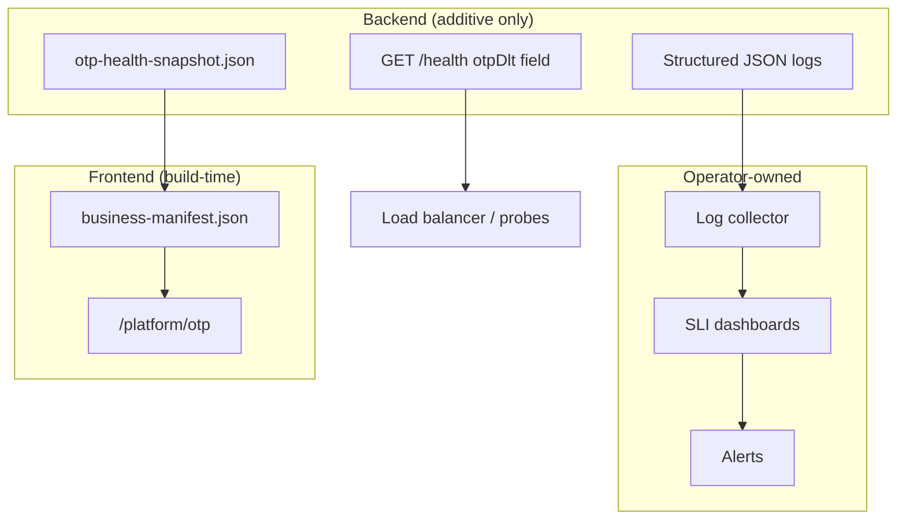

# OTP DLT Observability

| | |
|---|---|
| **Purpose** | SLIs, log taxonomy, health snapshots, and aggregation guidance for OTP DLT operations (Phase 8C). |
| **Intended Audience** | Operations, SRE, on-call engineers, platform maintainers. |
| **Last Updated** | 2026-06-05 (Phase 8D) |
| **Related Documents** | [OTP DLT Migration](./otp-dlt-migration.md) · [Log Triage Runbook](../runbooks/otp-dlt-log-triage.md) · [Logging Specification](./LOGGING_SPECIFICATION.md) · [Platform OTP Dashboard](/platform/otp) |

---

## Architecture



Phase 8C added visibility; Phase 8D adds per-app retirement (`legacyRouteEnabled`) and controlled fallback behavior.

---

## Service level indicators

| SLI | Target | Primary event | Query pattern |
|-----|--------|---------------|---------------|
| OTP SMS success rate | ≥ 99.5% | `otp_delivery_completed` | `status=completed` / total |
| DLT delivery share | → 100% | `otp_delivery_completed` | `deliveryMode=dlt` count |
| Fallback rate | → 0 before 8D | `otp_dlt_fallback` | event count |
| DLT provider acceptance | ≥ 99% | `provider_response` | `route=dlt return:true` |
| OTP verify success | Stable | `otp_verify_outcome` | `outcome=success` ratio |
| Provider latency p95 | < 3s | `provider_response` | `percentile(durationMs, 95)` |

Run `npm run otp:health` for config snapshot. Run `node backend/scripts/otp-log-query-reference.mjs` for query templates.

---

## Phase 8C log events

| Event | Category | Key fields |
|-------|----------|------------|
| `otp_config_health` | SYSTEM | `configHealthStatus`, `mappingCount`, `activeDltCount` |
| `otp_delivery_completed` | OTP | `appId`, `deliveryMode`, `providerRoute`, `durationMs`, `status` |
| `otp_verify_outcome` | OTP | `appId`, `outcome`, `reason` |

## Phase 8D log events

| Event | Category | Key fields |
|-------|----------|------------|
| `otp_dlt_hard_failure` | OTP | `appId`, `business`, `templateKey`, `templateId`, `deliveryMode`, `fallbackAllowed: false` |
| `otp_cutover_status` | SYSTEM | `retiredApps`, `hybridApps`, `legacyApps`, `retirementPercent` |
| `otp_legacy_route_retired` | SYSTEM | `appId`, `business`, `templateKey`, `templateId`, `deliveryMode`, `fallbackAllowed` |

Existing 8B events: `otp_dlt_dispatch`, `otp_dlt_fallback`, `otp_dlt_activation_status`.

**Security:** Never log OTP values, `variables_values`, or secrets.

---

## Health snapshot

**Path:** `backend/.generated/otp-health-snapshot.json`

| Field | Description |
|-------|-------------|
| `generatedAt` | ISO timestamp |
| `globalDltEnabled` | From `OTP_DLT_ENABLED` |
| `stats` | Mapping counts, active DLT % |
| `configHealth` | Registry and metadata status |
| `retirement` | `retiredApps`, `hybridApps`, `legacyApps`, `retirementPercent` |
| `retirementReadiness` | Phase 8D gate checks |
| `deliveryBreakdown` | `dlt_only`, `hybrid`, `legacy_q` counts |

Generated at startup (fail-open) and via `npm run otp:health`. Merged into `business-manifest.json` at frontend build.

---

## Portal dashboard

[/platform/otp](/platform/otp) sections:

1. **Summary** — mapping, DLT-only, hybrid, legacy counts
2. **Rollout overview** — global flag, delivery breakdown
3. **Delivery policy** — per-app DLT / fallback / mode
4. **Retirement status** — per-app status and readiness summary
5. **Configuration health** — snapshot indicators
6. **Retirement readiness gate** — config + manual log checks
7. **Runbooks** — operational doc links
8. **Mapping table** — per-app metadata

Read-only. No backend API polling.

---

## GET /health extension (additive)

```json
{
  "status": "ok",
  "service": "elva-otp-service",
  "timestamp": "...",
  "requestId": "...",
  "otpDlt": {
    "globalDltEnabled": false,
    "mappingCount": 1,
    "activeDltCount": 0,
    "configHealthStatus": "healthy",
    "retirementConfigReady": false,
    "retiredApps": 1,
    "hybridApps": 0,
    "retirementPercent": 50,
    "snapshotGeneratedAt": "..."
  }
}
```

`otpDlt` omitted if snapshot not yet generated.

---

## Cross-links

- Outage: [otp-dlt-outage.md](../runbooks/otp-dlt-outage.md)
- Rollback: [otp-dlt-rollback.md](../runbooks/otp-dlt-rollback.md)
- Rollout: [otp-dlt-rollout.md](../runbooks/otp-dlt-rollout.md)
- Retirement: [otp-dlt-retirement-readiness.md](../runbooks/otp-dlt-retirement-readiness.md)
