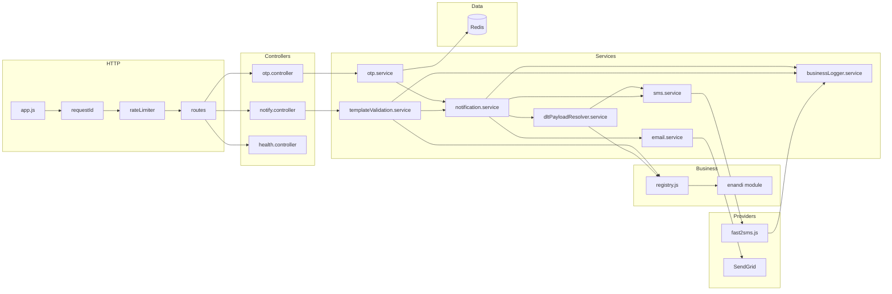
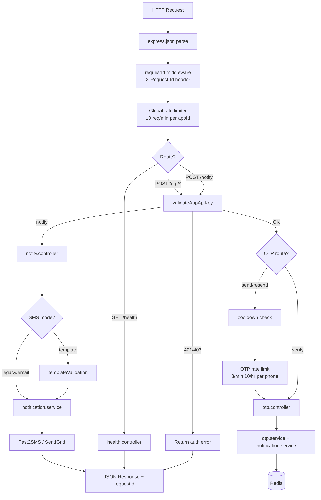

# Architecture Overview

| | |
|---|---|
| **Purpose** | Describe the current ELVA Notify v2 system architecture: components, folder layout, and how requests flow through the service. |
| **Intended Audience** | New developers, future maintainers, and DevOps engineers onboarding to the codebase. |
| **Last Updated** | 2026-06-05 |
| **Related Documents** | [Documentation Portal](../README.md) · [Request Lifecycle](./request-lifecycle.md) · [DLT Layer](./dlt-layer.md) · [Authentication](../api/authentication.md) · [Notify API](../api/notify.md) · [eNandi Business](../businesses/enandi.md) |

---

## Concepts

ELVA Notify follows a **layered monolith** pattern: a single Node.js process exposes HTTP endpoints and delegates to service modules. Business-specific template data lives in isolated modules under `src/businesses/`, registered at startup via a **Business Registry**. Delivery paths (OTP, legacy SMS, DLT SMS, email) converge in the **Notification Service**.

Key design principles:

- **Multi-tenant isolation** — `appId` scopes OTP storage and authentication.
- **Separation of validation and delivery** — Template validation runs before DLT payload build and send.
- **Provider abstraction at service level** — SMS goes through `sms.service.js`; Fast2SMS is the current provider implementation.
- **Centralized logging** — Controllers do not log; services emit structured JSON via `businessLogger`.

---

## Current Architecture — Component Diagram



---

## Core Components

### Business Registry

**Location:** `src/businesses/registry.js`, `src/businesses/index.js`

Central index of registered business modules. Provides `getBusiness()`, `getTemplate()`, `listBusinesses()`, `listTemplates()`. Businesses self-register at startup; adding a new business does not require modifying existing modules.

### Business Modules

**Location:** `src/businesses/<name>/`

Each module bundles:

- `config.js` — `businessId`, display name, DLT defaults (PEID, sender ID)
- `templates.js` — Template catalog with variable schemas and per-template DLT IDs
- `index.js` — Facade exposing `getTemplate()`, `listTemplateKeys()`

Currently registered: **eNandi** (`enandi`).

### Validation Layer

**Location:** `src/services/templateValidation/`

Validates `/notify` DLT requests:

1. Resolve `business` → business module
2. Resolve `templateKey` → template definition
3. Validate `variables` against schema (type, length, pattern, format)

Throws `TemplateValidationError` with machine-readable `code` on failure.

### DLT Layer

**Location:** `src/services/dltPayloadResolver.service.js`

Transforms validated template + variables into Fast2SMS DLT payload:

- `senderId`, `templateId`, `entityId`, `variablesValues` (pipe-separated)

Resolution order: template DLT → business DLT → environment fallback.

### Notification Layer

**Location:** `src/services/notification.service.js`

Single dispatch entry point `sendNotification()`. Routes by channel:

| Path | Condition | Handler |
|------|-----------|---------|
| DLT SMS | `validatedTemplate` present | `buildDltPayload` → `sendDltTemplated` |
| Legacy SMS | `message` string present | `sendMessage` (route `q`) |
| OTP SMS | `templateData.otp` present | `sendOTP` (route `q`) |
| Email | `channel: EMAIL` | `sendEmail` via SendGrid |

### Logging Layer

**Location:** `src/services/logging/`

Categories: `SYSTEM`, `BUSINESS`, `OTP`, `NOTIFICATION`, `DLT`, `ERROR`.

All logs include: `requestId`, `business`, `templateKey`, `channel`, `recipient`, `status`, `provider`, `templateId`, `businessVersion` (default `v1`).

---

## Folder Structure

```
elva-notify-platform/
├── docs/                          # Markdown documentation source
│   ├── README.md
│   ├── architecture/
│   ├── api/
│   └── businesses/
├── frontend/                      # Next.js documentation portal
├── backend/
│   ├── public/                    # API landing page (index.html)
│   ├── src/
│   │   ├── app.js                 # Express app, middleware, error handler
│   │   ├── server.js              # Startup: Redis connect, listen
│   │   ├── businesses/
│   │   │   ├── index.js           # Registry bootstrap
│   │   │   ├── registry.js        # Business Registry
│   │   │   └── enandi/
│   │   │       ├── config.js      # PEID, sender ID
│   │   │       ├── templates.js   # Template catalog
│   │   │       └── index.js       # Module facade
│   │   ├── config/
│   │   │   ├── allowedApps.js       # APP_CREDENTIALS_JSON loader
│   │   │   ├── channels.js        # SUPPORTED_CHANNELS
│   │   │   └── env.js             # Environment config
│   │   ├── controllers/
│   │   ├── middleware/
│   │   ├── routes/
│   │   ├── services/
│   │   └── utils/
│   ├── package.json
│   └── .env.example
└── package.json                   # Root orchestrator scripts
```

---

## Request Processing Overview



---

## API Surface Summary

| Method | Path | Auth | Controller |
|--------|------|------|------------|
| `GET` | `/health` | No | `health.controller` |
| `GET` | `/` | No | Static HTML |
| `POST` | `/otp/send` | Yes | `otp.controller` |
| `POST` | `/otp/resend` | Yes | `otp.controller` |
| `POST` | `/otp/verify` | Yes | `otp.controller` |
| `POST` | `/notify` | Yes | `notify.controller` |

Route mounting: `health.routes.js` mounts `/health` and `/otp/*`; `notify.routes.js` mounts `/notify`.

---

## Real Request Example

```http
POST /notify HTTP/1.1
Host: notify.elvatech.in
Content-Type: application/json

{
  "appId": "enandi-app",
  "apiKey": "your-secret-key",
  "channel": "SMS",
  "to": ["919876543210"],
  "business": "enandi",
  "templateKey": "ORDER_PLACED",
  "variables": {
    "orderId": "ORD-2026-001",
    "orderDate": "2026-06-05"
  }
}
```

## Real Response Example

```json
{
  "success": true,
  "message": "Notification sent",
  "channel": "SMS",
  "templateKey": "ORDER_PLACED",
  "requestId": "f47ac10b-58cc-4372-a567-0e02b2c3d479"
}
```

---

## Troubleshooting Notes

| Issue | Check |
|-------|-------|
| Service won't start | Redis connectivity (`REDIS_URL` or `REDIS_HOST:REDIS_PORT`) |
| All routes return 429 | Global rate limit (10/min) — check `appId` keying |
| DLT sends fail silently in logs | Search logs for `provider_response_failed` with `category: DLT` |
| Template not found | Confirm `business` is `enandi` and `templateKey` matches catalog exactly |

---

## Future Extensibility

- **New business:** Add `src/businesses/<name>/`, call `registerBusiness()` in `src/businesses/index.js`.
- **New SMS provider:** Implement provider module, wire through `sms.service.js`.
- **OTP DLT migration:** Wire OTP send path to use eNandi `LOGIN_OTP` template instead of route `q`.
- **New channels:** Extend `SUPPORTED_CHANNELS` and add handler in `notification.service.js`.
