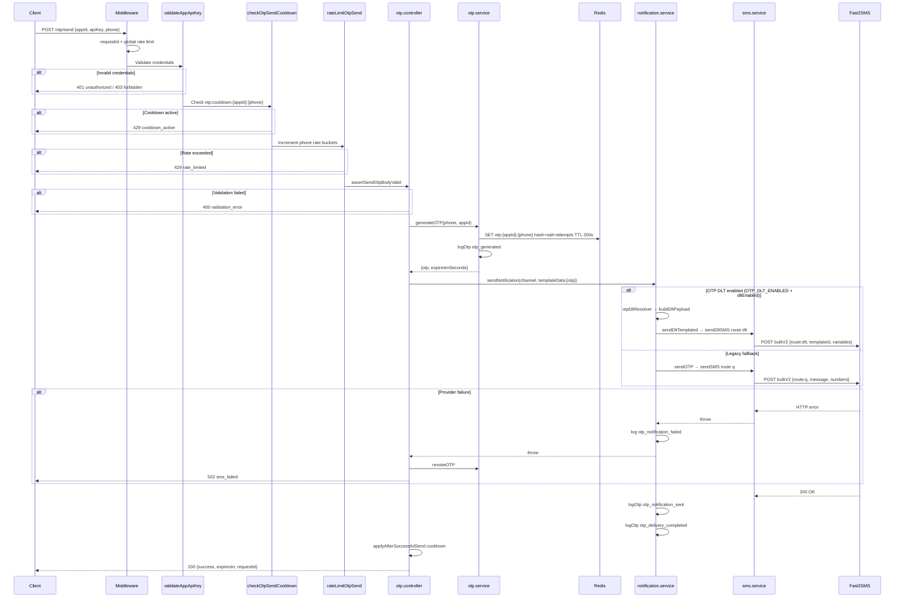
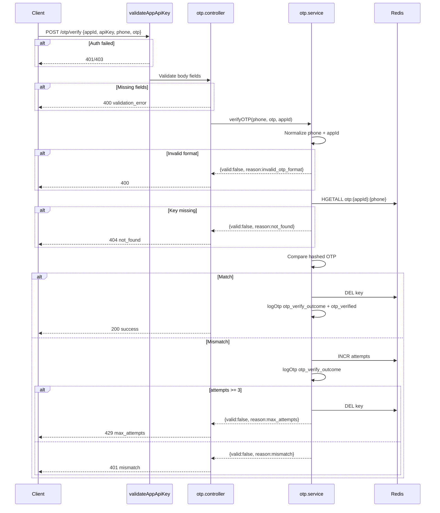
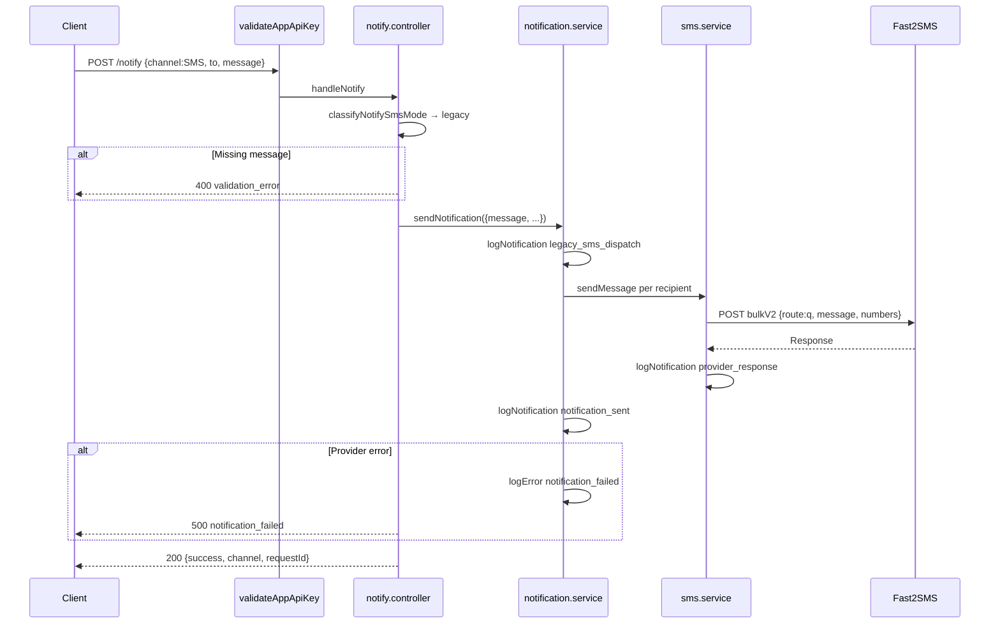
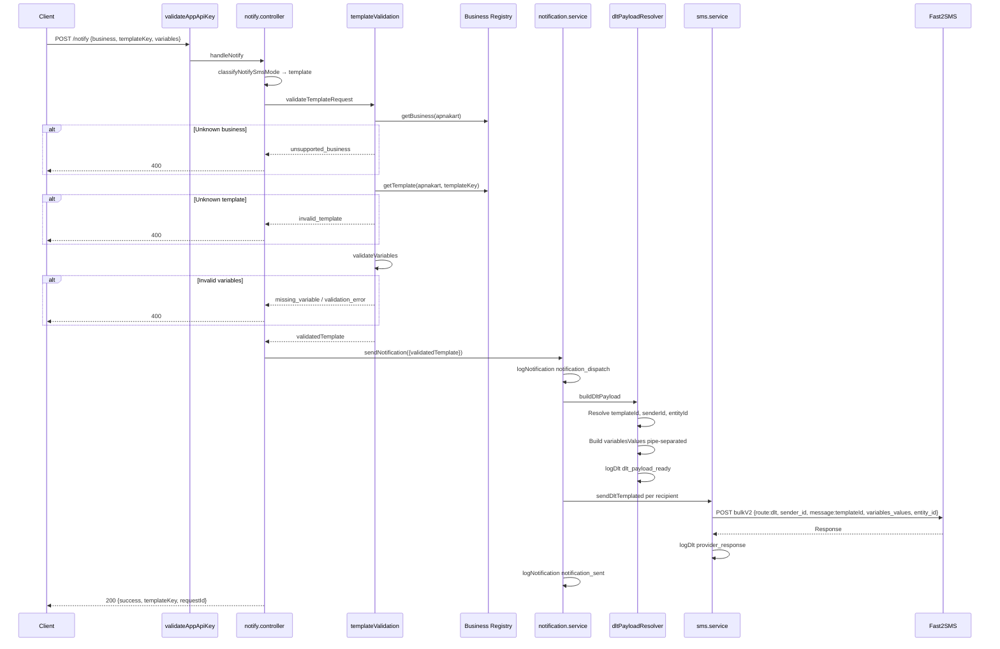
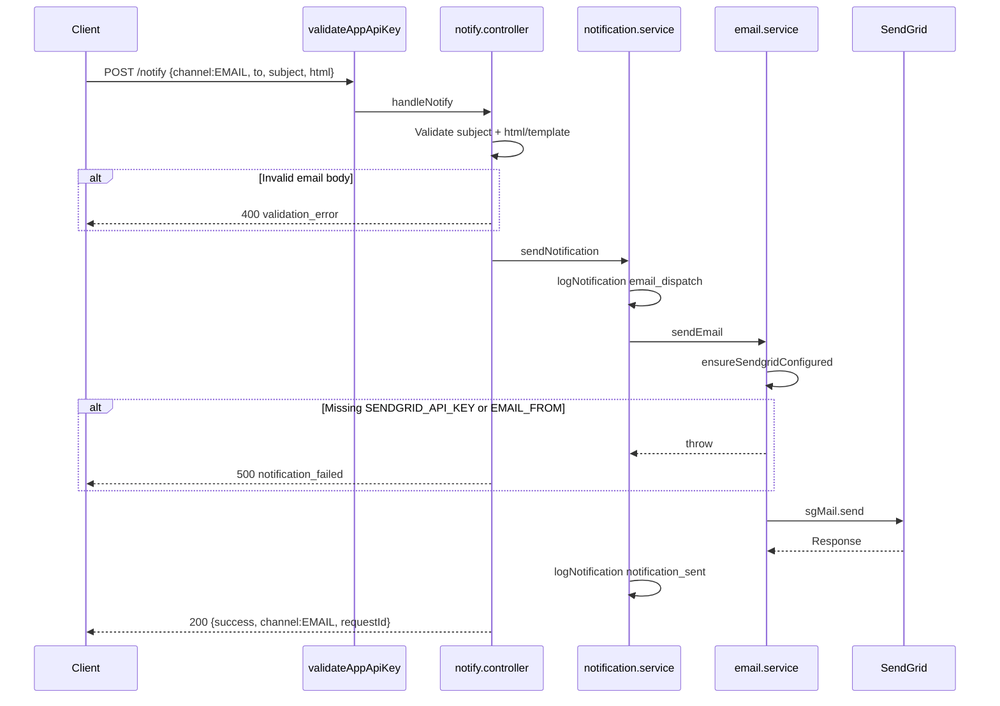

# Request Lifecycle

| | |
|---|---|
| **Purpose** | Document end-to-end request lifecycles for every major ELVA Notify flow: OTP send, OTP verify, legacy SMS, DLT template SMS, and email. |
| **Intended Audience** | Developers, maintainers, and integrators who need to understand what happens between HTTP request and provider response. |
| **Last Updated** | 2026-06-05 |
| **Related Documents** | [Architecture Overview](./overview.md) · [DLT Layer](./dlt-layer.md) · [OTP API](../api/otp.md) · [Notify API](../api/notify.md) · [Authentication](../api/authentication.md) · [Error Codes](../api/error-codes.md) |

---

## Concepts

Every authenticated request passes through a common pipeline before reaching flow-specific logic:

1. **JSON parse** — `express.json()`
2. **Request ID** — UUID assigned to `req.requestId`, returned as `X-Request-Id` header and in JSON body
3. **Global rate limit** — 10 requests/minute per `appId` (or `apiKey` / IP fallback)
4. **Authentication** — `validateAppApiKey` on `/otp/*` and `/notify`
5. **Controller** — Validation and orchestration
6. **Services** — Business logic, provider calls, logging
7. **Response** — JSON with `success`, `requestId`, and flow-specific fields

Controllers do **not** emit logs. Services log via `businessLogger` with the propagated `requestId`.

---

## 1. OTP Send Lifecycle

**Endpoint:** `POST /otp/send`

Additional middleware (after auth): `checkOtpSendCooldown` → `rateLimitOtpSend`



### Real Request

```json
{
  "appId": "enandi-app",
  "apiKey": "your-secret-key",
  "phone": "919876543210"
}
```

### Real Success Response

```json
{
  "success": true,
  "message": "OTP sent successfully",
  "expiresIn": 300,
  "requestId": "a1b2c3d4-e5f6-7890-abcd-ef1234567890"
}
```

### Real Failure Response (provider)

```json
{
  "success": false,
  "error": "sms_failed",
  "message": "Failed to send OTP. Please try again.",
  "requestId": "a1b2c3d4-e5f6-7890-abcd-ef1234567890"
}
```

> **Note:** OTP SMS uses Fast2SMS `route=dlt` when `OTP_DLT_ENABLED=true` and the app mapping has `dltEnabled: true` (see [OTP DLT Migration](./otp-dlt-migration.md)). Otherwise it falls back to route `q` with message: `Your ELVA OTP is {otp}. It expires in 5 minutes.`

---

## 2. OTP Verify Lifecycle

**Endpoint:** `POST /otp/verify`

No cooldown or OTP rate-limit middleware on verify.



### Real Request

```json
{
  "appId": "enandi-app",
  "apiKey": "your-secret-key",
  "phone": "919876543210",
  "otp": "482910"
}
```

### Real Success Response

```json
{
  "success": true,
  "message": "OTP verified successfully",
  "requestId": "b2c3d4e5-f6a7-8901-bcde-f12345678901"
}
```

### Real Failure Response (wrong OTP)

```json
{
  "success": false,
  "error": "mismatch",
  "message": "Invalid OTP",
  "requestId": "b2c3d4e5-f6a7-8901-bcde-f12345678901"
}
```

---

## 3. Legacy SMS Notify Lifecycle

**Endpoint:** `POST /notify` with `message` field (no `business`/`templateKey`)



### Real Request

```json
{
  "appId": "enandi-app",
  "apiKey": "your-secret-key",
  "channel": "SMS",
  "to": ["919876543210"],
  "message": "Your order has been approved."
}
```

### Real Success Response

```json
{
  "success": true,
  "message": "Notification sent",
  "channel": "SMS",
  "requestId": "c3d4e5f6-a7b8-9012-cdef-123456789012"
}
```

---

## 4. DLT Template Notify Lifecycle

**Endpoint:** `POST /notify` with `business`, `templateKey`, `variables`



### Real Request

```json
{
  "appId": "enandi-app",
  "apiKey": "your-secret-key",
  "channel": "SMS",
  "to": ["919876543210"],
  "business": "apnakart",
  "templateKey": "OUT_FOR_DELIVERY",
  "variables": {
    "orderId": "ORD-2026-001",
    "expectedDeliveryTime": "14:30"
  }
}
```

### Real Success Response

```json
{
  "success": true,
  "message": "Notification sent",
  "channel": "SMS",
  "templateKey": "OUT_FOR_DELIVERY",
  "requestId": "d4e5f6a7-b8c9-0123-def0-234567890123"
}
```

---

## 5. Email Notify Lifecycle

**Endpoint:** `POST /notify` with `channel: EMAIL`



### Real Request (HTML)

```json
{
  "appId": "enandi-app",
  "apiKey": "your-secret-key",
  "channel": "EMAIL",
  "to": ["user@example.com"],
  "subject": "Order Confirmation",
  "html": "<h1>Your order is confirmed</h1><p>Thank you for shopping with eNandi.</p>"
}
```

### Real Success Response

```json
{
  "success": true,
  "message": "Notification sent",
  "channel": "EMAIL",
  "requestId": "e5f6a7b8-c9d0-1234-ef01-345678901234"
}
```

---

## Rate Limits and Cooldowns Summary

| Flow | Limit | Error |
|------|-------|-------|
| All routes | 10 req/min per `appId` | `rate_limited` (429) |
| OTP send/resend | 3 req/min per phone | `rate_limited` (429) |
| OTP send/resend | 10 req/hr per phone | `rate_limited` (429) |
| OTP send/resend | Cooldown after successful SMS send | `cooldown_active` (429) |
| OTP verify | Max 3 wrong attempts per OTP | `max_attempts` (429) |

---

## Troubleshooting Notes

| Symptom | Lifecycle stage | Action |
|---------|-----------------|--------|
| `cooldown_active` immediately after send | OTP send | Wait for cooldown key expiry in Redis |
| OTP sent but not received | Provider step | Check Fast2SMS logs (`provider_response_failed`) |
| DLT 400 before send | Validation | Fix `variables` format — see [ApnaKart Templates](../businesses/apnakart.md) |
| `notification_failed` with DLT | Fast2SMS DLT route | Verify template ID and PEID are approved |
| Email 500 | SendGrid step | Confirm `SENDGRID_API_KEY` and `EMAIL_FROM` |

---

## Related Flow Comparison

| Aspect | OTP Send | Legacy SMS | DLT SMS | Email |
|--------|----------|------------|---------|-------|
| Endpoint | `/otp/send` | `/notify` | `/notify` | `/notify` |
| Redis | Yes | No | No | No |
| Fast2SMS route | `q` | `q` | `dlt` | — |
| Template validation | No | No | Yes | No |
| Response includes `templateKey` | No | No | Yes | No |
