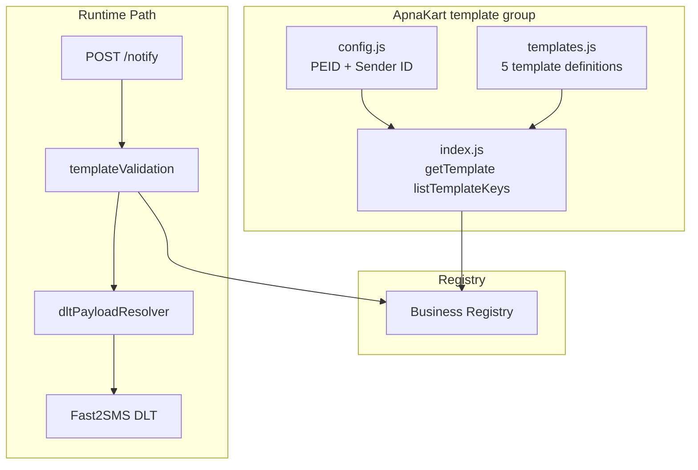
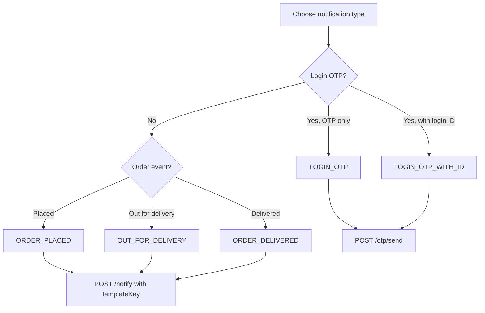

# ApnaKart Template Group

| | |
|---|---|
| **Purpose** | Document the ApnaKart shared DLT template catalog: template catalog, DLT identifiers, variable schemas, and how to send templated SMS via ELVA Notify. |
| **Intended Audience** | integrators, ELVA team members, and future business integrators using ApnaKart as the reference implementation. |
| **Last Updated** | 2026-06-05 |
| **Related Documents** | [Documentation Portal](../README.md) · [DLT Layer](../architecture/dlt-layer.md) · [Notify API](../api/notify.md) · [Error Codes](../api/error-codes.md) · [Architecture Overview](../architecture/overview.md) |

---

## Business Overview

**ApnaKart** is the shared DLT template group in ELVA Notify Platform v2. It provides a catalog of DLT-approved SMS templates for login OTP and order lifecycle notifications.

| Property | Value |
|----------|-------|
| Template group ID | `apnakart` |
| Display name | ApnaKart |
| Config path | `backend/config/businesses/apnakart/` |
| PEID (Entity ID) | `1201177860312735154` |
| Default Sender ID | `ELVATK` |

The module is registered at startup from `backend/config/businesses/apnakart/` via the business registry.

> **Brands vs template group:** `apnakart` is the **DLT template catalog** (LOGIN_OTP, ORDER_* templates). **Brands** such as `enandi` (eNandi), `cms`, `puma`, and `elva-sales` are separate tenant identities that reference `businessModule: "apnakart"`. API calls use `brandId` for OTP and SMS; customers see each brand's `brandName`, not the template group name.

---

## Business Architecture Diagram



---

## Template Catalog Table

| Template Key | Template ID | Purpose | Variables | Fast2SMS Route |
|--------------|-------------|---------|-----------|----------------|
| `LOGIN_OTP` | `1207177979441360359` | Send OTP for user login | 1 | `dlt` |
| `LOGIN_OTP_WITH_ID` | `1207177979905330405` | Login OTP with identity field | 2 | `dlt` |
| `ORDER_PLACED` | `1207177979197056177` | Order placed notification | 2 | `dlt` |
| `ORDER_DELIVERED` | `1207177979979637116` | Order delivered notification | 2 | `dlt` |
| `OUT_FOR_DELIVERY` | `1207177987065122467` | Out for delivery notification | 2 | `dlt` |

### DLT IDs Summary

| DLT Field | Value |
|-----------|-------|
| PEID (entityId) | `1201177860312735154` |
| Sender ID | `ELVATK` |

All templates inherit PEID and Sender ID from `config.js` unless overridden per-template (currently none are overridden).

---

## Variables

### LOGIN_OTP

| Variable | Position | Type | Required | Constraints |
|----------|----------|------|----------|-------------|
| `otp` | 1 | numeric | Yes | Exactly 6 digits |

**Pipe output:** `482910`

### LOGIN_OTP_WITH_ID

| Variable | Position | Type | Required | Constraints |
|----------|----------|------|----------|-------------|
| `otp` | 1 | numeric | Yes | Exactly 6 digits |
| `loginId` | 2 | string | Yes | 1–30 chars, `^[A-Za-z0-9_-]{1,30}$` |

**Pipe output:** `482910|user_42`

### ORDER_PLACED

| Variable | Position | Type | Required | Constraints |
|----------|----------|------|----------|-------------|
| `orderId` | 1 | string | Yes | 1–40 chars, `^[A-Za-z0-9_-]{1,40}$` |
| `orderDate` | 2 | date | Yes | Format `YYYY-MM-DD` |

**Pipe output:** `ORD-2026-001|2026-06-05`

### ORDER_DELIVERED

| Variable | Position | Type | Required | Constraints |
|----------|----------|------|----------|-------------|
| `orderId` | 1 | string | Yes | 1–40 chars, `^[A-Za-z0-9_-]{1,40}$` |
| `deliveryDateTime` | 2 | datetime | Yes | Format `YYYY-MM-DD HH:mm` |

**Pipe output:** `ORD-2026-001|2026-06-05 14:30`

### OUT_FOR_DELIVERY

| Variable | Position | Type | Required | Constraints |
|----------|----------|------|----------|-------------|
| `orderId` | 1 | string | Yes | 1–40 chars, `^[A-Za-z0-9_-]{1,40}$` |
| `expectedDeliveryTime` | 2 | time | Yes | Format `HH:mm` |

**Pipe output:** `ORD-2026-001|14:30`

---

## Template Selection Flow



---

## Current Usage

ApnaKart templates are exposed through two delivery paths:

| Path | Templates | Endpoint |
|------|-----------|----------|
| **Transactional notify** | `ORDER_PLACED`, `ORDER_DELIVERED`, `OUT_FOR_DELIVERY` | `POST /notify` with `templateKey` + `variables` |
| **OTP (server-generated)** | `LOGIN_OTP`, `LOGIN_OTP_WITH_ID` | `POST /otp/send` → `POST /otp/verify` (DLT when `OTP_DLT_ENABLED=true`) |

`appId` identifies the business module (e.g. `apnakart` or `CMS`). Do **not** pass `otp` in `/notify` — OTP templates are rejected on notify with `otp_template_not_supported`.

### Notify request shape (transactional)

```json
{
  "appId": "ELVA_NOTIFY",
  "apiKey": "your-secret-key",
  "channel": "SMS",
  "to": ["919876543210"],
  "templateKey": "ORDER_PLACED",
  "variables": {
    "customerName": "Arun",
    "businessName": "ApnaKart",
    "orderId": "ORD-2026-001"
  }
}
```

**Rejected — LOGIN_OTP via notify:**

```json
HTTP 400
{
  "success": false,
  "error": "otp_template_not_supported",
  "message": "OTP delivery must use POST /otp/send and POST /otp/verify..."
}
```

### OTP request shape (login)

```json
{
  "appId": "CMS",
  "apiKey": "your-secret-key",
  "phone": "919876543210"
}
```

For `LOGIN_OTP_WITH_ID` mapping, add optional `"loginId": "user_01"`.

---

## Template reference (Phase 8E)

Each template below lists purpose, DLT metadata, variables, validation, example payload/response, and OTP mapping.

### LOGIN_OTP

| Field | Value |
|-------|-------|
| **Purpose** | Send OTP for user login |
| **Template ID** | `1207177979441360359` |
| **Sender ID** | `ELVATK` |
| **Entity ID** | `1201177860312735154` |
| **API path** | `POST /otp/send` · `POST /otp/verify` · `POST /otp/resend` — **not** `/notify` |
| **Message ID (Fast2SMS)** | `216423` |
| **OTP mapping** | `apnakart`, `CMS` → `ApnaKart/LOGIN_OTP` |

**Variables:** `otp` (6 digits) — **generated by ELVA**, not supplied by client.

**Validation:** Numeric, exactly 6 digits (enforced when building DLT payload server-side).

**Example `/otp/send` request:**

```json
{
  "appId": "CMS",
  "apiKey": "your-secret-key",
  "phone": "919876543210"
}
```

**Example success:**

```json
{
  "success": true,
  "message": "OTP sent successfully",
  "expiresIn": 300,
  "requestId": "uuid"
}
```

**DLT pipe output:** `{otp}` → e.g. `482910`

---

### LOGIN_OTP_WITH_ID

| Field | Value |
|-------|-------|
| **Purpose** | Login OTP with identity field |
| **Template ID** | `1207177979905330405` |
| **Sender ID** | `ELVATK` |
| **Entity ID** | `1201177860312735154` |
| **API path** | `POST /otp/send` · `POST /otp/verify` · `POST /otp/resend` (+ optional `loginId`) — **not** `/notify` |
| **Message ID (Fast2SMS)** | `216426` |
| **OTP mapping** | Not mapped in `otp-mappings.json` today — DLT payload verified locally |

**Variables:** `otp` (server-generated), `loginId` (client-supplied on send when using this template mapping).

**Example `/otp/send` request:**

```json
{
  "appId": "CMS",
  "apiKey": "your-secret-key",
  "phone": "919876543210",
  "loginId": "user_01"
}
```

**DLT pipe output:** `482910|user_01`

---

### ORDER_PLACED

| Field | Value |
|-------|-------|
| **Purpose** | Order placed notification |
| **Template ID** | `1207177979197056177` |
| **Sender ID** | `ELVATK` |
| **Entity ID** | `1201177860312735154` |
| **API path** | `POST /notify` |

**Variables:** `orderId` (string, max 40), `orderDate` (date `YYYY-MM-DD`)

**Example request / response:** See [Integration Examples](#integration-examples) below.

**DLT pipe output:** `ORD-2026-001|2026-06-06`

---

### ORDER_DELIVERED

| Field | Value |
|-------|-------|
| **Purpose** | Order delivered notification |
| **Template ID** | `1207177979979637116` |
| **Sender ID** | `ELVATK` |
| **Entity ID** | `1201177860312735154` |
| **API path** | `POST /notify` |

**Variables:** `orderId`, `deliveryDateTime` (`YYYY-MM-DD HH:mm`)

**DLT pipe output:** `ORD-2026-001|2026-06-06 14:30`

---

### OUT_FOR_DELIVERY

| Field | Value |
|-------|-------|
| **Purpose** | Out for delivery notification |
| **Template ID** | `1207177987065122467` |
| **Sender ID** | `ELVATK` |
| **Entity ID** | `1201177860312735154` |
| **API path** | `POST /notify` |

**Variables:** `orderId`, `expectedDeliveryTime` (`HH:mm`)

**DLT pipe output:** `ORD-2026-001|14:30`

---

## Current Usage (legacy table)

### What uses ApnaKart today

| Use case | Template | Endpoint | Status |
|----------|----------|----------|--------|
| Order placed SMS | `ORDER_PLACED` | `POST /notify` | Active |
| Order delivery SMS | `ORDER_DELIVERED` | `POST /notify` | Active |
| Out for delivery SMS | `OUT_FOR_DELIVERY` | `POST /notify` | Active |
| Login OTP (DLT) | `LOGIN_OTP` | `POST /otp/send` | Active when `OTP_DLT_ENABLED=true` |
| Login OTP with ID | `LOGIN_OTP_WITH_ID` | `POST /otp/send` + `loginId` | Payload verified; no app mapping yet |

### What does NOT use ApnaKart today

| Use case | Current path | Notes |
|----------|--------------|-------|
| OTP via `/notify` | Blocked | `otp_template_not_supported` — use `/otp/send` |
| Legacy free-text SMS | `POST /notify` + `message` | No template validation |
| Email notifications | `POST /notify` + `channel: EMAIL` | SendGrid |

---

## Future Usage

| Planned integration | Template(s) | Description |
|--------------------|-------------|-------------|
| OTP API → DLT migration | `LOGIN_OTP`, `LOGIN_OTP_WITH_ID` | Wire `/otp/send` to use DLT instead of route `q` |
| Multi-app ApnaKart | All | Different `appId` values, same template catalog |
| New order templates | TBD | Add entries to `templates.js` + DLT portal registration |
| WhatsApp channel | TBD | Parallel business module or channel extension |
| Per-template sender override | Any | Optional `senderId` in template DLT block |

### Future Onboarding Pattern

New businesses will follow the ApnaKart template group structure without modifying ApnaKart files:

```
src/businesses/<new-business>/
├── config.js      # businessId, PEID, senderId
├── templates.js   # template catalog
└── index.js       # module facade
```

Register in `src/businesses/index.js` via `registerBusiness()`.

---

## Integration Examples

### LOGIN_OTP

**Request:**

```json
{
  "appId": "ApnaKart-app",
  "apiKey": "your-secret-key",
  "channel": "SMS",
  "to": ["919876543210"],
  "business": "ApnaKart",
  "templateKey": "LOGIN_OTP",
  "variables": {
    "otp": "482910"
  }
}
```

**Response:**

```json
{
  "success": true,
  "message": "Notification sent",
  "channel": "SMS",
  "templateKey": "LOGIN_OTP",
  "requestId": "a1b2c3d4-e5f6-7890-abcd-ef1234567890"
}
```

### ORDER_PLACED

**Request:**

```json
{
  "appId": "ApnaKart-app",
  "apiKey": "your-secret-key",
  "channel": "SMS",
  "to": ["919876543210"],
  "business": "ApnaKart",
  "templateKey": "ORDER_PLACED",
  "variables": {
    "orderId": "ORD-2026-001",
    "orderDate": "2026-06-05"
  }
}
```

### ORDER_DELIVERED

**Request:**

```json
{
  "appId": "ApnaKart-app",
  "apiKey": "your-secret-key",
  "channel": "SMS",
  "to": ["919876543210"],
  "business": "ApnaKart",
  "templateKey": "ORDER_DELIVERED",
  "variables": {
    "orderId": "ORD-2026-001",
    "deliveryDateTime": "2026-06-05 14:30"
  }
}
```

### OUT_FOR_DELIVERY

**Request:**

```json
{
  "appId": "ApnaKart-app",
  "apiKey": "your-secret-key",
  "channel": "SMS",
  "to": ["919876543210"],
  "business": "ApnaKart",
  "templateKey": "OUT_FOR_DELIVERY",
  "variables": {
    "orderId": "ORD-2026-001",
    "expectedDeliveryTime": "14:30"
  }
}
```

### LOGIN_OTP_WITH_ID

**Request:**

```json
{
  "appId": "ApnaKart-app",
  "apiKey": "your-secret-key",
  "channel": "SMS",
  "to": ["919876543210"],
  "business": "ApnaKart",
  "templateKey": "LOGIN_OTP_WITH_ID",
  "variables": {
    "otp": "482910",
    "loginId": "ravi_01"
  }
}
```

---

## cURL Example

```bash
curl -X POST {{API_BASE_URL}}/notify \
  -H "Content-Type: application/json" \
  -d '{
    "appId": "ApnaKart-app",
    "apiKey": "your-secret-key",
    "channel": "SMS",
    "to": ["919876543210"],
    "business": "ApnaKart",
    "templateKey": "ORDER_PLACED",
    "variables": {
      "orderId": "ORD-2026-001",
      "orderDate": "2026-06-05"
    }
  }'
```

---

## Troubleshooting Notes

| Error | Cause | Fix |
|-------|-------|-----|
| `unsupported_business` | `business` ≠ `apnakart` | Use exactly `apnakart` (lowercase) |
| `invalid_template` | Typo in `templateKey` | Use key from catalog table above |
| `missing_variable` | Omitted required variable | Include all variables for template |
| `validation_error` on date | Wrong format | Use `YYYY-MM-DD` or `YYYY-MM-DD HH:mm` or `HH:mm` |
| `validation_error` on orderId | Invalid characters | Alphanumeric, underscore, hyphen only |
| SMS sent but wrong content | Variable order | Variables are pipe-joined by `position` |
| Provider rejects template | DLT portal mismatch | Confirm template ID still active |

---

## Warnings

> **Never send DLT template IDs from client code.** Always use `templateKey`; the server resolves IDs.

> **`LOGIN_OTP` via `/notify` is not the same as `/otp/send`.** The OTP API manages Redis storage and verification; `/notify` only sends SMS.

> **Adding templates requires DLT portal registration** before adding entries to `templates.js`.

---

## Source File Reference

| File | Responsibility |
|------|----------------|
| `backend/config/businesses/apnakart/config.js` | PEID, sender ID, businessId |
| `backend/config/businesses/apnakart/templates.js` | Template catalog and variable schemas |
| `backend/config/businesses/apnakart/index.js` | `getTemplate()`, `listTemplateKeys()` |
