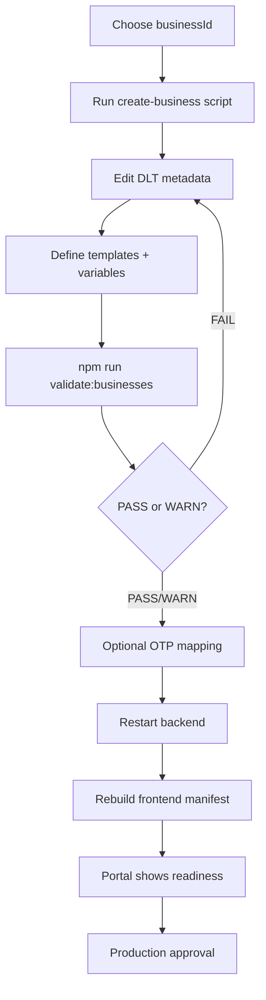

# Business Onboarding Guide

| | |
|---|---|
| **Purpose** | Step-by-step workflow for adding a new business to ELVA Notify without code changes. |
| **Intended Audience** | Platform engineers, business operators, onboarding approvers. |
| **Last Updated** | 2026-06-05 |
| **Related Documents** | [Configuration Reference](./configuration-reference.md) · [Validation Rules](./validation-rules.md) · [Business Onboarding Runbook](../runbooks/business-onboarding.md) |

---

## Goal

Onboard a new business by adding configuration only:

```text
backend/config/businesses/<businessId>/
├── business.json
└── templates.json
```

Optionally add OTP mappings in `backend/config/otp-mappings.json`.

---

## Onboarding workflow



---

## Step 1 — Scaffold configuration

```bash
node backend/scripts/create-business.mjs workspace --display-name "Workspace"
```

This creates draft files from `backend/config/templates/`.

---

## Step 2 — Complete DLT metadata

Edit `business.json`:

- `entityId` — DLT principal entity ID
- `defaultSenderId` — approved sender ID

Edit each template in `templates.json`:

- `templateId` — DLT-approved template ID
- `variables` — ordered, typed placeholders matching DLT registration

---

## Step 3 — Validate

```bash
npm run validate:businesses
```

Expected output:

- `PASS` — production-ready
- `WARN` — valid schema but placeholders or missing OTP mapping
- `FAIL` — schema or duplicate errors

---

## Step 4 — Optional OTP mapping

Add to `backend/config/otp-mappings.json`:

```json
{
  "workspace-app": {
    "business": "workspace",
    "templateKey": "LOGIN_OTP",
    "dltEnabled": false,
    "legacyRouteEnabled": true
  }
}
```

---

## Step 5 — Verify in portal

Open [/platform/businesses](/platform/businesses):

- **Readiness** table shows `Production` or `Draft`
- **Onboarding checklist** shows per-item status

---

## Troubleshooting

| Symptom | Action |
|---------|--------|
| Startup fails on new business | Run `npm run validate:businesses` and fix FAIL items |
| Portal shows Draft | Replace `REPLACE_*` placeholders |
| OTP mapping error | Ensure `business` and `templateKey` exist in config |
| Duplicate templateId | Use unique DLT template IDs per template |

See [Business Validation Failure](../runbooks/business-validation-failure.md).
