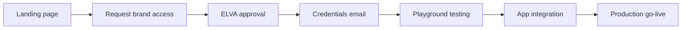
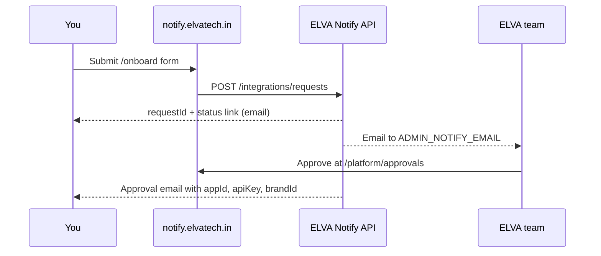
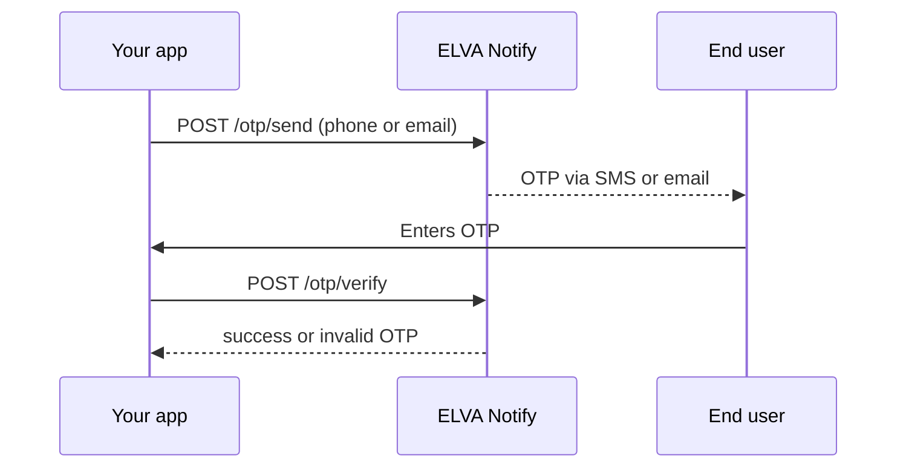
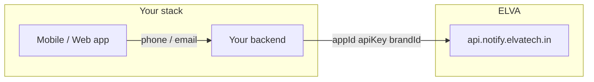

# End-to-End Integration Guide

| | |
|---|---|
| **Purpose** | Step-by-step path from landing on the ELVA Notify portal to calling OTP and Notify APIs in your own application. |
| **Intended Audience** | Developers integrating a new product or brand with ELVA Notify for the first time. |
| **Last Updated** | 2026-06-17 |
| **Related Documents** | [Authentication](../api/authentication.md) · [OTP API](../api/otp.md) · [Notify API](../api/notify.md) · [Error Codes](../api/error-codes.md) · [Business Onboarding Runbook](../runbooks/business-onboarding.md) |

---

## What you will accomplish

By the end of this guide you will:

1. Request access for your brand on the ELVA Notify portal
2. Receive platform credentials and your approved `brandId`
3. Test OTP and transactional SMS from the playground
4. Integrate the same calls into your backend or mobile app



---

## URLs you need

| Environment | Portal (docs + onboarding) | API base URL |
|-------------|---------------------------|--------------|
| **Production** | `https://notify.elvatech.in` | `https://api.notify.elvatech.in` |
| **Local dev** | `http://localhost:3000` | `http://localhost:4000` |

The **portal** is where you read docs, submit onboarding requests, and use the API playground.

The **API** is what your application calls in production. Always use HTTPS in production.

---

## Step 1 — Land on the portal

Open **https://notify.elvatech.in**.

You will see the ELVA Notify landing page with three main actions:

| Button | Path | When to use |
|--------|------|-------------|
| **Open API playground** | `/playground` | After you have credentials — try APIs without writing code |
| **Request brand access** | `/onboard` | First time — start here if you do not have a `brandId` yet |
| **Browse documentation** | `/docs` | Deep reference for OTP, Notify, errors, and architecture |

Other useful portal areas:

| Area | Path | Purpose |
|------|------|---------|
| Platform dashboard | `/platform/businesses` | View DLT template catalog and readiness |
| Interactive API reference | `/api-reference` | Searchable endpoint list |
| Live ops logs (backend) | `https://api.notify.elvatech.in/raw` | Raw request logs during testing |

---

## Step 2 — Understand what you are requesting

ELVA Notify gives you two separate pieces of identity:

| Concept | Field | Who provides it | Example |
|---------|-------|-----------------|---------|
| **Platform credentials** | `appId` + `apiKey` | ELVA team (after approval) | `ELVA_NOTIFY` + your secret key |
| **Brand identity** | `brandId` | You choose at onboarding; ELVA activates on approval | `elva-sales`, `puma`, `cms` |

- **`appId` / `apiKey`** — prove your application is allowed to call ELVA Notify. Same pair can be used across multiple approved brands.
- **`brandId`** — tells ELVA which brand’s templates and display name to use (OTP SMS/email branding, DLT templates, Redis OTP scope).

> **Do not invent your own `appId` or `apiKey`.** You receive them by email after ELVA approves your request.

### Brand display name vs brandId

| `brandId` (API) | `brandName` (customer-facing) |
|-----------------|------------------------------|
| `enandi` | eNandi |
| `cms` | CMS |
| `puma` | PUMA |
| `elva-sales` | ELVA Sales |

Customers see **`brandName`** in OTP emails/SMS (e.g. “ELVA Sales OTP Verification”). Your code sends **`brandId`** in every OTP request.

---

## Step 3 — Submit a brand access request

1. Go to **https://notify.elvatech.in/onboard**
2. Fill in your details:

| Field | Guidance |
|-------|----------|
| **Name** | Your name |
| **Work email** | Where ELVA sends approval and credentials |
| **Team / product** | e.g. “ELVA Sales mobile app” |
| **Brand name** | Customer-facing name (e.g. `ELVA Sales`) |
| **Brand ID** | Auto-generated slug from brand name (e.g. `elva-sales`). Lowercase, hyphens allowed. |
| **Templates** | Select OTP (`LOGIN_OTP`) and notify templates you need (`ORDER_PLACED`, etc.) |
| **Notes** | Optional context for the ELVA review team |

3. Click **Submit request**.



### After submission

- You are redirected to **`/onboard/status/{requestId}`**
- A confirmation email is sent to your work address with the status link
- Status values: `pending` → `approved` or `rejected`

Bookmark the status URL. You can return anytime to check progress.

---

## Step 4 — Wait for ELVA approval

The ELVA operations team reviews:

- Brand name and `brandId` are appropriate
- Requested templates are valid for your use case
- DLT template coverage exists for your brand

**Typical timeline:** business hours review (not instant).

When approved, you receive an email containing:

| Item | What to do with it |
|------|-------------------|
| `appId` | Store securely; send in every API request body |
| `apiKey` | Store securely (server-side only — never in mobile apps or frontends) |
| `brandId` | Send on every OTP call; send on SMS notify calls |
| Link to status page | Confirm `approved` status |

> **Security:** Keep `apiKey` on your **backend** only. Your mobile app or web frontend should call your own server, which then calls ELVA Notify.

---

## Step 5 — Confirm your brand is active

Before integrating, verify the brand appears in the registry:

```bash
curl -s "https://api.notify.elvatech.in/platform/brands" \
  | jq '.brands[] | select(.brandId=="YOUR_BRAND_ID")'
```

Expected: `"status": "active"` and your requested templates listed under `templates.otp` and `templates.notify`.

---

## Step 6 — Test in the API playground

1. Open **https://notify.elvatech.in/playground**
2. Enter your `appId`, `apiKey`, and `brandId`
3. Run these in order:

| Order | Action | What success looks like |
|-------|--------|-------------------------|
| 1 | Health check | `{ "status": "ok" }` |
| 2 | OTP send (SMS) | `{ "success": true, "expiresIn": 300 }` |
| 3 | OTP verify | `{ "success": true }` with the code from SMS |
| 4 | Notify `ORDER_PLACED` | `{ "success": true }` |

If something fails, open **https://api.notify.elvatech.in/raw** in another tab to see structured logs for your `requestId`.

---

## Step 7 — Learn the API contracts (quick reference)

### Authentication

Credentials go in the **JSON body**, not headers:

```json
{
  "appId": "ELVA_NOTIFY",
  "apiKey": "your-issued-api-key",
  "brandId": "your-brand-id"
}
```

See [Authentication](../api/authentication.md) for full details.

### OTP flow (login / verification)

Use **`POST /otp/*`** only — never `/notify` for OTP templates.



| Endpoint | Purpose |
|----------|---------|
| `POST /otp/send` | Generate and deliver OTP (5 min TTL) |
| `POST /otp/resend` | Invalidate old OTP, send new one (30s cooldown on SMS) |
| `POST /otp/verify` | Validate OTP (max 3 wrong attempts) |

### Notify flow (transactional SMS / email)

Use **`POST /notify`** for order updates and marketing-style templates — not for login OTP.

| Template | Use case |
|----------|----------|
| `ORDER_PLACED` | Order confirmation SMS |
| `ORDER_DELIVERED` | Delivery confirmation SMS |
| `OUT_FOR_DELIVERY` | Out-for-delivery SMS |

---

## Step 8 — Integrate OTP in your application

### Recommended architecture



Never expose `apiKey` in client-side code.

### 8a. Send OTP (SMS)

**Your backend** calls:

```http
POST https://api.notify.elvatech.in/otp/send
Content-Type: application/json

{
  "appId": "ELVA_NOTIFY",
  "apiKey": "your-issued-api-key",
  "brandId": "elva-sales",
  "phone": "919876543210"
}
```

Success response:

```json
{
  "success": true,
  "message": "OTP sent successfully",
  "expiresIn": 300,
  "requestId": "uuid"
}
```

### 8b. Send OTP (email)

```json
{
  "appId": "ELVA_NOTIFY",
  "apiKey": "your-issued-api-key",
  "brandId": "elva-sales",
  "channel": "EMAIL",
  "email": "user@example.com"
}
```

The email subject and body use your registry **`brandName`** (e.g. “Your ELVA Sales OTP Code”).

### 8c. Verify OTP

```json
{
  "appId": "ELVA_NOTIFY",
  "apiKey": "your-issued-api-key",
  "brandId": "elva-sales",
  "phone": "919876543210",
  "otp": "123456"
}
```

On success the OTP is consumed (single use). On failure you may get `401` (wrong code), `410` (expired), or `429` (too many attempts).

### 8d. Resend OTP

Same body as send. Wait **30 seconds** after a successful SMS send before resending, or you will get `429 cooldown_active`.

---

## Step 9 — Integrate transactional SMS (Notify)

### DLT template SMS (recommended for India)

```http
POST https://api.notify.elvatech.in/notify
Content-Type: application/json

{
  "appId": "ELVA_NOTIFY",
  "apiKey": "your-issued-api-key",
  "brandId": "elva-sales",
  "channel": "SMS",
  "to": ["919876543210"],
  "templateKey": "ORDER_PLACED",
  "variables": {
    "customerName": "Arun",
    "businessName": "ELVA Sales",
    "orderId": "ORD-1001"
  }
}
```

`variables.businessName` should match your approved brand display name. Alternatively, only `brandId` at the top level is enough when it resolves correctly.

### Email notification

```json
{
  "appId": "ELVA_NOTIFY",
  "apiKey": "your-issued-api-key",
  "channel": "EMAIL",
  "to": ["user@example.com"],
  "subject": "Order update",
  "html": "<p>Your order has been placed.</p>"
}
```

Email notify does not require `brandId`.

---

## Step 10 — Handle errors in your app

| HTTP | `error` code | What to do |
|------|--------------|------------|
| 401 | `unauthorized` | Missing `appId` or `apiKey` |
| 403 | `forbidden` | Wrong `apiKey` |
| 403 | `brand_not_approved` | Brand not active — check onboarding status |
| 400 | `brand_id_required` | Add `brandId` to OTP request |
| 401 | `mismatch` | Wrong OTP — let user retry |
| 410 | `expired` | OTP expired — call `/otp/send` again |
| 429 | `cooldown_active` | Wait 30s before resend |
| 429 | `rate_limited` | Too many requests — back off |
| 502 | `sms_failed` | Provider issue — retry later; check logs |

Full list: [Error Codes](../api/error-codes.md).

Always log the `requestId` from responses when contacting ELVA support.

---

## Step 11 — Go to production checklist

Before pointing real users at ELVA Notify:

- [ ] Brand status is `active` (`GET /platform/brands`)
- [ ] Credentials stored in server environment variables (not hardcoded)
- [ ] All API calls use `https://api.notify.elvatech.in`
- [ ] OTP send → verify flow tested on real phone and email
- [ ] Each notify template you use tested with production-like variables
- [ ] Error handling implemented for `expired`, `mismatch`, `rate_limited`
- [ ] `apiKey` never shipped in mobile or browser bundles

### Suggested environment variables (your app)

```bash
ELVA_NOTIFY_API_BASE=https://api.notify.elvatech.in
ELVA_NOTIFY_APP_ID=ELVA_NOTIFY
ELVA_NOTIFY_API_KEY=<issued-by-elva>
ELVA_NOTIFY_BRAND_ID=elva-sales
```

---

## Common mistakes

| Mistake | Correct approach |
|---------|------------------|
| Sending `LOGIN_OTP` via `/notify` | Use `/otp/send` and `/otp/verify` |
| Putting `apiKey` in a mobile app | Call ELVA from your backend only |
| Omitting `brandId` on OTP | Always include your approved `brandId` |
| Using `appId` as display name | Customers see `brandName` from registry |
| Resending OTP within 30 seconds | Wait for cooldown or show a timer in UI |
| Using HTTP in production | Always HTTPS |

---

## Where to go next

| Goal | Document |
|------|----------|
| Full OTP reference | [OTP API](../api/otp.md) |
| Full Notify reference | [Notify API](../api/notify.md) |
| Template variables | [ApnaKart Templates](../businesses/apnakart.md) |
| Copy-paste curl tests | [Postman / curl collection](../testing/POSTMAN_COLLECTION.md) |
| Pre-launch test checklist | [API validation checklist](../testing/PHASE_10D_API_CHECKLIST.md) |
| Interactive explorer | [API Reference](/api-reference) on the portal |

---

## Getting help

1. Note the `requestId` from the API response
2. Check live logs at `https://api.notify.elvatech.in/raw` (during testing)
3. Contact the ELVA team with your `brandId`, timestamp, and `requestId`
