# ELVA Notify Service — Complete Architectural Analysis

**Application:** `notify.elvatech.in`  
**Repository:** `elva-otp-service` (Express microservice, ~36 source files)  
**Analysis date:** June 5, 2026  
**Scope:** Read-only analysis; no code modified.

---

## Table of Contents

1. [Executive Summary](#1-executive-summary)
   - [Purpose of Application](#purpose-of-application)
   - [Main Business Functionality](#main-business-functionality)
   - [High-Level Workflow](#high-level-workflow)
2. [Technology Stack](#2-technology-stack)
   - [Frontend Technologies](#frontend-technologies)
   - [Backend Technologies](#backend-technologies)
   - [Database Technologies](#database-technologies)
   - [Hosting Infrastructure](#hosting-infrastructure)
   - [Third-Party Integrations](#third-party-integrations)
   - [Authentication Mechanisms](#authentication-mechanisms)
3. [Complete Folder Structure](#3-complete-folder-structure)
   - [Major Folder Purposes](#major-folder-purposes)
4. [Application Architecture](#4-application-architecture)
   - [Frontend Architecture](#frontend-architecture)
   - [Backend Architecture](#backend-architecture)
   - [Service Layers](#service-layers)
   - [Data Flow](#data-flow)
   - [Request Lifecycle](#request-lifecycle)
   - [Route Registration Note (Architectural Finding)](#route-registration-note-architectural-finding)
5. [API Documentation](#5-api-documentation)
   - [API Inventory](#api-inventory)
   - [GET /](#get-)
   - [GET /health](#get-health)
   - [POST /otp/send](#post-otpsend)
   - [POST /otp/resend](#post-otpresend)
   - [POST /otp/verify](#post-otpverify)
   - [POST /notify](#post-notify)
6. [Database Documentation](#6-database-documentation)
   - [Database Type](#database-type)
   - [Connection Configuration](#connection-configuration)
   - [Data Structures (Logical "Tables")](#data-structures-logical-tables)
   - [Relationships](#relationships)
   - [Indexes](#indexes)
   - [Stored Procedures](#stored-procedures)
   - [Queries Used](#queries-used)
7. [Authentication & Security](#7-authentication--security)
   - [Login Flow](#login-flow)
   - [Session Management](#session-management)
   - [Token Handling](#token-handling)
   - [Authorization Logic](#authorization-logic)
   - [Encryption Usage](#encryption-usage)
   - [Secrets Management](#secrets-management)
   - [Security Concerns](#security-concerns)
8. [Notification Architecture](#8-notification-architecture)
   - [OTP Generation Logic](#otp-generation-logic)
   - [SMS Sending Logic](#sms-sending-logic)
   - [Email Sending Logic](#email-sending-logic)
   - [WhatsApp Integrations](#whatsapp-integrations)
   - [Queue Systems](#queue-systems)
   - [Retry Mechanisms](#retry-mechanisms)
   - [Failure Handling](#failure-handling)
9. [Configuration Analysis](#9-configuration-analysis)
   - [Environment Variables](#environment-variables)
   - [Configuration Inventory](#configuration-inventory)
   - [Config Files](#config-files)
   - [Runtime Settings](#runtime-settings)
   - [Deployment Settings](#deployment-settings)
10. [External Integrations](#10-external-integrations)
    - [Integration Inventory](#integration-inventory)
    - [How Each Integration Works](#how-each-integration-works)
    - [Not Present](#not-present)
11. [Deployment Architecture](#11-deployment-architecture)
    - [Inferred Production Setup](#inferred-production-setup)
    - [Static Assets](#static-assets)
12. [Code Quality Assessment](#12-code-quality-assessment)
    - [Technical Debt](#technical-debt)
    - [Duplicate Logic](#duplicate-logic)
    - [Security Concerns](#security-concerns-1)
    - [Scalability Concerns](#scalability-concerns)
    - [Performance Bottlenecks](#performance-bottlenecks)
13. [SMS/OTP Deep Dive](#13-smsotp-deep-dive)
    - [End-to-End Trace: OTP Send via SMS](#end-to-end-trace-otp-send-via-sms)
    - [File-by-File Execution Path](#file-by-file-execution-path)
    - [End-to-End Trace: OTP Verification](#end-to-end-trace-otp-verification)
14. [Upgrade Readiness Assessment (DLT-Compliant Template Messaging)](#14-upgrade-readiness-assessment-dlt-compliant-template-messaging)
    - [All Locations Where SMS Content Is Generated](#all-locations-where-sms-content-is-generated)
    - [All Places Where OTP Templates Are Built](#all-places-where-otp-templates-are-built)
    - [Provider-Specific Code](#provider-specific-code)
    - [Template Rendering Logic](#template-rendering-logic)
    - [Dynamic Variables Used in Messages](#dynamic-variables-used-in-messages)
    - [Files Requiring Modification for DLT Compliance](#files-requiring-modification-for-dlt-compliance)
15. [Final Deliverables](#15-final-deliverables)
    - [Architecture Diagram](#architecture-diagram)
    - [Sequence Diagram (Full OTP Lifecycle)](#sequence-diagram-full-otp-lifecycle)
    - [Component Diagram](#component-diagram)
    - [Data Flow Diagram](#data-flow-diagram)
    - [API Inventory (Summary)](#api-inventory-summary)
    - [Database Inventory (Summary)](#database-inventory-summary)
    - [Configuration Inventory (Summary)](#configuration-inventory-summary)
    - [Integration Inventory (Summary)](#integration-inventory-summary)
    - [Key Architectural Takeaways](#key-architectural-takeaways)

---

# 1. Executive Summary

## Purpose of Application

ELVA Notify Service is a **multi-tenant OTP and notification microservice** for internal ELVA Tech applications. It centralizes:

- OTP generation, storage (hashed), delivery, and verification
- Direct SMS and EMAIL notifications via a unified API

Production base URL: `https://notify.elvatech.in` (referenced in `public/index.html:335`).

## Main Business Functionality

| Capability | Description |
|------------|-------------|
| OTP via SMS | 6-digit OTP, 5-minute TTL, Fast2SMS delivery |
| OTP via EMAIL | Same flow via SendGrid with HTML template |
| OTP verification | Scrypt-hashed comparison, 3 attempt limit, one-time consumption |
| Direct notifications | `POST /notify` for arbitrary SMS text or EMAIL (HTML/template) |
| Multi-tenancy | Per-`appId` isolation in Redis and API key auth |
| Abuse protection | Global, per-phone, and per-app cooldown rate limits |

## High-Level Workflow

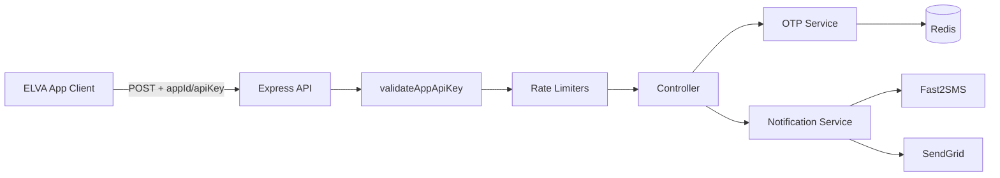

1. Client sends JSON with `appId` + `apiKey`.
2. Middleware authenticates, applies rate limits.
3. OTP path: generate → store hash in Redis → send via SMS/EMAIL → verify on callback.
4. Notify path: validate channel payload → send directly to provider.

---

# 2. Technology Stack

## Frontend Technologies

| Technology | Usage |
|------------|-------|
| Static HTML/CSS/JS | API landing page at `/` (`public/index.html`) |
| Vanilla JavaScript `fetch` | Live API tester against production or localhost |
| No SPA framework | No React/Vue/Angular |

## Backend Technologies

| Technology | Version | Purpose |
|------------|---------|---------|
| Node.js | ≥18 (`package.json:11`) | Runtime |
| Express | ^4.21.2 | HTTP server, routing, middleware |
| `dotenv` | ^16.4.7 | Environment loading |
| `cors` | ^2.8.6 | Cross-origin (wildcard `*`) |
| `express-rate-limit` | ^8.4.1 | In-memory global rate limit |
| `redis` | ^4.7.0 | OTP storage, distributed rate limits |
| `uuid` / `crypto.randomUUID` | — | Request ID generation |
| Node `crypto` | built-in | OTP generation, scrypt hashing |

## Database Technologies

**Redis only** — no relational database, no MongoDB, no ORM.

- OTP records (Redis hashes)
- Rate-limit counters
- Send cooldown flags

## Hosting Infrastructure

**Not defined in repository.** Inferred from codebase:

- Production domain: `https://notify.elvatech.in`
- Local dev: port `3000` default (`src/config/env.js:3`), landing page uses `localhost:4000` (`public/index.html:639-641`)
- Static files served by Express (`src/app.js:19`)
- Reverse proxy / SSL / process manager configs are **external** to this repo

## Third-Party Integrations

| Provider | Channel | SDK/API |
|----------|---------|---------|
| Fast2SMS | SMS | REST `POST https://www.fast2sms.com/dev/bulkV2` |
| SendGrid | EMAIL | `@sendgrid/mail` npm package |

**Not present:** WhatsApp, payment gateways, webhooks, push notifications.

## Authentication Mechanisms

- **API key in JSON body** (`appId` + `apiKey`) — not Bearer tokens, not sessions
- Credentials loaded from `APP_CREDENTIALS_JSON` env var at startup (`src/config/allowedApps.js`)
- No user login, OAuth, or JWT

---

# 3. Complete Folder Structure

```
OTP Service/
├── package.json              # Dependencies, scripts (start, dev)
├── package-lock.json         # Locked dependency tree
├── README.md                 # API documentation and ops guide
├── .gitignore                # Ignores node_modules, .env, logs
├── .env                      # Runtime secrets (gitignored, present locally)
│
├── public/
│   ├── index.html            # API landing page + live tester (notify.elvatech.in UI)
│   └── elva-logo.png         # Branding asset
│
└── src/
    ├── server.js             # Entry point: connect Redis, start HTTP server
    ├── app.js                # Express app setup, middleware, static files, error handler
    │
    ├── config/
    │   ├── env.js            # Environment variable parsing and validation
    │   ├── allowedApps.js    # Multi-tenant appId → apiKey map from env
    │   └── channels.js       # Supported channels: EMAIL, SMS
    │
    ├── routes/
    │   ├── index.js          # Route aggregator (health, otp, notify)
    │   ├── health.routes.js  # GET /health, mounts /otp/* sub-routes
    │   ├── otp.routes.js     # POST /send, /resend, /verify (middleware chain)
    │   └── notify.routes.js  # POST /notify
    │
    ├── controllers/
    │   ├── otp.controller.js      # OTP send/resend/verify request handling
    │   ├── notify.controller.js   # Unified notification API handler
    │   └── health.controller.js   # Health check response
    │
    ├── middleware/
    │   ├── requestId.js           # UUID per request, X-Request-Id header
    │   ├── validateAppApiKey.js   # appId/apiKey authentication
    │   ├── rateLimiter.js         # Global 10 req/min (in-memory)
    │   ├── rateLimitOtpSend.js    # Per-phone 3/min, 10/hour (Redis)
    │   └── checkOtpSendCooldown.js # 30s cooldown per appId+phone (Redis)
    │
    ├── services/
    │   ├── otp.service.js          # OTP generate/verify/revoke (Redis-backed)
    │   ├── otpCooldown.service.js   # Post-send cooldown writer
    │   ├── redis.service.js         # Redis client and key operations
    │   ├── notification.service.js  # Channel router (SMS/EMAIL)
    │   ├── sms/
    │   │   ├── sms.service.js       # SMS message builder + provider dispatch
    │   │   └── providers/
    │   │       └── fast2sms.js      # Fast2SMS HTTP client
    │   └── email/
    │       ├── email.service.js     # SendGrid wrapper
    │       └── emailTemplates.js    # OTP HTML email template
    │
    └── utils/
        ├── otpCrypto.js    # 6-digit OTP, scrypt hash, timing-safe compare
        ├── phone.js        # Phone normalization (digits only)
        ├── email.js        # Email normalization and validation
        ├── appId.js        # appId normalization (no colons)
        └── logger.js       # Structured JSON console logging
```

## Major Folder Purposes

| Folder | Role |
|--------|------|
| `public/` | Static API documentation UI for internal developers |
| `src/config/` | Boot-time configuration from environment |
| `src/routes/` | HTTP route definitions and middleware ordering |
| `src/controllers/` | Request validation and HTTP response mapping |
| `src/middleware/` | Cross-cutting: auth, rate limits, request tracing |
| `src/services/` | Business logic and external provider integration |
| `src/utils/` | Pure helpers (crypto, normalization, logging) |

---

# 4. Application Architecture

## Frontend Architecture

Single static page (`public/index.html`):

- Tabbed SMS/EMAIL API documentation
- Copy-to-clipboard for JSON/cURL examples
- Live API tester using `fetch()` to same origin or `notify.elvatech.in`
- Dark/light theme toggle (client-side only)
- **No build step**, no bundler, no state management library

## Backend Architecture

**Layered monolith microservice:**

```
Routes → Middleware → Controllers → Services → Providers/Redis
```

| Layer | Responsibility |
|-------|----------------|
| Routes | URL mapping, middleware ordering |
| Middleware | Auth, rate limiting, request ID |
| Controllers | Input validation, HTTP status codes |
| Services | OTP logic, notification routing |
| Providers | Fast2SMS, SendGrid HTTP calls |
| Redis Service | Persistence abstraction |

## Service Layers

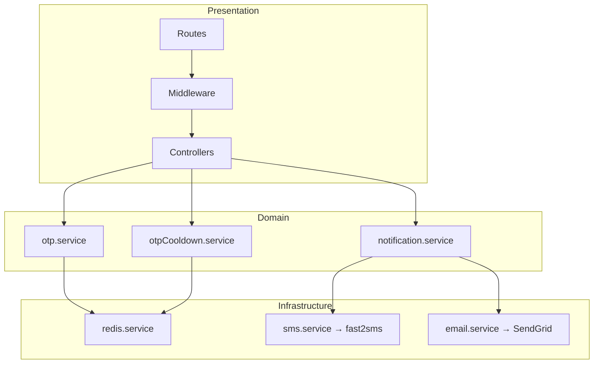

## Data Flow

**OTP Send (SMS):**

```
Client → validateAppApiKey → checkOtpSendCooldown → rateLimitOtpSend
  → otp.controller.sendOtp → otp.service.generateOTP → Redis HSET
  → notification.service.sendNotification → sms.service.sendOTP
  → fast2sms.sendSMS → HTTP to Fast2SMS
  → otpCooldown.service.applyAfterSuccessfulSend → Redis SET cooldown
  → 200 JSON response
```

**OTP Verify:**

```
Client → validateAppApiKey → otp.controller.verifyOtp
  → otp.service.verifyOTP → Redis HGETALL → scrypt compare
  → success: DEL key | failure: HINCRBY attempts
  → 200/401/404/410/429 response
```

## Request Lifecycle

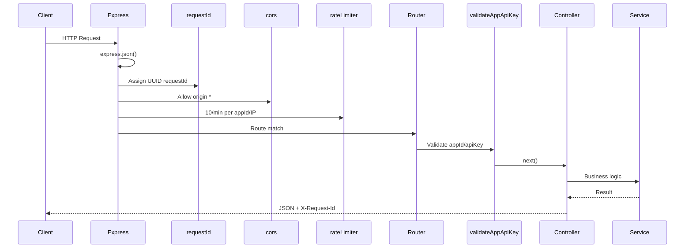

## Route Registration Note (Architectural Finding)

`src/routes/index.js` mounts `otpRoutes` **twice**:

1. Via `health.routes.js` → `/otp/send`, `/otp/resend`, `/otp/verify` (documented)
2. Directly at root → `/send`, `/resend`, `/verify` (undocumented duplicates)

```8:10:src/routes/index.js
router.use(healthRoutes);
router.use(otpRoutes);
router.use(notifyRoutes);
```

```8:10:src/routes/health.routes.js
router.get('/health', getHealth);

router.use('/otp', otpRoutes);
```

---

# 5. API Documentation

## API Inventory

| # | Route | Method | Auth | Source File |
|---|-------|--------|------|-------------|
| 1 | `/` | GET | None | `src/app.js:20-22` |
| 2 | `/health` | GET | None | `src/routes/health.routes.js:8` |
| 3 | `/otp/send` | POST | appId + apiKey | `src/routes/health.routes.js:10` + `otp.routes.js:9` |
| 4 | `/otp/resend` | POST | appId + apiKey | `src/routes/health.routes.js:10` + `otp.routes.js:10` |
| 5 | `/otp/verify` | POST | appId + apiKey | `src/routes/health.routes.js:10` + `otp.routes.js:11` |
| 6 | `/notify` | POST | appId + apiKey | `src/routes/notify.routes.js:7` |
| 7 | `/send` | POST | appId + apiKey | `src/routes/index.js:9` (duplicate) |
| 8 | `/resend` | POST | appId + apiKey | `src/routes/index.js:9` (duplicate) |
| 9 | `/verify` | POST | appId + apiKey | `src/routes/index.js:9` (duplicate) |

---

### `GET /`

| Field | Value |
|-------|-------|
| **Route** | `/` |
| **HTTP Method** | GET |
| **Request Parameters** | None |
| **Request Body** | None |
| **Response** | HTML (`public/index.html`) |
| **Authentication** | None |
| **Source** | `src/app.js:20-22` |

---

### `GET /health`

| Field | Value |
|-------|-------|
| **Route** | `/health` |
| **HTTP Method** | GET |
| **Request Parameters** | None |
| **Request Body** | None |
| **Response Structure** | `{ status, service, timestamp, requestId }` |
| **Authentication** | None |
| **Source** | `src/controllers/health.controller.js:1-8` |

```json
{
  "status": "ok",
  "service": "elva-otp-service",
  "timestamp": "2026-06-05T12:00:00.000Z",
  "requestId": "uuid"
}
```

---

### `POST /otp/send`

| Field | Value |
|-------|-------|
| **Route** | `/otp/send` |
| **HTTP Method** | POST |
| **Request Parameters** | None (all in JSON body) |
| **Authentication** | `appId` + `apiKey` in body |
| **Middleware** | `validateAppApiKey` → `checkOtpSendCooldown` → `rateLimitOtpSend` |
| **Source** | `src/routes/otp.routes.js:9`, `src/controllers/otp.controller.js:178-187` |

**Request Body (SMS — default):**

```json
{
  "appId": "string (required)",
  "apiKey": "string (required)",
  "phone": "string (required)",
  "channel": "SMS (optional, default)"
}
```

**Request Body (EMAIL):**

```json
{
  "appId": "string (required)",
  "apiKey": "string (required)",
  "channel": "EMAIL",
  "email": "string (required)"
}
```

**Success Response — 200:**

```json
{
  "success": true,
  "message": "OTP sent successfully",
  "expiresIn": 300,
  "requestId": "uuid"
}
```

**Error Responses:** 400 validation, 401 unauthorized, 403 forbidden, 429 rate_limited/cooldown_active, 502 sms_failed

---

### `POST /otp/resend`

| Field | Value |
|-------|-------|
| **Route** | `/otp/resend` |
| **HTTP Method** | POST |
| **Request Body** | Same as `/otp/send` |
| **Behavior** | Revokes existing OTP, then re-runs send flow |
| **Authentication** | `appId` + `apiKey` |
| **Middleware** | Same as send |
| **Source** | `src/routes/otp.routes.js:10`, `src/controllers/otp.controller.js:189-202` |

**Success Response — 200:** Same as send.

---

### `POST /otp/verify`

| Field | Value |
|-------|-------|
| **Route** | `/otp/verify` |
| **HTTP Method** | POST |
| **Authentication** | `appId` + `apiKey` |
| **Middleware** | `validateAppApiKey` only (no OTP send rate limits) |
| **Source** | `src/routes/otp.routes.js:11`, `src/controllers/otp.controller.js:204-265` |

**Request Body (SMS):**

```json
{
  "appId": "string (required)",
  "apiKey": "string (required)",
  "phone": "string (required if no email)",
  "otp": "string (required, 6 digits)"
}
```

**Request Body (EMAIL):**

```json
{
  "appId": "string (required)",
  "apiKey": "string (required)",
  "email": "string (required if no phone)",
  "otp": "string (required, 6 digits)"
}
```

**Success — 200:**

```json
{
  "success": true,
  "message": "OTP verified successfully",
  "requestId": "uuid"
}
```

**Failure codes:** `mismatch` (401), `not_found` (404), `expired` (410), `max_attempts` (429), validation errors (400)

---

### `POST /notify`

| Field | Value |
|-------|-------|
| **Route** | `/notify` |
| **HTTP Method** | POST |
| **Authentication** | `appId` + `apiKey` |
| **Source** | `src/routes/notify.routes.js:7`, `src/controllers/notify.controller.js:70-153` |

**Common Request Body:**

| Field | Type | Required | Description |
|-------|------|----------|-------------|
| `appId` | string | Yes | Tenant identifier |
| `apiKey` | string | Yes | Tenant secret |
| `channel` | string | Yes | `SMS` or `EMAIL` |
| `to` | string[] | Yes | Non-empty recipient array |

**SMS-specific:**

| Field | Required |
|-------|----------|
| `message` | Yes |

**EMAIL-specific:**

| Field | Required |
|-------|----------|
| `subject` | Yes |
| `html` OR `template` | One required, not both |
| `data` | Optional object (with `template`) |

**Success — 200:**

```json
{
  "success": true,
  "message": "Notification sent",
  "channel": "SMS|EMAIL",
  "requestId": "uuid"
}
```

**Failure — 500:**

```json
{
  "success": false,
  "error": "notification_failed",
  "message": "Provider error message",
  "channel": "SMS|EMAIL",
  "requestId": "uuid"
}
```

---

# 6. Database Documentation

## Database Type

**Redis** (in-memory key-value store with optional persistence). No SQL/NoSQL relational database.

## Connection Configuration

Source: `src/config/env.js:33-41`, `src/services/redis.service.js:8-33`

| Variable | Default | Purpose |
|----------|---------|---------|
| `REDIS_URL` | null | Full connection URL (takes precedence) |
| `REDIS_HOST` | `127.0.0.1` | Host when no URL |
| `REDIS_PORT` | `6379` | Port |
| `REDIS_USERNAME` | undefined | ACL username |
| `REDIS_PASSWORD` | undefined | Auth password |
| `REDIS_TLS` | `false` | TLS socket (`'true'` enables) |
| `REDIS_DB` | undefined | Database index |

Client: `redis` npm v4 (`createClient`), singleton, connected at startup in `src/server.js:6`.

## Data Structures (Logical "Tables")

Redis has no tables. The service uses these key patterns:

### 1. OTP Record

| Property | Value |
|----------|-------|
| **Key pattern** | `otp:{appId}:{recipient}` |
| **Type** | Hash |
| **TTL** | 300 seconds (5 min) |
| **Source** | `src/services/redis.service.js:70-72`, `src/services/otp.service.js:12-18` |

| Field | Type | Description |
|-------|------|-------------|
| `hash` | hex string | scrypt hash of OTP |
| `salt` | hex string | 16-byte random salt |
| `attempts` | string (int) | Failed verify count (max 3) |

### 2. OTP Send Cooldown

| Property | Value |
|----------|-------|
| **Key pattern** | `otp:cooldown:{appId}:{phone}` |
| **Type** | String (`"1"`) |
| **TTL** | 30 seconds |
| **Source** | `src/services/redis.service.js:79-81`, `src/services/otpCooldown.service.js:5` |

### 3. OTP Rate Limit — Minute Window

| Property | Value |
|----------|-------|
| **Key pattern** | `otp:rate:{phone}:minute` |
| **Type** | Counter (INCR) |
| **TTL** | 60 seconds |
| **Limit** | 3 requests |
| **Source** | `src/middleware/rateLimitOtpSend.js:9-15` |

### 4. OTP Rate Limit — Hour Window

| Property | Value |
|----------|-------|
| **Key pattern** | `otp:rate:{phone}:hour` |
| **Type** | Counter (INCR) |
| **TTL** | 3600 seconds |
| **Limit** | 10 requests |
| **Source** | `src/middleware/rateLimitOtpSend.js:13-15` |

## Relationships

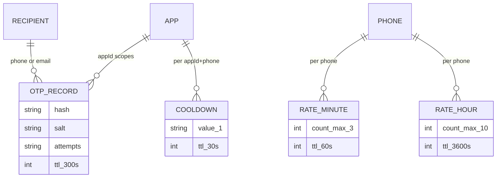

## Indexes

Redis has no explicit indexes. Key design enables O(1) lookup by `appId + recipient`.

## Stored Procedures

None. All logic is application-side JavaScript.

## Queries Used

| Operation | Redis Command | File:Line |
|-----------|---------------|-----------|
| Store OTP | `MULTI` → `HSET` + `EXPIRE` | `redis.service.js:107-112` |
| Read OTP | `HGETALL` | `redis.service.js:119-122` |
| Delete OTP | `DEL` | `redis.service.js:127-130` |
| Increment attempts | `HINCRBY` | `redis.service.js:138-141` |
| Check cooldown | `EXISTS` | `redis.service.js:87-90` |
| Set cooldown | `SET ... EX` | `redis.service.js:97-100` |
| Rate limit | `INCR` + `EXPIRE` + `DECR` rollback | `rateLimitOtpSend.js:51-72` |

---

# 7. Authentication & Security

## Login Flow

**No end-user login.** This is a machine-to-machine API:

1. Client includes `appId` and `apiKey` in every protected request body.
2. `validateAppApiKey` middleware (`src/middleware/validateAppApiKey.js:25-67`):
   - Missing/empty → **401** `unauthorized`
   - Unknown `appId` or wrong key → **403** `forbidden`
   - `appId` normalized via `normalizeAppId` (rejects `:` characters)

## Session Management

**None.** Stateless per-request API key validation. No cookies, no server-side sessions.

## Token Handling

API keys are static secrets from `APP_CREDENTIALS_JSON`, compared with strict equality (`allowedApps.js:62`). No JWT, no refresh tokens, no expiration.

## Authorization Logic

- **Tenant isolation:** OTP Redis keys include `appId` → `otp:{appId}:{recipient}`
- **Flat permission model:** Valid API key grants full access to all endpoints for that tenant
- **No RBAC, no scopes, no per-endpoint permissions**

## Encryption Usage

| Use Case | Algorithm | Source |
|----------|-----------|--------|
| OTP storage | scrypt (N=16384, r=8, p=1) + random salt | `src/utils/otpCrypto.js:5-23` |
| OTP comparison | `crypto.timingSafeEqual` | `src/utils/otpCrypto.js:25-29` |
| OTP generation | `crypto.randomInt(0, 1000000)` | `src/utils/otpCrypto.js:12-15` |
| Request IDs | `crypto.randomUUID` | `src/middleware/requestId.js:4` |
| TLS to Redis | Optional via `REDIS_TLS` | `src/config/env.js:39` |
| TLS to providers | HTTPS (fetch/SendGrid SDK) | Provider clients |

**Plaintext OTP exists only in memory** during send; never stored in Redis.

## Secrets Management

| Secret | Storage | Loaded At |
|--------|---------|-----------|
| `APP_CREDENTIALS_JSON` | `.env` / host env | Startup (`allowedApps.js`) |
| `FAST2SMS_API_KEY` | `.env` | Runtime (`env.js:25`) |
| `SENDGRID_API_KEY` | `.env` | Runtime (`env.js:28`) |
| `REDIS_PASSWORD` | `.env` | Runtime (`env.js:38`) |

`.env` is gitignored (`.gitignore:2`). No Vault, AWS Secrets Manager, or encrypted config in repo.

### Security Concerns

| Issue | Severity | Location |
|-------|----------|----------|
| CORS `origin: '*'` | Medium | `src/app.js:12-16` |
| API keys in request body (logged by proxies) | Medium | All protected endpoints |
| Fast2SMS raw response `console.log` | Medium | `fast2sms.js:31-38` |
| Global rate limiter in-memory (not shared across instances) | Medium | `rateLimiter.js:17-31` |
| Duplicate undocumented OTP routes at `/send` etc. | Low | `routes/index.js:9` |
| Landing page exposes live API tester with credentials | Low | `public/index.html` |
| No request signing / HMAC | Info | — |
| No IP allowlisting | Info | — |

---

# 8. Notification Architecture

## OTP Generation Logic

`src/services/otp.service.js:50-73`:

1. Normalize recipient (phone digits or lowercase email)
2. Normalize `appId`
3. `generateSixDigitOtp()` — zero-padded 6 digits
4. Random 16-byte salt
5. scrypt hash OTP + salt
6. Redis `HSET` with TTL 300s, attempts=0
7. Return plaintext OTP (for delivery only) + expiry metadata

## SMS Sending Logic

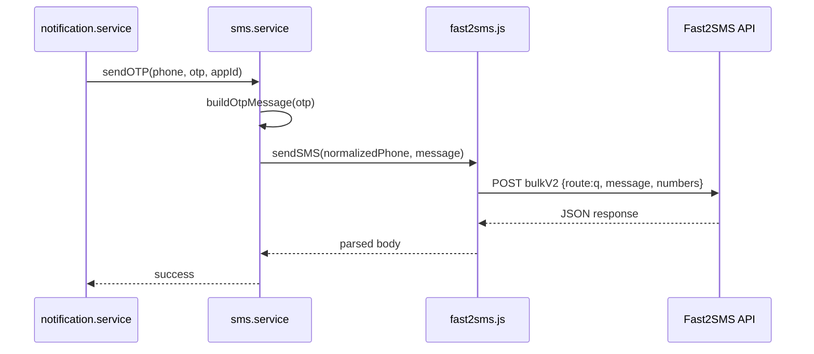

- **OTP SMS:** `sms.service.js:17-21` → `buildOtpMessage` → `fast2sms.sendSMS`
- **Direct SMS:** `sms.service.js:23-29` → `sendMessage` with caller-provided text
- **Provider route:** `'q'` (quick/transactional, non-DLT template) — `fast2sms.js:23`

## Email Sending Logic

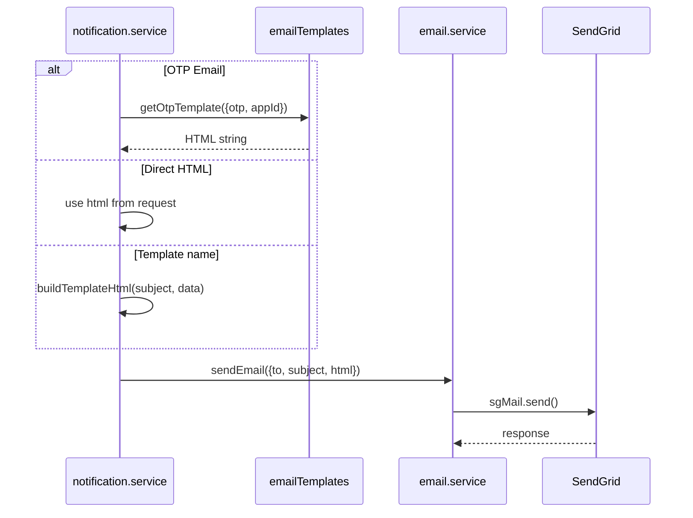

## WhatsApp Integrations

**None.** No code, config, or dependencies for WhatsApp.

## Queue Systems

**None.** All notifications are **synchronous**:

- `await` provider HTTP call in request handler
- `Promise.all` for multi-recipient sends (`notification.service.js:18-25`)
- No Bull, RabbitMQ, SQS, or background workers

## Retry Mechanisms

**None at application level.** Single attempt per provider call. Client must retry (`/otp/resend` for OTP).

## Failure Handling

| Scenario | Behavior | Source |
|----------|----------|--------|
| SMS send fails after OTP stored | OTP revoked from Redis, **502** `sms_failed` | `otp.controller.js:148-160` |
| Notify send fails | **500** `notification_failed`, sanitized message | `notify.controller.js:137-151` |
| Fast2SMS HTTP error | Throws with `err.cause = body` | `fast2sms.js:40-44` |
| SendGrid missing config | Throws at send time | `email.service.js:7-14, 38-41` |
| Redis connection error | Propagates to global error handler **500** | `app.js:24-36` |
| Max verify attempts | OTP deleted, **429** `max_attempts` | `otp.service.js:121-124, 136-138` |

---

# 9. Configuration Analysis

## Environment Variables

### Configuration Inventory

| Variable | Required | Default | Purpose | Source |
|----------|----------|---------|---------|--------|
| `PORT` | No | `3000` | HTTP listen port | `env.js:3` |
| `NODE_ENV` | No | `development` | Runtime environment label | `env.js:23` |
| `APP_CREDENTIALS_JSON` | **Yes** | — | JSON map `appId→apiKey` | `allowedApps.js:8` |
| `FAST2SMS_API_KEY` | Yes (SMS) | — | Fast2SMS auth header | `env.js:25` |
| `SENDGRID_API_KEY` | Yes (EMAIL) | — | SendGrid API key | `env.js:28` |
| `EMAIL_FROM` | Yes (EMAIL) | — | Sender email address | `env.js:31` |
| `REDIS_URL` | No | null | Full Redis connection URL | `env.js:34` |
| `REDIS_HOST` | No | `127.0.0.1` | Redis host | `env.js:35` |
| `REDIS_PORT` | No | `6379` | Redis port | `env.js:9,36` |
| `REDIS_USERNAME` | No | — | Redis ACL user | `env.js:37` |
| `REDIS_PASSWORD` | No | — | Redis password | `env.js:38` |
| `REDIS_TLS` | No | `false` | Enable TLS (`'true'`) | `env.js:39` |
| `REDIS_DB` | No | — | Redis DB index | `env.js:14-18,40` |

## Config Files

| File | Purpose |
|------|---------|
| `src/config/env.js` | Central env parsing with validation |
| `src/config/allowedApps.js` | Tenant credential map |
| `src/config/channels.js` | `['EMAIL', 'SMS']` constant |
| `.env` | Local/production secrets (not in git) |
| `package.json` | Scripts: `start`, `dev` (--watch) |

## Runtime Settings

| Setting | Value | Location |
|---------|-------|----------|
| OTP TTL | 300 seconds | `otp.service.js:12` |
| Max verify attempts | 3 | `otp.service.js:14` |
| Send cooldown | 30 seconds | `otpCooldown.service.js:5` |
| OTP rate: minute | 3/min per phone | `rateLimitOtpSend.js:4-5` |
| OTP rate: hour | 10/hour per phone | `rateLimitOtpSend.js:5-6` |
| Global rate | 10/min per appId/IP | `rateLimiter.js:18-19` |
| JSON body limit | Express default (~100kb) | `app.js:10` |
| CORS methods | GET, POST | `app.js:14` |

## Deployment Settings

**Not in repository.** No Dockerfile, docker-compose, nginx config, PM2 ecosystem file, or CI/CD workflows. Deployment is assumed to be manual or managed outside this repo.

---

# 10. External Integrations

## Integration Inventory

| Integration | Type | Endpoint/SDK | Auth | Used By |
|-------------|------|---------------|------|---------|
| Fast2SMS | SMS Provider | `POST https://www.fast2sms.com/dev/bulkV2` | `authorization` header = API key | `fast2sms.js` |
| SendGrid | Email Provider | `@sendgrid/mail` SDK | API key via `setApiKey` | `email.service.js` |
| Redis | Data Store | `redis` npm client | URL/password/TLS | `redis.service.js` |

## How Each Integration Works

### Fast2SMS

```10:28:src/services/sms/providers/fast2sms.js
async function sendSMS(phone, message) {
  // ...
  const response = await fetch(BULK_API_URL, {
    method: 'POST',
    headers: {
      authorization: apiKey,
      'Content-Type': 'application/json',
    },
    body: JSON.stringify({
      route: 'q',
      message,
      language: 'english',
      numbers: phone,
    }),
  });
```

- Phone sent as digits-only string
- Route `'q'` = quick transactional (not DLT template route)
- Free-form `message` text composed in application code
- Response parsed as JSON; HTTP errors throw

### SendGrid

```35:50:src/services/email/email.service.js
async function sendEmail({ to, subject, html }) {
  ensureSendgridConfigured();
  // ...
  return sgMail.send({
    to: recipients,
    from,
    subject,
    html,
  });
}
```

- Lazy API key initialization
- Supports single or array recipients
- HTML-only (no SendGrid dynamic templates used)

### Redis

- Connected once at startup before HTTP listen
- Used for OTP hashes, cooldowns, rate counters
- Error events logged to console (`redis.service.js:36-38`)

### Not Present

- Payment gateways
- Webhooks (inbound or outbound)
- WhatsApp Business API
- MSG91, Gupshup, Twilio (only Fast2SMS comment reference in `sms.service.js:10`)

---

# 11. Deployment Architecture

## Inferred Production Setup

Based on `public/index.html` and README; **no IaC in repo:**

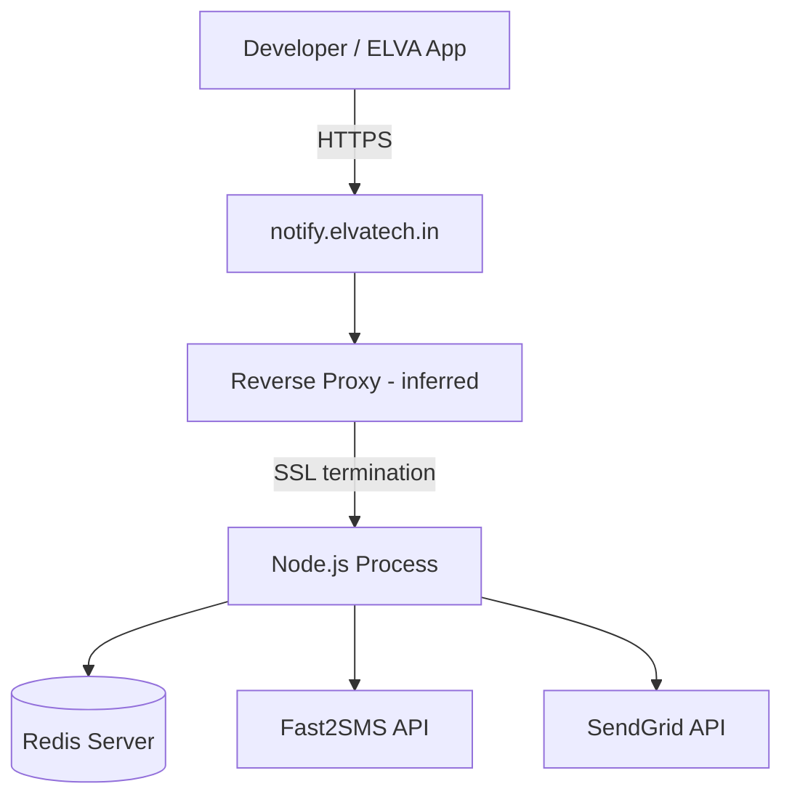

| Component | Status in Repo |
|-----------|----------------|
| Server setup | Node.js ≥18, `npm start` |
| Reverse proxy | **Not documented** (likely nginx/Apache in front) |
| SSL | **External** (Let's Encrypt or cloud LB) |
| Process manager | **Not documented** (likely PM2/systemd) |
| CI/CD pipeline | **None** in repository |
| Scheduled jobs | **None** (no cron, no TTL cleanup jobs — Redis handles expiry) |
| Health check | `GET /health` for load balancers |

## Static Assets

Express serves `public/` at root. Landing page doubles as internal API docs and live tester.

---

# 12. Code Quality Assessment

## Technical Debt

| Item | Impact | Location |
|------|--------|----------|
| Duplicate OTP routes at `/send`, `/resend`, `/verify` | Confusion, unintended exposure | `routes/index.js:9` |
| EMAIL `template` param is stub (`JSON.stringify(data)`) | Misleading API contract | `notification.service.js:32-34, 50-51` |
| `appId` param unused in SMS OTP message builder | Dead parameter | `sms.service.js:4-6` |
| Fast2SMS debug `console.log` in production path | Log noise, potential data leak | `fast2sms.js:31-38` |
| Port mismatch: env default 3000 vs landing page 4000 | Dev confusion | `env.js:3`, `index.html:639-641` |
| No `.env.example` in repo | Onboarding friction | — |
| No automated tests | Regression risk | — |

## Duplicate Logic

- `requireStringField` / `validationError` duplicated in `otp.controller.js` and `notify.controller.js`
- Phone normalization attempted in middleware and controllers (intentional pass-through on invalid)
- Channel resolution logic in both `otp.controller.js:36-51` and `notification.service.js:7-12`

## Security Concerns

(See Section 7.) Highest priority: CORS wildcard, API keys in body, provider response logging.

## Scalability Concerns

| Concern | Detail |
|---------|--------|
| Synchronous provider calls | Blocks event loop under load |
| In-memory global rate limiter | Ineffective with multiple Node instances |
| No connection pooling config | Single Redis client (OK for moderate load) |
| `Promise.all` multi-recipient | One failure fails entire batch |
| No horizontal scaling docs | Redis shared state helps; rate limiter doesn't |

## Performance Bottlenecks

1. **scrypt sync** on verify (`otpCrypto.js:22`) — CPU-bound per request
2. **Synchronous SMS/EMAIL** — latency = provider RTT
3. **Redis round-trips** — multiple per OTP send (store + cooldown + rate counters)
4. **No caching** of app credentials (negligible — in-memory map)

---

# 13. SMS/OTP Deep Dive

## End-to-End Trace: OTP Send via SMS

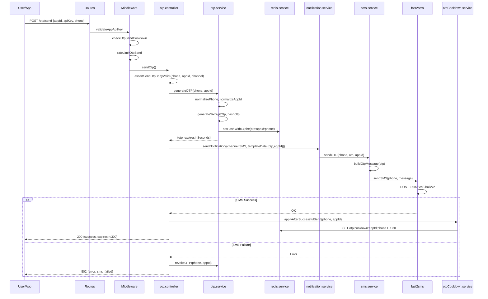

## File-by-File Execution Path

| Step | Action | File:Lines |
|------|--------|------------|
| 1. HTTP entry | Express JSON parse | `app.js:10` |
| 2. Request ID | UUID assigned | `requestId.js:3-7` |
| 3. Global rate limit | 10/min check | `rateLimiter.js:17-31` |
| 4. Route match | `POST /otp/send` | `health.routes.js:10`, `otp.routes.js:9` |
| 5. Auth | appId/apiKey validation | `validateAppApiKey.js:25-67` |
| 6. Cooldown check | Redis EXISTS | `checkOtpSendCooldown.js:18-48` |
| 7. Rate limit | Redis INCR minute/hour | `rateLimitOtpSend.js:30-78` |
| 8. Body validation | phone, appId, channel | `otp.controller.js:57-111` |
| 9. OTP generation | 6-digit + scrypt hash | `otp.service.js:50-73` |
| 10. Crypto | randomInt, scrypt | `otpCrypto.js:12-23` |
| 11. Redis store | HSET + EXPIRE 300s | `redis.service.js:107-112` |
| 12. Notification dispatch | channel router | `notification.service.js:65-112` |
| 13. SMS handler | templateData.otp branch | `notification.service.js:22-26` |
| 14. Message build | **"Your ELVA OTP is {otp}..."** | `sms.service.js:4-6, 17-21` |
| 15. Phone normalize | digits only | `phone.js:1-10` |
| 16. Provider call | Fast2SMS HTTP | `fast2sms.js:10-47` |
| 17. Cooldown set | 30s TTL | `otpCooldown.service.js:12-15` |
| 18. Response | 200 JSON | `otp.controller.js:167-172` |

## End-to-End Trace: OTP Verification

| Step | File:Lines |
|------|------------|
| Auth | `validateAppApiKey.js:25-67` |
| Validate otp, phone/email | `otp.controller.js:204-239` |
| Normalize target | `phone.js` or `email.js` |
| Redis fetch | `otp.service.js:109-110` |
| Format check (6 digits) | `otp.service.js:104-107` |
| Attempt limit check | `otp.service.js:116-124` |
| scrypt compare | `otp.service.js:126-133`, `otpCrypto.js:25-29` |
| Success: delete key | `otp.service.js:130-132` |
| Failure: increment attempts | `otp.service.js:135-141` |
| HTTP mapping | `otp.controller.js:243-261` |

---

# 14. Upgrade Readiness Assessment (DLT-Compliant Template Messaging)

India DLT (Distributed Ledger Technology) requires pre-registered templates with TRAI. Current implementation uses **free-form SMS text** via Fast2SMS route `'q'`, which is **not DLT-template compliant**.

## All Locations Where SMS Content Is Generated

| # | File | Lines | Content / Behavior | DLT Change Required |
|---|------|-------|-------------------|---------------------|
| 1 | `src/services/sms/sms.service.js` | 4-6 | `buildOtpMessage()` — **"Your ELVA OTP is {otp}. It expires in 5 minutes."** | **YES — primary OTP template** |
| 2 | `src/services/sms/sms.service.js` | 23-28 | `sendMessage()` — passes caller `message` as-is from `/notify` | **YES — all transactional SMS** |
| 3 | `src/controllers/notify.controller.js` | 120-123 | Validates `message` required for SMS channel | **YES — may need `templateId`, `variables`** |
| 4 | `public/index.html` | 447-453, 459-465 | Example SMS notify payloads | Docs only |

## All Places Where OTP Templates Are Built

| # | File | Lines | Channel | Template Logic | DLT Change |
|---|------|-------|---------|----------------|------------|
| 1 | `src/services/sms/sms.service.js` | 4-6 | SMS | Hardcoded English string with `{otp}` | **YES** |
| 2 | `src/services/email/emailTemplates.js` | 1-26 | EMAIL | HTML template with `{otp}`, `{appId}`, expiry text | No (DLT is SMS-only) |
| 3 | `src/services/notification.service.js` | 52-57 | EMAIL | Delegates to `getOtpTemplate` for OTP emails | No |
| 4 | `src/services/notification.service.js` | 32-34 | EMAIL | `buildTemplateHtml` stub for notify API | No |
| 5 | `src/controllers/otp.controller.js` | 145-146 | — | Passes `templateData: { otp, appId }` | **YES — may need DLT template ID mapping** |

## Provider-Specific Code

| File | Provider | DLT Change Required |
|------|----------|---------------------|
| `src/services/sms/providers/fast2sms.js` | Fast2SMS | **YES — route, sender_id, template_id, entity_id** |
| `src/services/sms/sms.service.js` | Abstraction layer | **YES — template routing** |
| `src/services/email/email.service.js` | SendGrid | No |
| `src/config/env.js` | Fast2SMS API key | **YES — add DLT config vars** |

## Template Rendering Logic

| Location | Current Behavior | DLT Gap |
|----------|------------------|---------|
| `sms.service.js:4-6` | String interpolation: `` `Your ELVA OTP is ${otp}...` `` | Must use registered template with variable slots |
| `notification.service.js:14-29` | Routes to `sendOTP` or `sendMessage` | No template ID concept |
| `fast2sms.js:22-27` | Sends `message` free text, `route: 'q'` | Needs DLT route (e.g. `'dlt'`) with `sender_id`, `message` as template ID or variables |
| `emailTemplates.js` | Full HTML rendering | N/A for DLT |

## Dynamic Variables Used in Messages

| Variable | Used In | Current Usage |
|----------|---------|---------------|
| `otp` | SMS `buildOtpMessage`, EMAIL `getOtpTemplate` | Embedded in message body |
| `appId` | EMAIL template only (`emailTemplates.js:2,11`) | Tenant name in email heading; **ignored in SMS** (`sms.service.js:4`) |
| `message` | `/notify` SMS, EMAIL fallback | Caller-provided free text |
| `subject` | EMAIL only | Email subject line |
| `data` | EMAIL notify template stub | JSON stringified into HTML |
| `expiresIn` | API response only | Not in SMS text (hardcoded "5 minutes") |

## Files Requiring Modification for DLT Compliance

| Priority | File | Changes Needed |
|----------|------|----------------|
| P0 | `src/services/sms/providers/fast2sms.js` | DLT API payload: `sender_id`, `template_id`, `entity_id`, variable mapping, route change |
| P0 | `src/services/sms/sms.service.js` | Replace `buildOtpMessage` with DLT template variable builder; per-app template config |
| P0 | `src/config/env.js` | Add `FAST2SMS_SENDER_ID`, `FAST2SMS_ENTITY_ID`, `FAST2SMS_OTP_TEMPLATE_ID`, etc. |
| P1 | `src/controllers/notify.controller.js` | SMS validation: accept `templateId` + `variables` instead of/in addition to `message` |
| P1 | `src/services/notification.service.js` | `handleSMS` DLT template branch |
| P1 | `src/controllers/otp.controller.js` | Pass DLT template metadata in `templateData` |
| P2 | `src/config/allowedApps.js` or new config | Per-`appId` DLT template IDs |
| P2 | `README.md` | Document DLT fields |
| P2 | `public/index.html` | Update SMS API examples |
| P3 | `src/routes/index.js` | Remove duplicate OTP routes (security cleanup) |

---

# 15. Final Deliverables

## Architecture Diagram

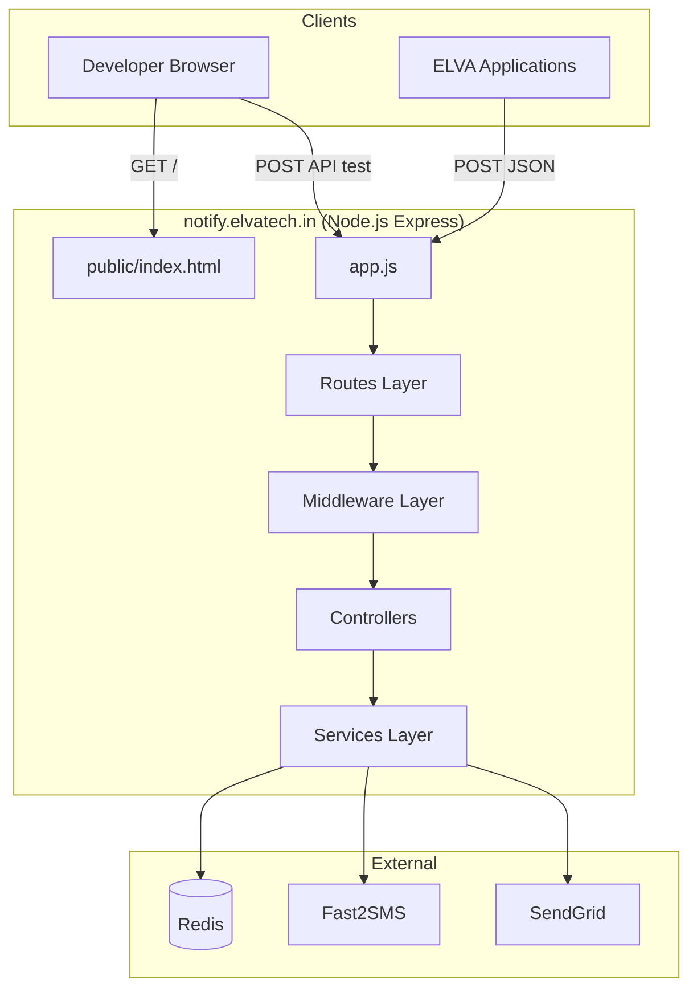

## Sequence Diagram (Full OTP Lifecycle)

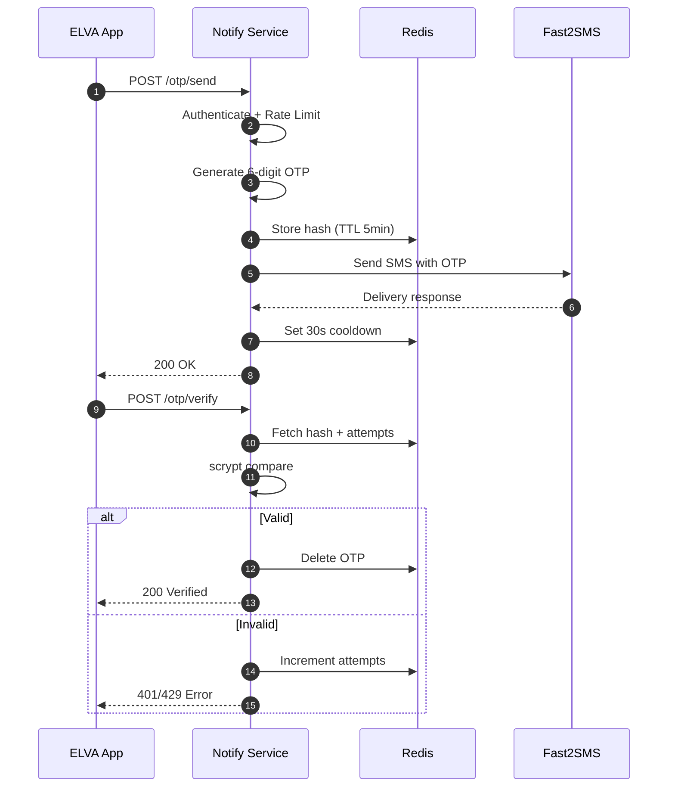

## Component Diagram

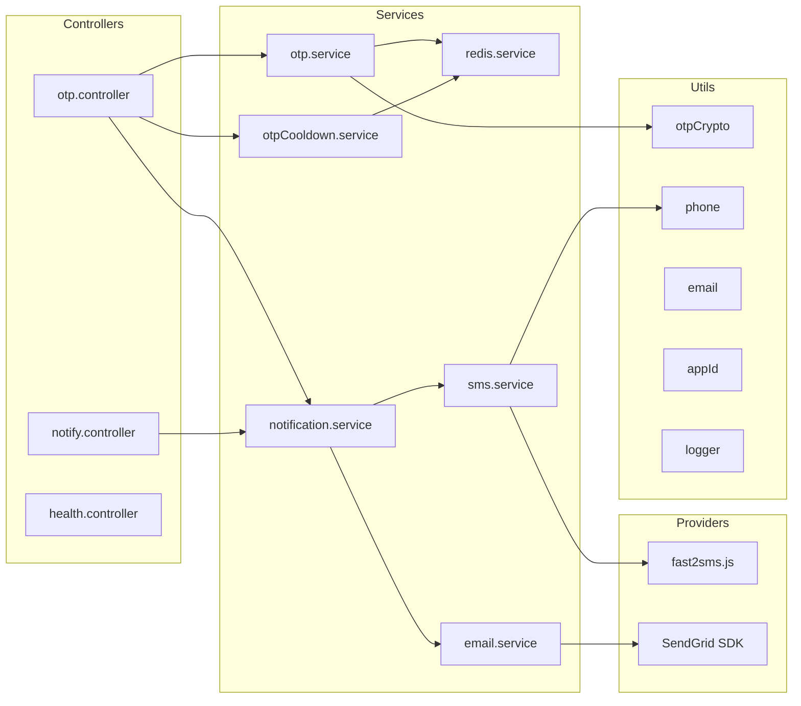

## Data Flow Diagram

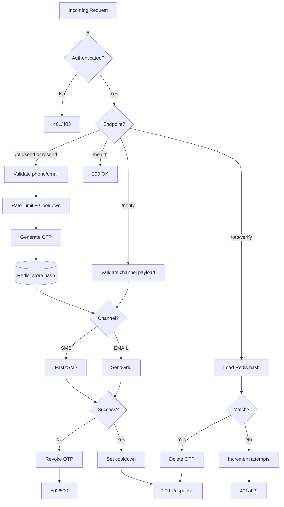

## API Inventory (Summary)

| Endpoint | Method | Auth | Purpose |
|----------|--------|------|---------|
| `/` | GET | No | Landing page |
| `/health` | GET | No | Health check |
| `/otp/send` | POST | API Key | Generate + send OTP |
| `/otp/resend` | POST | API Key | Revoke + resend OTP |
| `/otp/verify` | POST | API Key | Verify + consume OTP |
| `/notify` | POST | API Key | Direct SMS/EMAIL notification |
| `/send`, `/resend`, `/verify` | POST | API Key | Undocumented duplicates |

## Database Inventory (Summary)

| Key Pattern | Type | TTL | Purpose |
|-------------|------|-----|---------|
| `otp:{appId}:{recipient}` | Hash | 300s | OTP hash, salt, attempts |
| `otp:cooldown:{appId}:{phone}` | String | 30s | Resend throttle |
| `otp:rate:{phone}:minute` | Counter | 60s | 3/min limit |
| `otp:rate:{phone}:hour` | Counter | 3600s | 10/hour limit |

## Configuration Inventory (Summary)

12 environment variables across app config, Redis, Fast2SMS, SendGrid, and tenant credentials. See Section 9.

## Integration Inventory (Summary)

| Service | Protocol | Purpose |
|---------|----------|---------|
| Redis | TCP/TLS | OTP + rate data |
| Fast2SMS | HTTPS REST | SMS delivery |
| SendGrid | HTTPS (SDK) | Email delivery |

---

## Key Architectural Takeaways

1. **Small, focused microservice** — ~1,500 lines of application code, no frontend framework, no relational DB.
2. **Redis-centric state** — all OTP and abuse-prevention state is ephemeral with TTLs.
3. **Synchronous delivery model** — no queues; provider latency is user-facing latency.
4. **Multi-tenant via `appId`** — credentials and OTP keys are tenant-scoped.
5. **DLT gap is the primary production risk** for Indian SMS — free-form messages via route `'q'` will not meet TRAI DLT requirements.
6. **Deployment/ops are external** — no CI/CD, Docker, or infra-as-code in this repository; production setup must be documented separately.

This analysis is based entirely on the current repository state. No files were created or modified.
