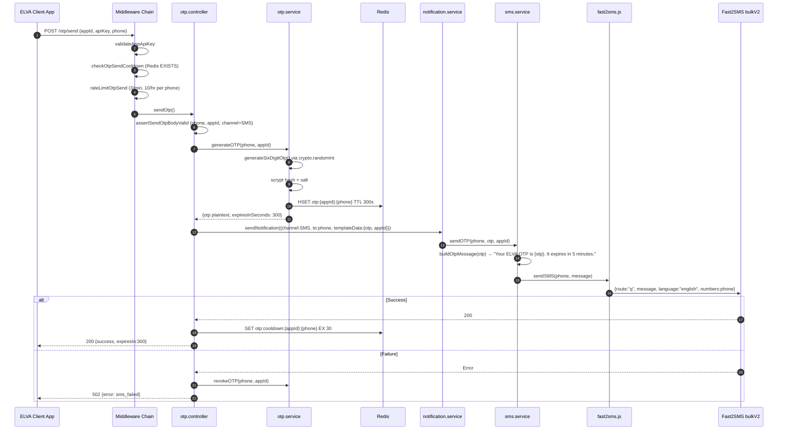
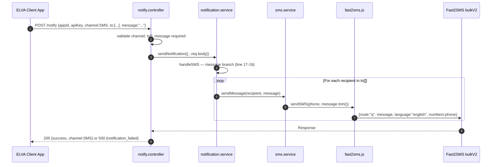
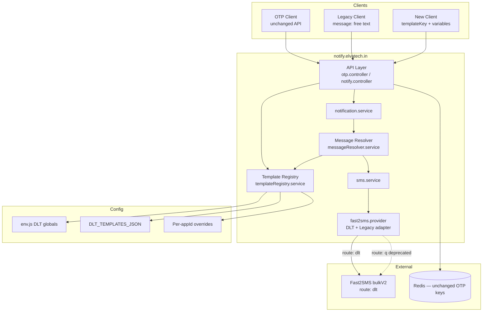
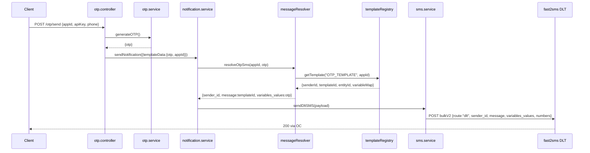
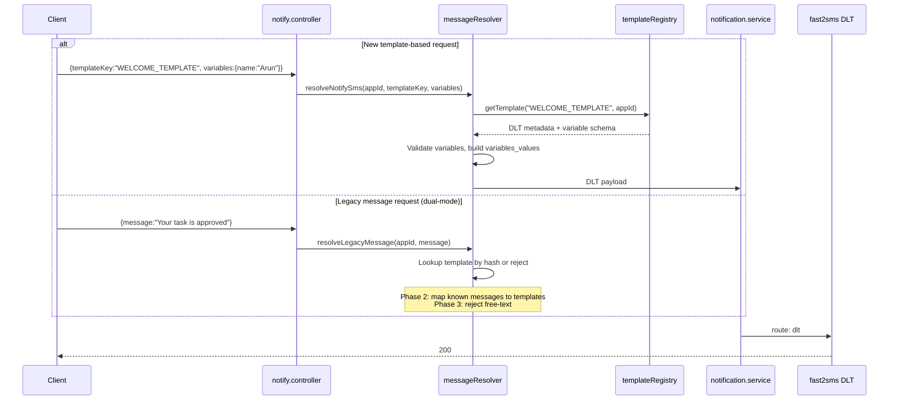
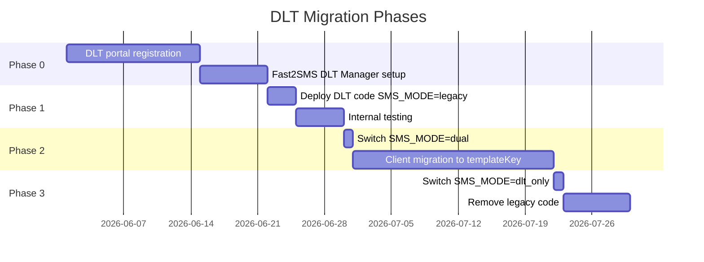
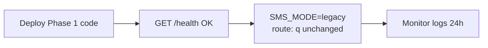
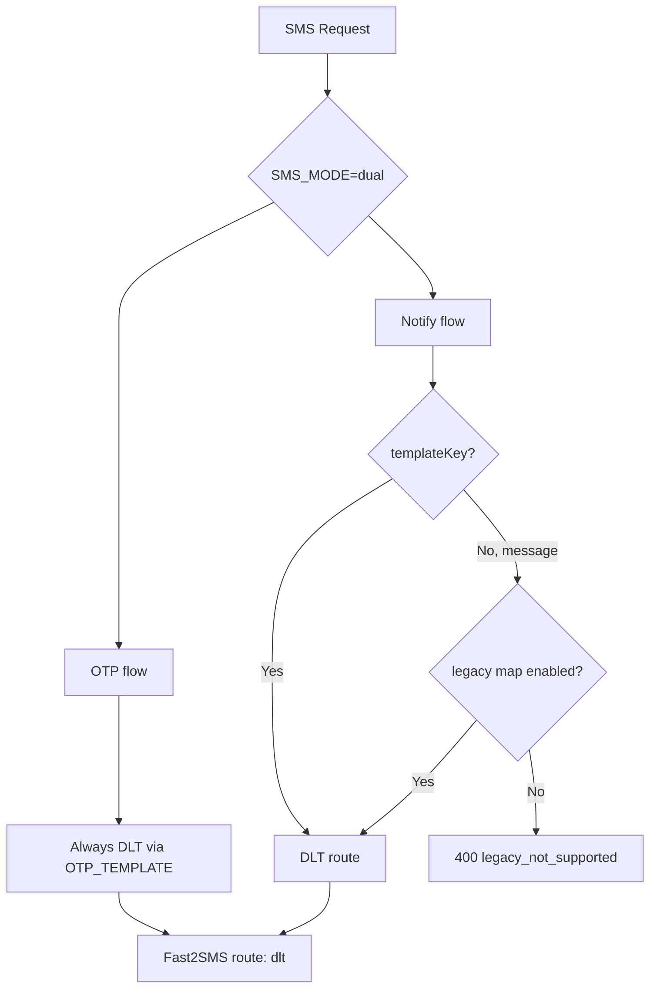
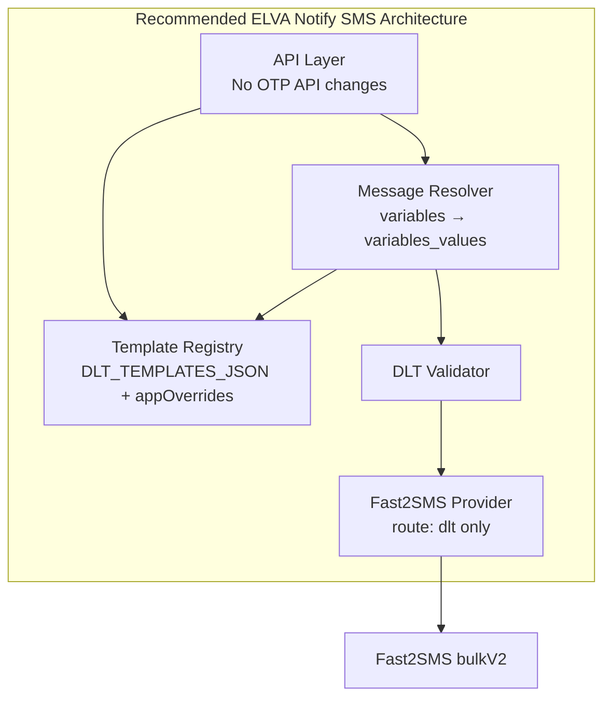

# ELVA Notify Service — DLT Migration Design Document

**Application:** `notify.elvatech.in`  
**Repository:** `elva-otp-service`  
**Document version:** 1.0  
**Date:** June 5, 2026  
**Status:** Architecture & migration design only — no implementation  

---

## Table of Contents

1. [Current SMS Flow](#1-current-sms-flow)
2. [DLT Requirements Analysis](#2-dlt-requirements-analysis)
3. [Future Architecture](#3-future-architecture)
4. [Template Registry Design](#4-template-registry-design)
5. [Multi-Tenant Design](#5-multi-tenant-design)
6. [API Design](#6-api-design)
7. [Database Impact](#7-database-impact)
8. [File-Level Change Plan](#8-file-level-change-plan)
9. [Migration Strategy](#9-migration-strategy)
10. [Final Recommendation](#10-final-recommendation)

---

# 1. Current SMS Flow

## 1.1 Overview

Today, all SMS traffic — both OTP and direct notifications — is sent as **free-form text** via Fast2SMS **route `q`** (quick/transactional). No DLT metadata (`sender_id`, `entity_id`, `template_id`, `variables_values`) is passed. This is non-compliant with TRAI DLT regulations for commercial SMS in India.

**Provider endpoint (current):** `POST https://www.fast2sms.com/dev/bulkV2`  
**Source:** `src/services/sms/providers/fast2sms.js:3, 16-28`

---

## 1.2 OTP SMS Flow (`POST /otp/send`, `POST /otp/resend`)

Applies when `channel` is omitted or set to `SMS` (default).



### File trace (OTP SMS)

| Step | File | Lines | Action |
|------|------|-------|--------|
| Route | `src/routes/health.routes.js` | 10 | Mounts `/otp` prefix |
| Route | `src/routes/otp.routes.js` | 9-10 | `POST /send`, `/resend` middleware chain |
| Auth | `src/middleware/validateAppApiKey.js` | 25-67 | API key check |
| Cooldown | `src/middleware/checkOtpSendCooldown.js` | 18-48 | 30s resend block |
| Rate limit | `src/middleware/rateLimitOtpSend.js` | 30-78 | 3/min, 10/hr per phone |
| Validation | `src/controllers/otp.controller.js` | 57-111 | Phone + appId validation |
| OTP gen | `src/services/otp.service.js` | 50-73 | Generate + Redis store |
| Dispatch | `src/controllers/otp.controller.js` | 141-147 | `templateData: {otp, appId}` |
| Route SMS | `src/services/notification.service.js` | 22-26 | `templateData.otp` branch |
| Message build | `src/services/sms/sms.service.js` | 4-6, 17-21 | **Hardcoded free-text message** |
| Provider | `src/services/sms/providers/fast2sms.js` | 10-47 | **route: `q`, free-form message** |
| Cooldown | `src/services/otpCooldown.service.js` | 12-15 | Post-success 30s TTL |

### Current OTP SMS message (exact)

```
Your ELVA OTP is {otp}. It expires in 5 minutes.
```

Built in `src/services/sms/sms.service.js:4-6`. The `appId` parameter is accepted but **not used** in the SMS body.

---

## 1.3 Notify SMS Flow (`POST /notify`)

Direct SMS notifications bypass OTP generation entirely.



### File trace (Notify SMS)

| Step | File | Lines | Action |
|------|------|-------|--------|
| Route | `src/routes/notify.routes.js` | 7 | `POST /notify` |
| Validation | `src/controllers/notify.controller.js` | 120-123 | `message` required for SMS |
| Dispatch | `src/services/notification.service.js` | 17-19 | Passes `message` as-is per recipient |
| Send | `src/services/sms/sms.service.js` | 23-28 | No transformation |
| Provider | `src/services/sms/providers/fast2sms.js` | 22-27 | **route: `q`, caller's free text** |

### Current Notify SMS validation rule

```javascript
// notify.controller.js:120-123
if (!isNonEmptyString(message)) {
  return validationError(req, res, 'message is required for SMS channel');
}
```

Clients supply arbitrary message text. There is no template concept for SMS today (unlike EMAIL, which supports `html` or `template`).

---

## 1.4 Current vs DLT Gap Summary

| Aspect | Current State | DLT Requirement |
|--------|---------------|-----------------|
| Route | `q` (quick) | `dlt` or `dlt_manual` |
| Message body | Free-form string composed in code or by client | Pre-approved template text with `{#var#}` slots |
| Sender ID | Not sent | 3–6 char DLT-approved Header |
| Template ID | Not sent | DLT Content Template ID |
| Entity ID | Not sent | Principal Entity ID (PEID) |
| Variables | Embedded in message string | Pipe-separated `variables_values` or substituted in manual route |
| Consent | Not tracked | Required for promotional; implicit for transactional OTP |

---

# 2. DLT Requirements Analysis

## 2.1 Principal Entity ID (PEID / Entity ID)

**What it is:** A 19-digit identifier assigned by TRAI's DLT platform to the organization (Principal Entity) that sends SMS. ELVA Tech (or its registered entity) must register on a DLT portal (e.g., Jio, Airtel, Vodafone Idea, BSNL) and obtain a PEID.

**Role in SMS delivery:**
- Binds every SMS template and sender ID to a registered legal entity
- Required by telecom operators for template matching and audit
- Passed to Fast2SMS as `entity_id` (mandatory unless template is pre-registered in Fast2SMS DLT Manager)

**ELVA implication:** One PEID for ELVA Tech as the Principal Entity. All ELVA Notify SMS should use this single PEID regardless of which client `appId` triggered the send.

---

## 2.2 Sender ID (Header)

**What it is:** A 3–6 character alphanumeric identifier (e.g., `ELVA`, `ELVOTP`, `ELVTCH`) registered on DLT and mapped to the PEID.

**Rules:**
- Must be pre-approved on DLT portal
- Must be linked to each Content Template used
- Displayed to end user as the SMS sender name
- Case-sensitive in some operator systems

**ELVA implication:** Register at least one sender ID for transactional OTP and optionally separate IDs for different message categories (OTP vs alerts vs marketing).

**Fast2SMS parameter:** `sender_id` (required for DLT routes)

---

## 2.3 Template ID (Content Template ID)

**What it is:** A unique ID assigned when a message template is approved on the DLT portal. Each distinct message pattern requires its own template registration.

**Example DLT-approved OTP template text:**

```
Your ELVA OTP is {#var#}. It expires in 5 minutes. Do not share this code.
```

- `{#var#}` is the TRAI placeholder for a variable
- The **exact wording** (including punctuation, spacing, brand name) must match DLT registration character-for-character
- Template ID (e.g., `1107161234567890123456`) is returned upon approval

**Fast2SMS parameter:** `message` field holds the DLT Template ID (in `dlt` route) or full substituted text (in `dlt_manual` route). Per Fast2SMS docs, `message` in DLT route = Message_ID from DLT Manager.

---

## 2.4 Consent Requirements

| SMS Category | Consent Required | ELVA Use Cases |
|--------------|------------------|----------------|
| **Transactional** | No explicit opt-in needed; user initiated the action | OTP verification, password reset OTP, login OTP |
| **Service Implicit** | Implied by existing customer relationship | Order status, appointment reminders (if registered as service) |
| **Promotional** | Explicit opt-in required; scrubbing against DND registry | Marketing, offers, campaigns |

**ELVA Notify Service scope:**

| Flow | Recommended Category | Consent |
|------|---------------------|---------|
| `POST /otp/send` | Transactional | User requested OTP → implicit consent |
| `POST /otp/resend` | Transactional | Same session, user re-requested |
| `POST /notify` (alerts) | Transactional or Service | Depends on template registration category |
| `POST /notify` (marketing) | Promotional | **Not recommended** in current service; requires separate consent management |

**Design decision:** Register all ELVA Notify templates as **Transactional** where possible. Do not allow promotional free-text via `/notify` without a separate consent subsystem.

---

## 2.5 Variable Placeholders

**TRAI/DLT format:** `{#var#}` in template registration  
**Fast2SMS DLT route format:** `variables_values` as pipe-separated string

**Example:**

| DLT Template Text | Variables | `variables_values` |
|-------------------|-----------|-------------------|
| `Your ELVA OTP is {#var#}. It expires in 5 minutes.` | 1 (OTP) | `482910` |
| `Hi {#var#}, your task {#var#} has been approved.` | 2 (name, taskId) | `Arun|TASK-123` |

**Rules:**
- Number of values must match number of `{#var#}` placeholders in approved template
- Variable content must not cause the final message to deviate from approved pattern
- OTP values: numeric, 6 digits (matches current `generateSixDigitOtp`)
- No URLs in OTP templates unless explicitly approved

**Current code gap:** `buildOtpMessage()` interpolates directly into a string that may not match any DLT-registered template exactly.

---

## 2.6 OTP Template Requirements

Specific requirements for OTP SMS under DLT:

| Requirement | Detail |
|-------------|--------|
| Category | Must be registered as Transactional |
| Content | Must include brand identifier (ELVA or client brand if separate PEID) |
| Variable slots | OTP value must use `{#var#}` placeholder, not hardcoded positions |
| Expiry mention | If "expires in 5 minutes" is in message, it must be part of approved template (static text, not variable) |
| No dynamic URLs | OTP SMS should not contain unapproved links |
| Length | SMS ≤ 160 chars for single segment (GSM-7); longer templates split into multiple parts |
| Sender-template binding | Sender ID must be linked to OTP template on DLT portal |

**Recommended ELVA OTP template (to register on DLT):**

```
Your ELVA OTP is {#var#}. It expires in 5 minutes. Do not share this code.
```

This is close to the current message in `sms.service.js:5` with an added security line (must be registered exactly as approved).

---

## 2.7 Transactional vs Promotional Routes

### Fast2SMS Route Options

| Route | Purpose | DLT Compliance | Current Usage |
|-------|---------|----------------|---------------|
| `q` | Quick SMS, free-form | **Non-compliant** for India commercial SMS | **Currently used** |
| `dlt` | DLT template SMS with variable substitution | Compliant | Not used |
| `dlt_manual` | Full DLT message with variables pre-substituted | Compliant (higher risk of mismatch) | Not used |

### Operator-Level Categories

| Category | Time Restrictions | DND Scrubbing | ELVA Fit |
|----------|-------------------|---------------|----------|
| Transactional | 24×7 allowed | Exempt | OTP, security alerts |
| Promotional | 10:00–21:00 IST | Required | Not in scope for v1 |

**Recommendation:** Use Fast2SMS route `dlt` (not `dlt_manual`) for production. The `dlt` route passes `sender_id`, template ID as `message`, and `variables_values` — reducing risk of character mismatch with approved template.

---

# 3. Future Architecture

## 3.1 Design Goals

1. **DLT compliance** for all outbound SMS in India
2. **Backward compatibility** — existing clients sending `message` continue to work during migration
3. **Template-first** — new clients use `templateKey` or `templateId` + `variables`
4. **Centralized template registry** — DLT IDs managed server-side, not by clients
5. **OTP unchanged at API level** — `POST /otp/send` body unchanged; DLT applied internally
6. **Multi-tenant support** — per-`appId` template overrides where needed, with global defaults

---

## 3.2 Target Architecture



---

## 3.3 OTP Flow (Future — DLT Compliant)

Client API **unchanged**. DLT resolution happens server-side.



**Key principle:** Clients never pass DLT template IDs for OTP. The service maps `OTP_TEMPLATE` internally.

---

## 3.4 Notify Flow (Future — DLT Compliant)



---

## 3.5 Backward Compatibility Model

| Phase | `POST /otp/send` | `POST /notify` SMS |
|-------|------------------|-------------------|
| Phase 1 | Unchanged API; internal DLT | `message` OR `templateKey`+`variables` accepted |
| Phase 2 | Unchanged API; DLT only internally | Both modes; `message` logged as deprecated |
| Phase 3 | Unchanged API | `templateKey`+`variables` only; `message` returns 400 |

**OTP backward compatibility:** Fully maintained — no client changes required ever for OTP endpoints.

**Notify backward compatibility:** Maintained through Phase 2 via legacy-to-template mapping table or explicit `templateKey` alias.

---

## 3.6 New Service Components (Conceptual)

| Component | Responsibility |
|-----------|----------------|
| `templateRegistry.service` | Load, validate, and resolve DLT template definitions |
| `messageResolver.service` | Map logical template keys + variables → Fast2SMS DLT payload |
| `dltValidator` | Ensure variable count/types match template schema |
| `fast2sms.provider` (extended) | `sendDltSMS()` alongside deprecated `sendSMS()` |
| `smsMode` config | `legacy` \| `dual` \| `dlt_only` env flag |

---

# 4. Template Registry Design

## 4.1 Design Principles

- Templates identified by **logical keys** (e.g., `OTP_TEMPLATE`), not raw DLT IDs in client requests
- DLT metadata (`templateId`, `senderId`, `entityId`) stored **server-side only**
- Variable schema defines allowed placeholders and validation rules
- Per-`appId` overrides supported via nested config
- Loaded at startup; hot-reload optional in Phase 2

---

## 4.2 Configuration Model

### Environment-level globals

```
FAST2SMS_ENTITY_ID=1001234567890123456
FAST2SMS_DEFAULT_SENDER_ID=ELVAOT
SMS_MODE=dual
DLT_TEMPLATES_JSON={...}
```

### Template entry schema

```json
{
  "key": "OTP_TEMPLATE",
  "dltTemplateId": "1107161234567890123456",
  "senderId": "ELVAOT",
  "category": "transactional",
  "description": "Standard 6-digit OTP for login and verification",
  "approvedText": "Your ELVA OTP is {#var#}. It expires in 5 minutes. Do not share this code.",
  "variables": [
    {
      "name": "otp",
      "position": 1,
      "type": "numeric",
      "length": 6,
      "required": true
    }
  ],
  "enabled": true
}
```

---

## 4.3 Example: OTP_TEMPLATE

```json
{
  "OTP_TEMPLATE": {
    "dltTemplateId": "1107161234567890123456",
    "senderId": "ELVAOT",
    "entityId": "${FAST2SMS_ENTITY_ID}",
    "category": "transactional",
    "approvedText": "Your ELVA OTP is {#var#}. It expires in 5 minutes. Do not share this code.",
    "variables": [
      {
        "name": "otp",
        "position": 1,
        "type": "numeric",
        "length": 6,
        "required": true
      }
    ],
    "enabled": true
  }
}
```

**Resolver output for OTP `482910`:**

```json
{
  "route": "dlt",
  "sender_id": "ELVAOT",
  "message": "1107161234567890123456",
  "variables_values": "482910",
  "numbers": "9876543210"
}
```

---

## 4.4 Example: WELCOME_TEMPLATE

```json
{
  "WELCOME_TEMPLATE": {
    "dltTemplateId": "1107161234567890123457",
    "senderId": "ELVAOT",
    "entityId": "${FAST2SMS_ENTITY_ID}",
    "category": "transactional",
    "approvedText": "Welcome to ELVA, {#var#}! Your account is now active.",
    "variables": [
      {
        "name": "name",
        "position": 1,
        "type": "string",
        "maxLength": 30,
        "required": true
      }
    ],
    "enabled": true
  }
}
```

**Client request:**

```json
{
  "templateKey": "WELCOME_TEMPLATE",
  "variables": { "name": "Arun" }
}
```

**Resolver output:**

```json
{
  "route": "dlt",
  "sender_id": "ELVAOT",
  "message": "1107161234567890123457",
  "variables_values": "Arun",
  "numbers": "9876543210"
}
```

---

## 4.5 Example: PASSWORD_RESET_TEMPLATE

```json
{
  "PASSWORD_RESET_TEMPLATE": {
    "dltTemplateId": "1107161234567890123458",
    "senderId": "ELVAOT",
    "entityId": "${FAST2SMS_ENTITY_ID}",
    "category": "transactional",
    "approvedText": "Your ELVA password reset OTP is {#var#}. Valid for 5 minutes. Do not share.",
    "variables": [
      {
        "name": "otp",
        "position": 1,
        "type": "numeric",
        "length": 6,
        "required": true
      }
    ],
    "enabled": true
  }
}
```

**Note:** If password reset uses the same wording as login OTP, register one template and alias both keys to the same DLT ID in the registry.

---

## 4.6 Example: CUSTOM_NOTIFICATION_TEMPLATE

For client-specific transactional alerts with two variables:

```json
{
  "CUSTOM_NOTIFICATION_TEMPLATE": {
    "dltTemplateId": "1107161234567890123459",
    "senderId": "ELVAOT",
    "entityId": "${FAST2SMS_ENTITY_ID}",
    "category": "transactional",
    "approvedText": "Hi {#var#}, your {#var#} request has been processed successfully.",
    "variables": [
      {
        "name": "name",
        "position": 1,
        "type": "string",
        "maxLength": 30,
        "required": true
      },
      {
        "name": "requestType",
        "position": 2,
        "type": "string",
        "maxLength": 40,
        "required": true
      }
    ],
    "enabled": true
  }
}
```

---

## 4.7 Full `DLT_TEMPLATES_JSON` Example

```json
{
  "defaults": {
    "entityId": "1001234567890123456",
    "senderId": "ELVAOT"
  },
  "templates": {
    "OTP_TEMPLATE": {
      "dltTemplateId": "1107161234567890123456",
      "senderId": "ELVAOT",
      "category": "transactional",
      "approvedText": "Your ELVA OTP is {#var#}. It expires in 5 minutes. Do not share this code.",
      "variables": [{ "name": "otp", "position": 1, "type": "numeric", "length": 6, "required": true }]
    },
    "WELCOME_TEMPLATE": {
      "dltTemplateId": "1107161234567890123457",
      "senderId": "ELVAOT",
      "category": "transactional",
      "approvedText": "Welcome to ELVA, {#var#}! Your account is now active.",
      "variables": [{ "name": "name", "position": 1, "type": "string", "maxLength": 30, "required": true }]
    },
    "PASSWORD_RESET_TEMPLATE": {
      "dltTemplateId": "1107161234567890123458",
      "senderId": "ELVAOT",
      "category": "transactional",
      "approvedText": "Your ELVA password reset OTP is {#var#}. Valid for 5 minutes. Do not share.",
      "variables": [{ "name": "otp", "position": 1, "type": "numeric", "length": 6, "required": true }]
    },
    "CUSTOM_NOTIFICATION_TEMPLATE": {
      "dltTemplateId": "1107161234567890123459",
      "senderId": "ELVAOT",
      "category": "transactional",
      "approvedText": "Hi {#var#}, your {#var#} request has been processed successfully.",
      "variables": [
        { "name": "name", "position": 1, "type": "string", "maxLength": 30, "required": true },
        { "name": "requestType", "position": 2, "type": "string", "maxLength": 40, "required": true }
      ]
    }
  },
  "appOverrides": {
    "my-app": {
      "OTP_TEMPLATE": {
        "dltTemplateId": "1107169999999999999999",
        "senderId": "MYAPP",
        "approvedText": "Your MyApp OTP is {#var#}. Valid for 5 minutes."
      }
    }
  }
}
```

---

## 4.8 Registry Resolution Algorithm

```
resolve(templateKey, appId, variables):
  1. Load base template from templates[templateKey]
  2. If appOverrides[appId][templateKey] exists, deep-merge override
  3. Validate all required variables present and type-correct
  4. Sort variables by position, join values with "|" → variables_values
  5. Return {route:"dlt", sender_id, message: dltTemplateId, variables_values, entity_id}
```

---

# 5. Multi-Tenant Design

## 5.1 Option A: Global ELVA Templates

All `appId` tenants share one set of DLT-registered templates under ELVA's Principal Entity ID and sender ID(s).

| Pros | Cons |
|------|------|
| Single DLT registration effort | All SMS shows ELVA sender ID |
| Simpler operations and compliance audit | Client brands cannot use their own sender ID |
| One template approval pipeline | Less flexibility for white-label clients |
| Matches current `buildOtpMessage` branding | New templates require ELVA admin action |

## 5.2 Option B: Per appId Templates

Each `appId` can have its own DLT template IDs, sender IDs, and optionally separate PEIDs.

| Pros | Cons |
|------|------|
| White-label sender IDs (e.g., `MYAPP`) | Each client needs DLT registration or sub-entity setup |
| Per-client template wording | Complex compliance tracking |
| Client-specific branding in OTP SMS | Higher operational overhead |
| Already hinted in code (`appId` param in `sendOTP`) | Misconfiguration risk per tenant |

---

## 5.3 Recommendation: **Hybrid — Option A default with Option B overrides**

**Primary model:** Global ELVA templates (Option A)  
**Extension:** Per-`appId` overrides (Option B subset) via `appOverrides` in template registry

### Justification

1. **DLT legal entity:** SMS in India must be sent under a registered PEID. ELVA Tech is the service operator; clients are API consumers, not telecom principals. A single PEID under ELVA is the standard model for notification platforms.

2. **Current code behavior:** `buildOtpMessage` already uses "ELVA" branding and ignores `appId`. Clients do not expect per-app SMS branding today.

3. **Operational simplicity:** One OTP template approval covers all tenants for Phase 1 launch.

4. **Future flexibility:** `appOverrides` in the registry (see Section 4.7) supports white-label clients who complete their own DLT registration without restructuring the service.

5. **Compliance:** Centralized template control reduces risk of clients sending non-approved content via `/notify`.

### Override rules

| Template | Default | Override allowed? |
|----------|---------|-------------------|
| `OTP_TEMPLATE` | Global ELVA | Yes, if client has approved DLT template |
| `WELCOME_TEMPLATE` | Global ELVA | Yes |
| `PASSWORD_RESET_TEMPLATE` | Global ELVA | Rarely — usually global |
| `CUSTOM_NOTIFICATION_TEMPLATE` | Global | Yes, per client |

**Constraint:** Override requires pre-registration of `dltTemplateId` + `senderId` in config. Clients cannot supply raw DLT IDs at runtime.

---

# 6. API Design

## 6.1 Design Principles

- **OTP endpoints:** No breaking changes to request/response
- **Notify SMS:** Additive fields (`templateKey`, `variables`); `message` deprecated then removed
- **Validation:** Strict variable schema enforcement per template
- **Error codes:** New `invalid_template`, `missing_variable`, `dlt_send_failed`

---

## 6.2 OTP Endpoints (Unchanged)

### `POST /otp/send` — No client changes

**Request (unchanged):**

```json
{
  "appId": "my-app",
  "apiKey": "your-secret-key",
  "phone": "919876543210"
}
```

**Response (unchanged):**

```json
{
  "success": true,
  "message": "OTP sent successfully",
  "expiresIn": 300,
  "requestId": "uuid"
}
```

Internally, service resolves `OTP_TEMPLATE` from registry. Client is unaware of DLT.

---

## 6.3 Notify SMS — Future Payload Design

### Mode 1: Template-based (recommended)

```json
{
  "appId": "my-app",
  "apiKey": "your-secret-key",
  "channel": "SMS",
  "to": ["919876543210"],
  "templateKey": "WELCOME_TEMPLATE",
  "variables": {
    "name": "Arun"
  }
}
```

### Mode 2: Template with multiple variables

```json
{
  "appId": "my-app",
  "apiKey": "your-secret-key",
  "channel": "SMS",
  "to": ["919876543210", "919876543211"],
  "templateKey": "CUSTOM_NOTIFICATION_TEMPLATE",
  "variables": {
    "name": "Arun",
    "requestType": "leave application"
  }
}
```

### Mode 3: Legacy (Phase 1–2 only)

```json
{
  "appId": "my-app",
  "apiKey": "your-secret-key",
  "channel": "SMS",
  "to": ["919876543210"],
  "message": "Your task is approved"
}
```

In Phase 1–2, legacy `message` is either:
- Rejected with `400` + guidance to use `templateKey`, OR
- Mapped via `legacyMessageMap` to a registered template (if exact match)

### Mode 4: Explicit DLT (admin/internal only — not recommended for clients)

```json
{
  "appId": "my-app",
  "apiKey": "your-secret-key",
  "channel": "SMS",
  "to": ["919876543210"],
  "templateId": "1107161234567890123456",
  "variables": {
    "otp": "482910"
  }
}
```

Reserved for internal debugging. Not exposed in public API docs.

---

## 6.4 Validation Rules (Notify SMS — Future)

| Rule | Error |
|------|-------|
| Neither `message` nor `templateKey` provided | `400 validation_error` |
| Both `message` and `templateKey` provided | `400 validation_error` |
| `templateKey` unknown | `400 invalid_template` |
| Missing required variable | `400 missing_variable` |
| Variable fails type/length check | `400 validation_error` |
| Template disabled | `400 template_disabled` |
| `SMS_MODE=dlt_only` and `message` provided | `400 legacy_not_supported` |

---

## 6.5 Response Changes

### Success (unchanged shape)

```json
{
  "success": true,
  "message": "Notification sent",
  "channel": "SMS",
  "requestId": "uuid"
}
```

### Optional additive field (Phase 2+)

```json
{
  "success": true,
  "message": "Notification sent",
  "channel": "SMS",
  "templateKey": "WELCOME_TEMPLATE",
  "requestId": "uuid"
}
```

### New error: invalid template

```json
{
  "success": false,
  "error": "invalid_template",
  "message": "Unknown templateKey: UNKNOWN_TEMPLATE",
  "requestId": "uuid"
}
```

---

## 6.6 OTP Error Code (unchanged)

SMS DLT failure continues to return:

```json
{
  "success": false,
  "error": "sms_failed",
  "message": "Failed to send OTP. Please try again.",
  "requestId": "uuid"
}
```

Consider adding `dlt_rejected` sub-code in logs (not client response) for operator debugging.

---

## 6.7 EMAIL Channel (No DLT Impact)

EMAIL `/notify` and OTP email flows remain unchanged. DLT migration is SMS-only.

---

# 7. Database Impact

## 7.1 Summary

**OTP Redis schema: no changes required.**

DLT migration is a **delivery-layer change**, not a storage-layer change. OTP generation, hashing, TTL, attempt counting, cooldown, and rate-limit keys remain identical.

---

## 7.2 Redis Keys — Unchanged

| Key Pattern | Type | TTL | Change |
|-------------|------|-----|--------|
| `otp:{appId}:{recipient}` | Hash | 300s | **None** |
| `otp:cooldown:{appId}:{phone}` | String | 30s | **None** |
| `otp:rate:{phone}:minute` | Counter | 60s | **None** |
| `otp:rate:{phone}:hour` | Counter | 3600s | **None** |

---

## 7.3 Optional Redis Additions (Phase 2+)

Not required for launch. Consider for operational improvements:

### 7.3.1 DLT Send Audit Log (optional)

| Key Pattern | Type | TTL | Purpose |
|-------------|------|-----|---------|
| `dlt:audit:{requestId}` | Hash | 7 days | Store templateKey, templateId, recipient hash, status |

Fields: `templateKey`, `dltTemplateId`, `senderId`, `status`, `providerRequestId`, `timestamp`

**Why optional:** Structured JSON logs (`logger.js`) may be sufficient initially.

### 7.3.2 Template Cache (optional)

| Key Pattern | Type | TTL | Purpose |
|-------------|------|-----|---------|
| `dlt:templates:cache` | String (JSON) | None / manual refresh | Hot-reload templates without restart |

**Why optional:** Templates loaded from env at startup is sufficient for Phase 1. Redis cache adds complexity without clear benefit at current scale.

### 7.3.3 Legacy Message Mapping (Phase 2 dual-mode)

| Key Pattern | Type | TTL | Purpose |
|-------------|------|-----|---------|
| `dlt:legacymap:{hash}` | String | Permanent | Map legacy message text → templateKey |

**Alternative:** In-memory map in `templateRegistry.service` — preferred over Redis for static mappings.

---

## 7.4 Configuration Storage

| Storage | Content | Phase |
|---------|---------|-------|
| Environment variables | `FAST2SMS_ENTITY_ID`, `FAST2SMS_DEFAULT_SENDER_ID`, `SMS_MODE` | Phase 1 |
| `DLT_TEMPLATES_JSON` env var | Full template registry | Phase 1 |
| `APP_CREDENTIALS_JSON` | Unchanged | All phases |
| Redis | Not required for template config | — |

**Recommendation:** Keep template registry in environment/config files (same pattern as `APP_CREDENTIALS_JSON`). Do not store DLT templates in Redis unless hot-reload without deploy is a hard requirement.

---

## 7.5 TTL Changes

**None.** All existing TTLs remain:

- OTP: 300 seconds
- Cooldown: 30 seconds
- Rate limits: 60s / 3600s

---

# 8. File-Level Change Plan

## 8.1 New Files

| File | Reason | Effort | Risk |
|------|--------|--------|------|
| `src/config/dltTemplates.js` | Load and parse `DLT_TEMPLATES_JSON` at startup | 4h | Low |
| `src/config/smsMode.js` | `SMS_MODE` flag: `legacy` \| `dual` \| `dlt_only` | 1h | Low |
| `src/services/templateRegistry.service.js` | Template resolution, appId overrides, validation | 8h | Medium |
| `src/services/messageResolver.service.js` | Build Fast2SMS DLT payload from template + variables | 6h | Medium |
| `src/utils/dltValidator.js` | Variable type, length, position validation | 4h | Low |

**Total new files effort:** ~23h

---

## 8.2 Modified Files

| File | Reason | Effort | Risk |
|------|--------|--------|------|
| `src/config/env.js` | Add `FAST2SMS_ENTITY_ID`, `FAST2SMS_DEFAULT_SENDER_ID`, `SMS_MODE`, `DLT_TEMPLATES_JSON` | 2h | Low |
| `src/services/sms/providers/fast2sms.js` | Add `sendDltSMS()` with route `dlt`; deprecate route `q`; remove debug `console.log` | 6h | **High** — core delivery path |
| `src/services/sms/sms.service.js` | Replace `buildOtpMessage` with registry lookup; add `sendDltTemplated()`, refactor `sendOTP`/`sendMessage` | 6h | **High** |
| `src/services/notification.service.js` | `handleSMS` branches: templateKey, legacy message, OTP templateData | 5h | Medium |
| `src/controllers/notify.controller.js` | Validate `templateKey`/`variables`; dual-mode `message` support; new error codes | 5h | Medium |
| `src/controllers/otp.controller.js` | Pass `appId` to resolver (no API change); optional templateKey override header (future) | 2h | Low |
| `src/routes/index.js` | Remove duplicate OTP routes at `/send`, `/resend`, `/verify` | 1h | Low |
| `README.md` | Document DLT templates, new notify payload, env vars, migration phases | 4h | Low |
| `public/index.html` | Update SMS examples to template-based; mark `message` deprecated | 3h | Low |
| `.env.example` (new) | Document all DLT env vars | 1h | Low |

**Total modified files effort:** ~35h

---

## 8.3 Unchanged Files

| File | Reason |
|------|--------|
| `src/services/otp.service.js` | OTP generation/storage independent of DLT |
| `src/services/redis.service.js` | Key patterns unchanged |
| `src/services/otpCooldown.service.js` | Cooldown logic unchanged |
| `src/middleware/*` | Auth and rate limits unaffected |
| `src/services/email/*` | EMAIL channel unaffected |
| `src/utils/otpCrypto.js` | Crypto logic unaffected |
| `src/utils/phone.js` | Normalization unchanged (note: 10-digit for Fast2SMS) |
| `src/server.js` | Startup unchanged (optional: load template registry) |
| `src/app.js` | Middleware stack unchanged |

---

## 8.4 Risk Matrix

| Risk | Level | Mitigation |
|------|-------|------------|
| Fast2SMS DLT payload mismatch | **High** | Test against Fast2SMS sandbox; validate `variables_values` count |
| Template text drift from DLT approval | **High** | Store `approvedText` in registry; validation lint tool |
| Legacy clients break on `/notify` | **Medium** | Dual-mode Phase 2; deprecation warnings in logs |
| Wrong sender ID / template ID | **Medium** | Config validation at startup; fail-fast on missing templates |
| Multi-instance deploy with stale config | **Low** | Templates in env; redeploy to update |
| OTP delivery regression | **High** | Canary deploy; rollback via `SMS_MODE=legacy` flag |

---

## 8.5 Total Estimated Effort

| Category | Hours |
|----------|-------|
| New services + config | 23h |
| Provider + SMS layer | 12h |
| Controllers + notification routing | 10h |
| Documentation + landing page | 7h |
| Testing (manual + integration) | 16h |
| DLT portal registration (ops, non-dev) | 8–40h |
| **Total development** | **~68h** |
| **Total including DLT registration** | **~76–108h** |

---

# 9. Migration Strategy

## 9.1 Overview

Three-phase, zero-downtime migration with feature flag `SMS_MODE` controlling behavior.



---

## 9.2 Phase 0: Prerequisites (Pre-Deployment)

**Goal:** Obtain all DLT credentials before code changes go live.

| Task | Owner | Output |
|------|-------|--------|
| Register ELVA Tech as Principal Entity on DLT portal | Ops/Legal | PEID (`entity_id`) |
| Register sender ID (e.g., `ELVAOT`) | Ops | Approved header |
| Register `OTP_TEMPLATE` text on DLT | Ops | `dltTemplateId` |
| Register `WELCOME_TEMPLATE`, `PASSWORD_RESET_TEMPLATE`, etc. | Ops | Template IDs |
| Link templates to sender ID and PEID on DLT | Ops | Approved bindings |
| Configure templates in Fast2SMS DLT Manager | Ops | Fast2SMS-side approval |
| Test send via Fast2SMS dashboard | Ops/QA | Confirmed delivery |

**Gate:** Do not enable DLT in production until at least `OTP_TEMPLATE` is approved and tested.

---

## 9.3 Phase 1: DLT Support Added (`SMS_MODE=legacy`)

**Goal:** Deploy all DLT code paths without changing runtime behavior.

| Action | Detail |
|--------|--------|
| Deploy new code | All new services, `sendDltSMS()`, registry — behind `SMS_MODE=legacy` |
| Runtime behavior | Identical to today — route `q`, free-form messages |
| OTP API | Unchanged |
| Notify API | Unchanged |
| Config | `DLT_TEMPLATES_JSON` loaded but not used for sending |
| Testing | Unit tests for registry, resolver, validator; smoke test in staging with `SMS_MODE=dlt` |
| Rollback | Redeploy previous version; no config change needed |

**Zero-downtime approach:**
- Rolling deploy of Node.js process
- Redis keys unchanged — no migration
- Health check `GET /health` validates startup (template registry parse OK)



---

## 9.4 Phase 2: Dual Mode (`SMS_MODE=dual`)

**Goal:** OTP uses DLT internally; Notify accepts both `message` and `templateKey`.

| Action | Detail |
|--------|--------|
| Set `SMS_MODE=dual` | Flip env var; rolling restart |
| OTP `/otp/send` | Internally uses `OTP_TEMPLATE` via DLT route |
| OTP `/otp/resend` | Same |
| Notify `templateKey` | Sent via DLT |
| Notify `message` | Either rejected with 400 + migration guide, OR mapped via legacy map |
| Logging | Log `DEPRECATED_LEGACY_MESSAGE` for every `message` usage |
| Client communication | Notify all ELVA app teams of new `templateKey` API |
| Monitoring | Track DLT failure rate vs historical `sms_failed` rate |

**Backward compatibility:**

| Client | Phase 2 behavior |
|--------|------------------|
| OTP clients | No changes needed — DLT applied transparently |
| Notify clients using `message` | Continue working (if legacy map enabled) OR receive 400 with migration instructions |
| Notify clients using `templateKey` | New DLT-compliant path |

**Rollback:** Set `SMS_MODE=legacy` → instant revert to route `q` for all SMS.



---

## 9.5 Phase 3: DLT Only (`SMS_MODE=dlt_only`)

**Goal:** Full DLT compliance; remove legacy free-text path.

| Action | Detail |
|--------|--------|
| Set `SMS_MODE=dlt_only` | All SMS must use DLT templates |
| OTP | DLT only (already since Phase 2) |
| Notify `message` | **400 `legacy_not_supported`** |
| Notify `templateKey` | Required for all SMS |
| Remove dead code | `buildOtpMessage`, route `q` path, legacy map |
| Remove `console.log` debug in fast2sms | Security hygiene |
| Update docs | Remove `message` from SMS examples |

**Rollback:** Set `SMS_MODE=dual` to re-enable legacy (if legacy code not yet removed) or `legacy` for emergency route `q`.

---

## 9.6 Zero-Downtime Deployment Checklist

| Step | Downtime Risk | Action |
|------|---------------|--------|
| 1. Register DLT templates | None | Ops task |
| 2. Deploy Phase 1 code | None | Rolling restart |
| 3. Staging test with `SMS_MODE=dlt` | None | QA |
| 4. Production `SMS_MODE=dual` | None | Env var change + rolling restart |
| 5. Monitor OTP delivery 48h | None | Compare success rates |
| 6. Migrate notify clients | None | Client-side changes |
| 7. Production `SMS_MODE=dlt_only` | None | Env var change |
| 8. Remove legacy code | None | Standard deploy |

**No Redis migration. No database migration. No API contract break for OTP.**

---

## 9.7 Testing Strategy per Phase

| Phase | Test |
|-------|------|
| 1 | Registry loads; validator rejects bad variables; staging DLT send with test number |
| 2 | OTP send/verify E2E; notify with `templateKey`; legacy `message` deprecation log |
| 3 | Reject `message` with 400; all SMS exit via route `dlt`; failure rate baseline |

---

# 10. Final Recommendation

## 10.1 Recommended Architecture

Implement a **Template Registry + Message Resolver** pattern with **hybrid multi-tenancy** (global ELVA templates, optional per-`appId` overrides), using Fast2SMS **route `dlt`** for all production SMS.



---

## 10.2 Key Decisions

| Decision | Recommendation |
|----------|----------------|
| Fast2SMS route | `dlt` (variable substitution) |
| OTP client API | **No changes** |
| Notify client API | Add `templateKey` + `variables`; deprecate `message` |
| Multi-tenancy | Global templates + optional `appOverrides` |
| Template storage | `DLT_TEMPLATES_JSON` env var (not Redis) |
| Redis changes | **None** for OTP keys |
| Feature flag | `SMS_MODE`: `legacy` → `dual` → `dlt_only` |
| Migration duration | ~4–6 weeks including DLT portal approval |
| Provider code | Extend `fast2sms.js`; do not add new provider yet |

---

## 10.3 Target Fast2SMS Payload (Production)

**OTP send (internal):**

```json
{
  "route": "dlt",
  "sender_id": "ELVAOT",
  "message": "1107161234567890123456",
  "variables_values": "482910",
  "language": "english",
  "numbers": "9876543210"
}
```

**Notify send (client-facing templateKey):**

```json
{
  "route": "dlt",
  "sender_id": "ELVAOT",
  "message": "1107161234567890123457",
  "variables_values": "Arun",
  "language": "english",
  "numbers": "9876543210"
}
```

---

## 10.4 Implementation Priority

| Priority | Item |
|----------|------|
| P0 | DLT portal registration (PEID, sender ID, OTP template) |
| P0 | `fast2sms.js` — `sendDltSMS()` with route `dlt` |
| P0 | `templateRegistry.service.js` + `DLT_TEMPLATES_JSON` |
| P0 | OTP internal path → `OTP_TEMPLATE` (transparent to clients) |
| P1 | Notify `templateKey` + `variables` API |
| P1 | `SMS_MODE` feature flag |
| P1 | `messageResolver.service.js` + `dltValidator.js` |
| P2 | Per-`appId` template overrides |
| P2 | Legacy `message` deprecation + client migration |
| P3 | Remove route `q` and `buildOtpMessage` |
| P3 | Remove duplicate `/send` routes |

---

## 10.5 Success Criteria

| Metric | Target |
|--------|--------|
| OTP delivery success rate | ≥ pre-migration baseline |
| DLT rejection rate | < 1% after Phase 2 stabilizes |
| Client OTP API changes | Zero |
| Notify clients migrated to `templateKey` | 100% before Phase 3 |
| Free-text SMS in production | Zero after Phase 3 |
| TRAI DLT audit readiness | All sends mapped to registered template IDs |

---

## 10.6 What Not to Do

| Anti-pattern | Reason |
|--------------|--------|
| Let clients pass raw `templateId` in production | Compliance risk; bypasses registry validation |
| Use route `q` as fallback in Phase 3 | Illegal for commercial SMS in India |
| Store DLT templates only in client apps | Central registry required for audit |
| Use `dlt_manual` with runtime string building | High mismatch risk with approved text |
| Add promotional SMS without consent system | TRAI violation |
| Change Redis OTP key structure | Unnecessary migration risk |

---

## 10.7 Summary

The ELVA Notify Service requires a **delivery-layer migration**, not a data-layer rewrite. OTP flows remain API-compatible while internally switching from free-text `route: q` to DLT template `route: dlt`. A server-side **Template Registry** centralizes all DLT metadata under ELVA's Principal Entity, with optional per-`appId` overrides for white-label clients. A three-phase **`SMS_MODE` flag** enables zero-downtime rollout: deploy DLT code silently, enable dual mode for client migration, then enforce DLT-only compliance. Redis, OTP cryptography, authentication, and email channels remain untouched.

**Recommended first action:** Register `OTP_TEMPLATE` on the DLT portal and obtain PEID + sender ID before any production code deployment.

---

*End of DLT Migration Design Document*
