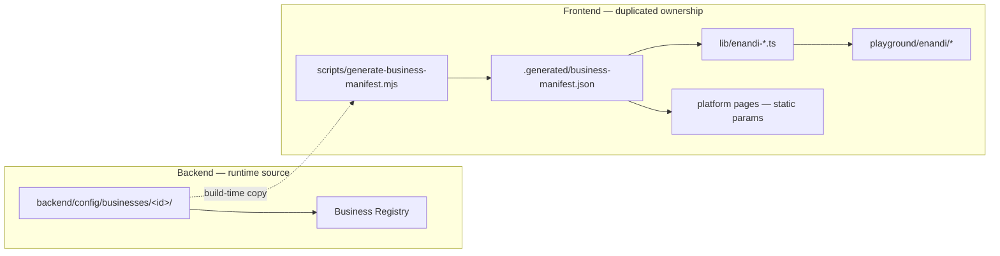
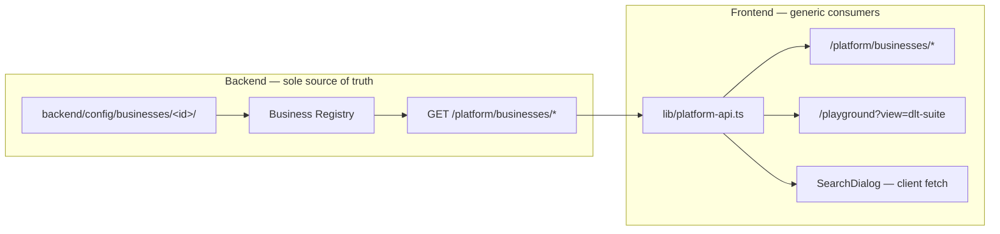
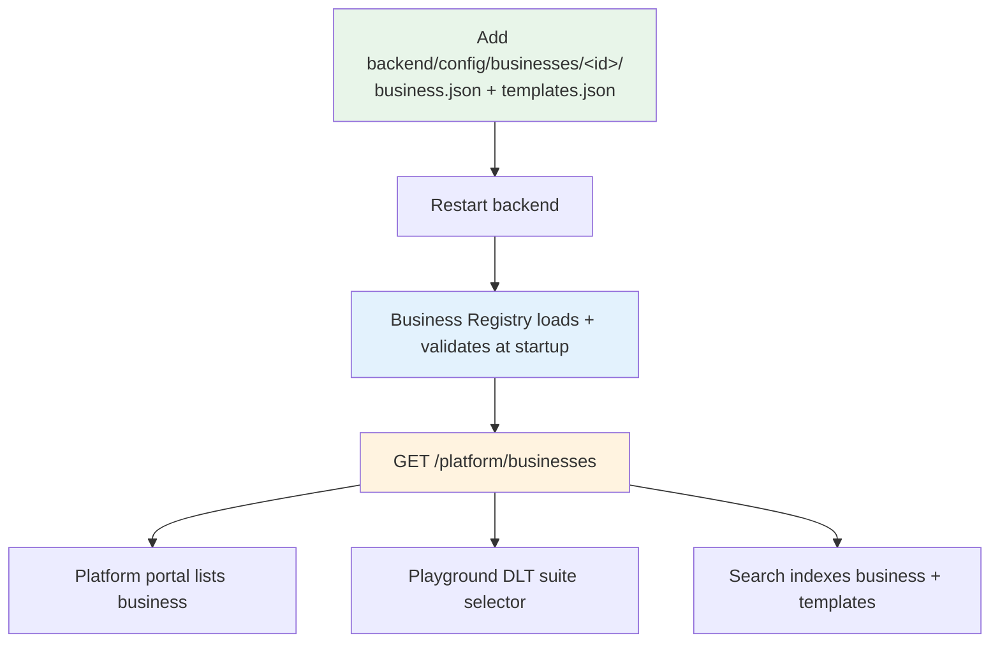

# Phase 9A — Remove Frontend Ownership of Business Templates

**Status:** Complete  
**Date:** 2026-06-06  
**Scope:** Metadata ownership refactor only — OTP/Notify APIs, DLT delivery, OpenAPI, Redis, logging, and validation rules unchanged.

---

## 1. Architecture — Before vs After

### Before (problem)



Problems:

- Frontend build script scanned `backend/config/businesses/` and wrote `frontend/.generated/business-manifest.json`.
- eNandi-specific TypeScript duplicated template keys, DLT IDs, sender IDs, and variable schemas.
- Platform and playground pages were statically tied to eNandi.
- Adding a business required frontend manifest regeneration and often code changes.

### After (target)



Onboarding a new business requires **only**:

```
backend/config/businesses/<businessId>/
  business.json
  templates.json
```

Restart backend → business appears in Platform, Playground, and Search automatically.

---

## 2. Frontend audit — hardcoded references

Search terms: `enandi`, `LOGIN_OTP`, `LOGIN_OTP_WITH_ID`, `ORDER_PLACED`, `ORDER_DELIVERED`, `OUT_FOR_DELIVERY`

| Location | Status | Notes |
|----------|--------|-------|
| `frontend/lib/enandi-test-suite.ts` | **Removed** | Hardcoded suite order + template keys |
| `frontend/lib/enandi-dlt-templates.ts` | **Removed** | Full DLT catalog mirror |
| `frontend/lib/enandi-execution-history.ts` | **Removed** | eNandi-specific localStorage key |
| `frontend/components/playground/enandi-*.tsx` | **Removed** | eNandi-only UI |
| `frontend/scripts/generate-business-manifest.mjs` | **Removed** | Build-time manifest generator |
| `frontend/.generated/business-manifest.json` | **Removed** | Stale generated artifact |
| `frontend/lib/playground-config.ts` | **Fixed** | Generic sample payloads only |
| `frontend/lib/nav.config.ts` | **Fixed** | Links to `/platform/businesses` |
| `frontend/app/playground/enandi/page.tsx` | **Redirect** | → `/playground?view=dlt-suite&business=enandi` |
| `docs/businesses/enandi.md` | **Retained** | Documentation content (not runtime metadata) |
| `frontend/scripts/generate-manifest.mjs` | **Retained** | Docs search index for markdown pages |
| `frontend/**/*.ts(x)` template keys | **Clean** | `grep` finds zero matches post-refactor |

---

## 3. Files removed

```
frontend/lib/enandi-test-suite.ts
frontend/lib/enandi-dlt-templates.ts
frontend/lib/enandi-execution-history.ts
frontend/components/playground/enandi-dlt-test-suite.tsx
frontend/components/playground/enandi-template-test-card.tsx
frontend/components/playground/enandi-playground-shell.tsx
frontend/components/playground/dlt-template-info.tsx
frontend/scripts/generate-business-manifest.mjs
frontend/.generated/business-manifest.json
```

`frontend/package.json` — removed `generate:business` script and `generate-business-manifest.mjs` from `predev` / `prebuild`.

---

## 4. Files created / materially changed

### Backend (new)

| File | Purpose |
|------|---------|
| `backend/src/services/platformMetadata.service.js` | Serializes registry → safe metadata (secrets redacted) |
| `backend/src/controllers/platform.controller.js` | HTTP handlers |
| `backend/src/routes/platform.routes.js` | Route definitions |
| `backend/src/routes/index.js` | Mounts platform routes |

### Frontend (new generic layer)

| File | Purpose |
|------|---------|
| `frontend/lib/platform-api.ts` | Fetch helpers + `formatValidationRules` |
| `frontend/lib/dlt-test-utils.ts` | Generic template utilities |
| `frontend/lib/dlt-execution-history.ts` | Generic execution history |
| `frontend/lib/playground-config-core.ts` | Shared playground types |
| `frontend/components/platform/use-platform-manifest.tsx` | Client manifest hook |
| `frontend/components/playground/dlt-test-suite.tsx` | Business-driven test suite |
| `frontend/components/playground/dlt-test-suite-loader.tsx` | Loads businesses from API |
| `frontend/components/playground/template-test-card.tsx` | Generic template card |
| `frontend/components/playground/template-test-card.types.ts` | Card types |

### Frontend (refactored)

- Platform pages: `app/platform/businesses/**`, `app/platform/page.tsx`, `app/platform/otp/page.tsx`
- Playground: `api-playground.tsx` → `DltTestSuiteLoader`, view `dlt-suite`
- Layouts: removed sync manifest; `SearchDialog` fetches client-side
- `business-config-loader.ts` → thin async wrappers over `platform-api`

---

## 5. New backend metadata endpoints

All read-only. No secrets, API keys, or OTP values exposed.

| Method | Path | Returns |
|--------|------|---------|
| `GET` | `/platform/businesses` | All businesses, stats, business-health snapshot |
| `GET` | `/platform/businesses/:businessId` | Single business metadata |
| `GET` | `/platform/businesses/:businessId/templates` | Template list with variable schemas |
| `GET` | `/platform/businesses/:businessId/templates/:templateKey` | Single template + DLT ids |
| `GET` | `/platform/otp` | OTP mapping metadata (bonus, used by platform OTP page) |

Example response shape (business list):

```json
{
  "success": true,
  "generatedAt": "2026-06-06T…",
  "stats": { "businessCount": 2, "templateCount": 6 },
  "businesses": [
    { "businessId": "enandi", "displayName": "eNandi", "templates": […], "dlt": {…} },
    { "businessId": "workspace", "displayName": "Workspace", "templates": […], "dlt": {…} }
  ]
}
```

`apiKey` in example payloads is always `[REDACTED]`.

**Verification:** `GET /platform/businesses` → HTTP 200, `businesses: ['enandi', 'workspace']`.

---

## 6. Verification — no hardcoded eNandi template definitions

```bash
# Frontend TypeScript/TSX — zero template key matches
rg "LOGIN_OTP|ORDER_PLACED|OUT_FOR_DELIVERY|ORDER_DELIVERED" frontend --glob "*.{ts,tsx}"
# → no matches

# Frontend TypeScript/TSX — only legacy redirect references enandi
rg "enandi" frontend --glob "*.{ts,tsx}"
# → app/playground/enandi/page.tsx (redirect only)

# TypeScript compile
cd frontend && npx tsc --noEmit
# → exit 0
```

Runtime UI loads templates dynamically from `GET /platform/businesses/:id/templates`.

---

## 7. Onboarding validation

Adding `backend/config/businesses/workspace/` (already present) automatically surfaces:

| Surface | Mechanism |
|---------|-----------|
| `/platform/businesses` | `fetchPlatformManifest()` at request time |
| `/platform/businesses/workspace` | Dynamic `[businessId]` route |
| `/playground?view=dlt-suite` | `DltTestSuiteLoader` → business `<select>` |
| Global search (⌘K) | `SearchDialog` → `fetchPlatformManifestClient()` |

No frontend code changes required.

---

## 8. Onboarding flow diagram



**Operator checklist:**

1. Create folder `backend/config/businesses/<businessId>/`.
2. Add `business.json` (display name, DLT defaults, version).
3. Add `templates.json` (template keys, DLT ids, variable schemas).
4. Restart backend — startup validator fails fast on schema errors.
5. Open `/platform/businesses` or `/playground?view=dlt-suite` — business appears.

---

## 9. Compatibility statement

Unchanged:

- `POST /otp/send`, `/otp/resend`, `/otp/verify`
- `POST /notify`
- DLT payload resolution and Fast2SMS delivery
- OpenAPI specification
- Redis OTP storage
- Structured logging events
- Template/business validation rules at startup

This refactor moves **metadata display ownership** to the backend registry APIs only.
