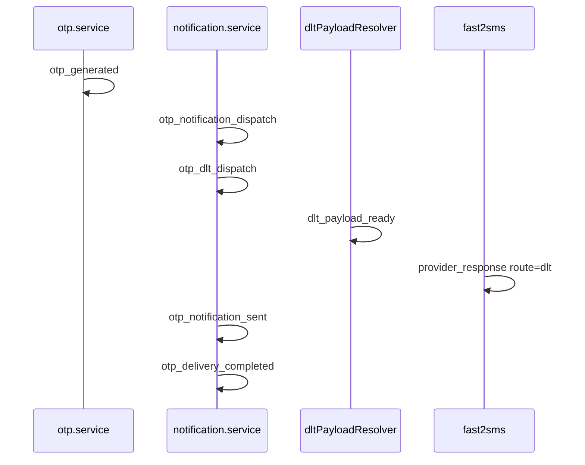

# OTP DLT Log Triage

| | |
|---|---|
| **Purpose** | Map OTP/DLT log events to investigation steps and SLI queries. |
| **Intended Audience** | On-call engineers, operations, SRE. |
| **Last Updated** | 2026-06-05 |
| **Related Documents** | [OTP DLT Observability](../architecture/otp-dlt-observability.md) · [Logging Specification](../architecture/LOGGING_SPECIFICATION.md) |

---

## Log flow (OTP SMS DLT)

---

## Canonical events (Phase 8C)

| Event | Category | Use for |
|-------|----------|---------|
| `otp_dlt_activation_status` | SYSTEM | Startup rollout state |
| `otp_config_health` | SYSTEM | Config snapshot summary |
| `otp_generated` | OTP | OTP stored (no plaintext) |
| `otp_notification_dispatch` | OTP | Send started |
| `otp_dlt_dispatch` | OTP | DLT path entered |
| `otp_dlt_fallback` | OTP | Global on, app using route=q |
| `dlt_payload_ready` | DLT | Payload built |
| `provider_response` | DLT / NOTIFICATION | Provider result; check `route`, `durationMs` |
| `otp_notification_sent` | OTP | Send success |
| `otp_delivery_completed` | OTP | **Terminal** — use for SLIs (`durationMs`, `deliveryMode`) |
| `otp_notification_failed` | ERROR | Send failure |
| `otp_verify_outcome` | OTP | All verify paths (`outcome`, `reason`) |
| `otp_verified` | OTP | Success (legacy, kept) |
| `otp_verify_failed` | OTP | Failure (legacy, kept) |

---

## Investigation by symptom

| Symptom | First query | Next steps |
|---------|-------------|------------|
| `502 sms_failed` | `requestId` + `otp_notification_failed` | Check `provider_response_failed`; revoke OTP expected |
| DLT rejection | `provider_response_failed route:dlt` | Template ID, sender, entity, variables order |
| Fallback spike | `event:otp_dlt_fallback` | Per `appId`; check `dltEnabled` + global flag |
| Verify failures | `otp_verify_outcome outcome:rejected` | Group by `reason` |
| Slow sends | `otp_delivery_completed` → `durationMs` p95 | Compare DLT vs legacy |

---

## SLI query templates

Run `node backend/scripts/otp-log-query-reference.mjs` for copy-paste templates.

---

## Security rules

**Never log:** OTP values, `variables_values`, API keys, `APP_CREDENTIALS_JSON`.

---

## Verification checklist

- [ ] Correlate single `requestId` across full OTP send chain
- [ ] Confirm `deliveryMode` matches expected activation rule
- [ ] Provider `durationMs` present on `provider_response`
