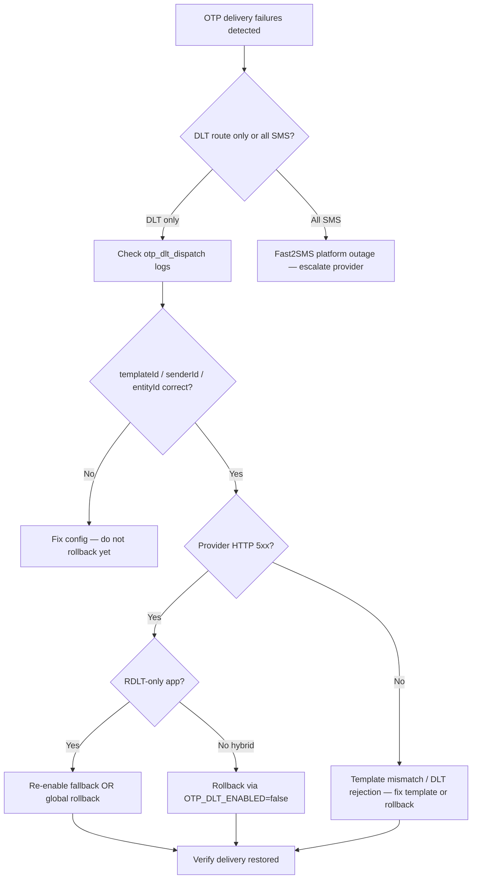

# OTP DLT Outage Response

| | |
|---|---|
| **Purpose** | Step-by-step response when OTP DLT delivery fails or Fast2SMS rejects DLT sends at scale. |
| **Intended Audience** | On-call engineers, operations, platform maintainers. |
| **Last Updated** | 2026-06-05 (Phase 8D) |
| **Related Documents** | [OTP DLT Rollback](./otp-dlt-rollback.md) · [Log Triage](./otp-dlt-log-triage.md) · [OTP DLT Observability](../architecture/otp-dlt-observability.md) |

---

## Symptoms

- Spike in `otp_notification_failed` or `otp_delivery_completed` with `status=failed`
- Spike in `provider_response_failed` with `route=dlt`
- Spike in `otp_dlt_hard_failure` for DLT-only apps (Phase 8D — no automatic fallback)
- User reports: OTP not received; API returns `502 sms_failed`
- Fast2SMS `return: false` in provider logs

---

## Decision tree

---

## Immediate actions

1. **Confirm scope** — Query logs for `event:otp_delivery_completed`, `event:otp_dlt_hard_failure`, and `event:provider_response_failed` in last 15 minutes.
2. **Check activation** — `otp_dlt_activation_status` / `otp_cutover_status` / `otp_config_health` at last startup.
3. **Identify delivery policy** — Per app: `deliveryPolicy` in `otp_cutover_status` or `/platform/otp` → Delivery policy table.
4. **Sample failure** — Inspect one `requestId` end-to-end: `otp_generated` → `otp_dlt_dispatch` → `dlt_payload_ready` → `provider_response_failed` or `otp_dlt_hard_failure`.
5. **Assess user impact** — Failed sends revoke OTP in Redis; users see `502` and must retry. DLT-only apps have **no** route=q fallback.

---

## DLT-only failure handling (Phase 8D)

When `legacyRouteEnabled=false` and DLT fails:

| Symptom | Log event | Mitigation |
|---------|-----------|------------|
| Provider 5xx / timeout | `otp_dlt_hard_failure` | Re-enable fallback (see [Rollback](./otp-dlt-rollback.md)) or set `OTP_DLT_ENABLED=false` |
| Template rejection | `otp_dlt_hard_failure` | Fix template metadata; do not expect fallback |
| Global DLT off | `otp_dlt_fallback` with `reason=dlt_inactive` | N/A for DLT-only apps — they use route=q only when global flag is false |

**Operational signal:** `otp_dlt_hard_failure` count should be zero in steady state. Any sustained spike on a retired app requires immediate action.

---

## Escalation

| Severity | Condition | Action |
|----------|-----------|--------|
| **P1** | >50% OTP sends failing >5 min | Rollback immediately; notify stakeholders |
| **P2** | 10–50% failure rate | Investigate 15 min; rollback if not resolved |
| **P3** | Isolated failures | Monitor; check template/provider for single app |

---

## Verification checklist

- [ ] Failure rate returned to baseline
- [ ] Test OTP send succeeds (staging number)
- [ ] Logs show expected `deliveryMode` after mitigation
- [ ] No OTP values appear in logs (security check)

---

## Post-incident

Document root cause: template ID, sender ID, entity ID, variable ordering, or provider outage. Update [Rollout runbook](./otp-dlt-rollout.md) if config change required.
