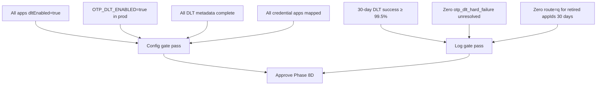

# OTP DLT Retirement Readiness (Phase 8D Gate)

| | |
|---|---|
| **Purpose** | Criteria and checklist for per-app legacy `route=q` retirement (Phase 8D). Route=q remains globally available for non-retired apps. |
| **Intended Audience** | Platform maintainers, release approvers. |
| **Last Updated** | 2026-06-05 (Phase 8D) |
| **Related Documents** | [OTP DLT Migration](../architecture/otp-dlt-migration.md) · [Platform OTP Dashboard](/platform/otp) |

---

## Retirement goal

Per-app removal of `sendOTP` → `route=q` fallback by setting `legacyRouteEnabled: false`. DLT-only apps use `route=dlt` exclusively when `OTP_DLT_ENABLED=true` and `dltEnabled=true`.

---

## Gate criteria

### Config checks (automated — portal + snapshot)

| Check | Source |
|-------|--------|
| All mapped apps `dltEnabled: true` | `otp-health-snapshot.json` |
| `OTP_DLT_ENABLED=true` in production | Environment |
| All DLT metadata complete | Startup validator + snapshot |
| All `APP_CREDENTIALS_JSON` apps mapped | Snapshot `unmappedCredentialApps: []` |
| All apps `rolloutReady` | Manifest |
| All DLT-enabled apps `legacyRouteEnabled: false` | `allProductionAppsRetired` in snapshot |

View status at [/platform/otp](/platform/otp) → **Retirement readiness gate**, **Delivery policy**, **Retirement status**.

### Log checks (manual — operator verification)

| Check | Target |
|-------|--------|
| 30-day DLT success rate | ≥ 99.5% (`otp_delivery_completed`) |
| Zero `otp_dlt_hard_failure` (unresolved) | Before and after cutover |
| Zero `otp_dlt_fallback` for retired appIds | 30 consecutive days |
| Zero OTP `providerRoute: q` for retired appIds | 30 consecutive days |

---

## Phase 8D cutover checklist

### Per-app cutover

1. Confirm Phase 8C readiness for the target `appId` (DLT success ≥ 99.5%, provider acceptance ≥ 99%).
2. Set `dltEnabled: true` and `legacyRouteEnabled: false` in `otp-mappings.json`.
3. Ensure `OTP_DLT_ENABLED=true` in production.
4. Restart backend; verify `otp_cutover_status` lists app under `retiredApps`.
5. Verify `/platform/otp` shows **Fully Retired** and **DLT Only** for the app.
6. Send test OTP; confirm `otp_dlt_dispatch` with `deliveryMode: dlt_only` and no `otp_dlt_fallback`.
7. Monitor `otp_dlt_hard_failure` for 24 hours.

### Full production cutover

- [ ] All production apps in `otp-mappings.json` with valid `business`, `templateKey`, `dltEnabled: true`
- [ ] Portal retirement gate: **Config Ready = true** (all config checks pass)
- [ ] Log SLIs reviewed and documented
- [ ] Re-enable fallback procedure tested in staging
- [ ] Stakeholder sign-off recorded

---

## Rollback after cutover

| Scope | Action |
|-------|--------|
| Single DLT-only app | Set `legacyRouteEnabled: true` → hybrid mode |
| Single app off DLT | Set `dltEnabled: false` |
| All apps | Set `OTP_DLT_ENABLED=false` |

See [OTP DLT Rollback](./otp-dlt-rollback.md).
