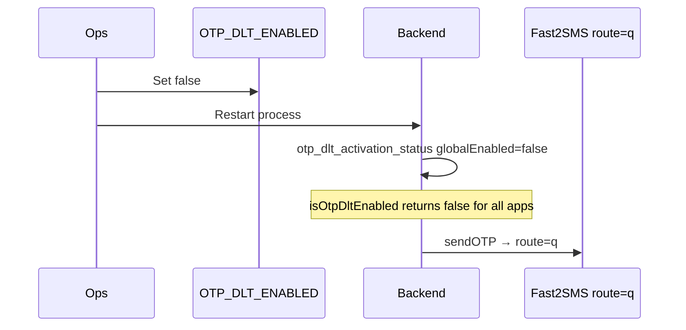

# OTP DLT Rollback

| | |
|---|---|
| **Purpose** | Immediately revert OTP SMS from DLT (`route=dlt`) to legacy free-text (`route=q`) without code deploy. |
| **Intended Audience** | On-call engineers, operations. |
| **Last Updated** | 2026-06-05 (Phase 8D) |
| **Related Documents** | [Outage Response](./otp-dlt-outage.md) · [OTP DLT Migration](../architecture/otp-dlt-migration.md) |

---

## When to rollback

- DLT provider rejection at scale
- Incorrect template metadata discovered in production
- OTP delivery success rate below SLO
- Any P1 incident during DLT rollout

---

## Rollback procedure

### Steps

1. Set `OTP_DLT_ENABLED=false` in deployment environment (or `backend/.env`).
2. **Restart** the backend process (required — env read at startup).
3. Verify startup log: `otp_dlt_activation_status` with `"globalEnabled": false`.
4. Send test OTP — logs should show `deliveryMode: legacy_q` and **no** `otp_dlt_dispatch`.
5. Confirm `provider_response` with `route: q` (NOTIFICATION category).

**Time to effect:** One process restart.

---

## Per-app rollback (without global flag)

Set `dltEnabled: false` in `backend/config/otp-mappings.json` for the affected app and restart.

Global flag off overrides all apps immediately.

---

## Re-enable fallback for a DLT-only app (Phase 8D)

Use when a retired app (`legacyRouteEnabled: false`) experiences DLT failures and you need route=q fallback **without** disabling DLT globally.

### Steps

1. Edit `backend/config/otp-mappings.json` — set `legacyRouteEnabled: true` for the affected `appId`.
2. Restart backend.
3. Verify startup log `otp_cutover_status` shows app in `hybridApps` (not `retiredApps`).
4. Confirm `/platform/otp` → Delivery policy shows **Fallback: enabled**, **Mode: Hybrid**.
5. Trigger test OTP; on simulated DLT failure, logs should show `otp_dlt_fallback` then `providerRoute: q`.

**Time to effect:** One process restart.

### Cutover checklist (reverse)

- [ ] Root cause of DLT failure understood
- [ ] Stakeholder notified of temporary hybrid mode
- [ ] `otp_dlt_hard_failure` rate returns to zero
- [ ] Plan to re-retire (`legacyRouteEnabled: false`) after 30-day stability

---

## User impact

| Scenario | Impact |
|----------|--------|
| Rollback before send completes | User sees `502`; OTP revoked; can retry |
| Rollback after successful send | OTP valid; SMS already delivered (DLT or legacy) |
| Mixed in-flight | Some DLT, some legacy SMS; verify unchanged |

**API contracts unchanged** — clients cannot distinguish delivery mode from responses.

---

## Verification checklist

- [ ] `OTP_DLT_ENABLED=false` in running environment
- [ ] `otp_dlt_fallback` may appear if global was true with per-app off; after global off, fallback stops
- [ ] `otp_delivery_completed` shows `deliveryMode: legacy_q`, `providerRoute: q`
- [ ] OTP verify flow unchanged

---

## Re-enable

Follow [Rollout runbook](./otp-dlt-rollout.md) after root cause fixed.
