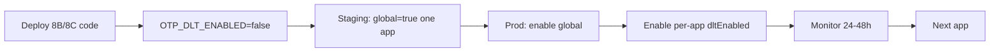

# OTP DLT Rollout

| | |
|---|---|
| **Purpose** | Staged production rollout checklist for OTP DLT delivery. |
| **Intended Audience** | Operations, platform maintainers, release engineers. |
| **Last Updated** | 2026-06-05 |
| **Related Documents** | [OTP DLT Migration](../architecture/otp-dlt-migration.md) · [Platform OTP Dashboard](/platform/otp) · [Rollback](./otp-dlt-rollback.md) |

---

## Prerequisites

- [ ] Phase 8B deployed with `OTP_DLT_ENABLED=false` (no behavior change)
- [ ] `otp-mappings.json` has correct `business` + `templateKey` per app
- [ ] `dltEnabled: true` only for apps ready to migrate
- [ ] Startup validation passes (`npm run otp:health` or backend start)
- [ ] Portal `/platform/otp` shows `rolloutReady` for target apps
- [ ] Staging test: real handset receives DLT OTP

---

## Rollout sequence

### Step-by-step

| Step | Action | Verify |
|------|--------|--------|
| 1 | Deploy with `OTP_DLT_ENABLED=false` | All sends use `route=q` |
| 2 | Run `npm run otp:health` | Snapshot `configHealth.status: healthy` |
| 3 | Staging: `OTP_DLT_ENABLED=true`, one app `dltEnabled: true` | `otp_dlt_dispatch` + `provider_response route:dlt` |
| 4 | Production: `OTP_DLT_ENABLED=true` | `otp_dlt_activation_status globalEnabled: true` |
| 5 | Enable `dltEnabled: true` per app (one at a time) | Portal shows Active DLT badge |
| 6 | Monitor SLIs 24–48h | See [Observability](../architecture/otp-dlt-observability.md) |
| 7 | Repeat for remaining apps | `legacyCount` → 0 in portal |

---

## Monitoring during rollout

| Signal | Healthy |
|--------|---------|
| `otp_delivery_completed` success rate | ≥ 99.5% |
| `otp_dlt_fallback` count | 0 for active DLT apps |
| `provider_response` DLT `return: true` | ≥ 99% |
| OTP verify success rate | Stable vs baseline |

---

## Rollback trigger

If any SLI breaches for >15 minutes → [Rollback](./otp-dlt-rollback.md).

---

## Verification checklist

- [ ] Test send + verify on production app
- [ ] Logs include `appId`, `deliveryMode`, `templateId`
- [ ] No OTP plaintext in logs
- [ ] `/health` shows `otpDlt` summary (additive field)
